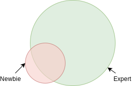
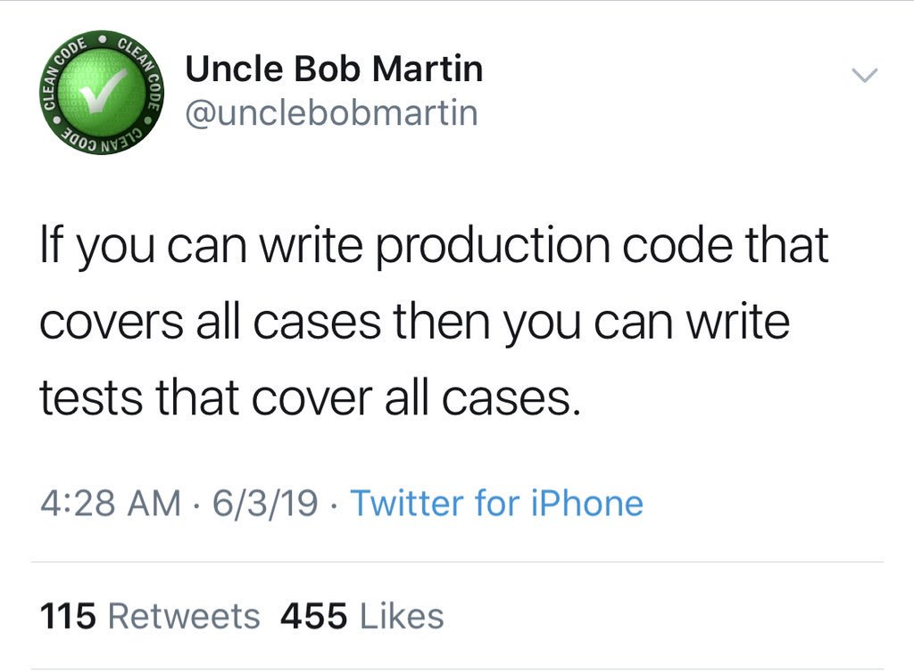
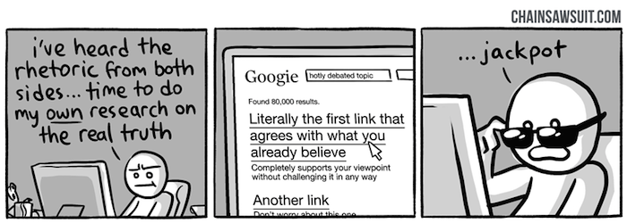

This is the collection of some **ideas** and my thoughts **about learning, teaching, and knowledge** in general. I wanted to separate this post into three parts, but all of them are interconnected so I guess this will be one long post. On the bright side, **sections are small** and there is **no need to read them all** or read them **in a given order**.

<!--more-->

## Building from scratch

To deeply understand some complex concepts, it is useful to analyze (disassemble, break into smaller parts) it, and understand how each part works. Another side of this approach is to build the thing that you want to understand from scratch.

This idea is present in [SICP](/posts/legendary-mit-6.001), authors start with the simplest concept of programming explained in the Lisp and then they show how to build the Lisp itself (circle closes). <!-- What is a Lisp? A little context (1-2 lines) here could be helpful for readers. -->

Gary Bernhardt likes to show how to build things from scratch in his [DAS "show"](https://www.destroyallsoftware.com/screencasts/catalog). [The Little Schemer](https://mitpress.mit.edu/books/little-schemer-fourth-edition) and [The Little Prover](http://the-little-prover.github.io/) are also written in the same vein.

**The main idea is to have small isolated examples which focus on essentials**.

For example, to learn basic ideas behind different programming languages, you can try to implement small programming languages like shown [here](https://plzoo.andrej.com/).

### But...

What if given subject heavily relies on other subjects, so it would be hard to present in isolation?

It is still possible to provide an isolated example. A good illustration of this approach can be found in [Teaching Garbage Collection without Implementing Compilers or Interpreters](https://cs.brown.edu/~sk/Publications/Papers/Published/cgkmf-teach-gc/paper.pdf).

> Given the widespread use of memory-safe languages, students must understand garbage collection well... an effective approach would be to have them implement garbage collectors. Unfortunately, a full implementation **depends on substantial knowledge of compilers and runtime systems**, which many courses do not cover or cannot assume.
> This paper presents an instructive approach to teaching GC, where students implement it atop a simplified stack and heap. Our approach **eliminates enormous curricular dependencies while preserving the essence of GC algorithms**. We take pains to enable testability, comprehensibility and facilitates debugging. Our approach has been successfully classroom-tested for several years at several institutions.
>
> -- Teaching GC without Implementing Compilers or Interpreters

Another counterpoint can be that some subjects are very hard and can't be simplified to a small isolated thing, for example, a modern browser is a very complex thing. Should we make people write a browser from scratch in order for them to understand web-development?

## "Problem first" approach

I first saw this idea in a [blog post where it was explained with an example based on the game](http://mkremins.github.io/blog/doors-headaches-intellectual-need/). Imagine: the game starts and you need to accomplish a tutorial: you need to escape from a room. You try to get out but the door is locked. The tutorial instructs you to find the key. After you find it, you get back and get out of the room.

Another variant of this tutorial could look like this – you got a task to get out of the room, but you already have a key in your inventory, so you quickly accomplish the tutorial. Now when you face the closed door in the game, you don't know what to do because you have no key and have no idea where to get it.

When you face the problem (closed door) before you got the solution (the key), you get to appreciate the solution more - you memorize it, you learn it.

This approach, for example, is used in [Programming Languages: Application and
Interpretation by Shriram Krishnamurthi](http://cs.brown.edu/courses/cs173/2012/book/book.pdf).

> Unlike some other textbooks, this one does not follow a top-down narrative. Rather it has the flow of a conversation, with backtracking. We will often build up programs incrementally, just as a pair of programmers would. We will include mistakes, not because I don’t know the answer, but because this is the best way for you to learn. Including mistakes makes it impossible for you to read passively: you must instead engage with the material because you can never be sure of the veracity of what you’re reading.
> At the end, you’ll always get to the right answer. However, this non-linear path is more frustrating in the short term (you will often be tempted to say, “Just tell me the answer, already!”), and it makes the book a poor reference guide (you can’t open up to a random page and be sure what it says is correct). However, that feeling of frustration is the sensation of learning. I don’t know of a way around it.

### Abstractions

Some high level [abstractions](/posts/abstraction/) can be very useful, but when they taught in a top-down manner it is hard to appreciate it, and it may seem like a lot of gibberish.

`<Insert joke about monad tutorials here>`

It would be nicer to show a couple of examples of how you can show different problems and that they, in fact, have the same idea behind which can be extracted and reused. To understand and value an abstraction you need to experience this a-ha moment.

## One size doesn't fit all

We learn and consume information through the prism of our current experience (knowledge). We all have a different background, different prior experience (knowledge). Some courses, tutorials may work well for one type of people, but not for another.

In this sense, one curriculum for all in schools maybe not the best idea, because it will fit for some and not for others. And people who can't catch up will feel as if they are incapable of learning something.

All people have a different pace of learning, different sleep/work cycles, different health conditions. For example, [10% of the population are dyslexic](https://www.bdadyslexia.org.uk/dyslexia).

Sir Ken Robinson explains the reasons behind the current educational system in [this video](https://www.ted.com/talks/ken_robinson_changing_education_paradigms). (It was created in the industrial period and "modeled" after the factory process.)

## Practical vs theoretical knowledge

Some theoretical knowledge are not directly applicable, they rather help you build a general and deeper understanding, for example halting problem or lambda calculus will not help you to write websites.

On the other side practical knowledge can get outdated fast (theoretical knowledge can get outdated as well, but this typically happens at a slower pace). For example, I worked with AS3 at one company, then layoffs happened and I realized nobody is working with AS3 anymore (I was lucky that it wasn't the only one language I worked with, but those n-years with AS3 in a CV are useless now).

A very simplified picture of longevity for different types of knowledge in IT:

```text
frameworks and libraries < programming languages < data structure and algorithms < math
```

In this sense cutting edge technologies, which contain a lot of quickly changing parts and bugs are a bad thing for beginners to learn. Because they will learn a lot of things which could get outdated pretty fast and it will feel like they don't move - the amount of useful knowledge will stay small.

### What to learn?

It depends on the situation. What is the purpose? How much time do you have? Are you a student or you work and learn or you learn on the go?

All of those questions should be taken into account to make a decision.

## Constructionism

The main idea behind the constructionism is that every person re-constructs the understanding in their head e.g. there is no direct transfer of knowledge, instead, you got information from outside (from the book, from the conversation, from the lesson, from personal experience, etc.) and construct knowledge based on it (from scratch).

The idea was proposed by Seymour Papert in 60-s, this idea has grown out of the idea of constructivism (v instead of n), proposed by Piaget.

How would we optimize learning based on this idea? We can create an environment which would stimulate experimentation. An environment with a clear response, with fast response loop, so that error-trial cycle would be faster. The task of the teacher would be not to go through the books, but rather expose pupils to problems so that they can figure out the solution themselves, and answer questions and help unstack, but they will build their own experience.

Papert came up with the turtle as a programming learning environment. Later a lot of people build upon this idea, for example, Bret Victor and his idea of very fast response loops, and controls in place and time travel which with hot reload, which got into Elm and Redux, Scratch programming language proposed concept of visual programming language. Read my previous post about [educational programming languages](/posts/educational-programming-languages/) to learn more about this idea.

## Knowledge is not measurable by one number

There is one number to measure intelligence - IQ (I'm not a fan of this approach and I believe it is an oversimplification, but it works for this example).

But you can't measure knowledge with one number (it's not a scalar value). Knowledge is rather can be thought as islands on the map. Some people may have some overlap in knowledge, but it is hard to say that person A knows more than person B. You can be tempted to measure the area of crossed areas on the map, but this doesn't make sense, because what the sense of comparing, for example, CS knowledge and medical knowledge - if CS professor knows more things (CS related) then med student it wouldn't help them to save somebody's life.

### Consequences

Even if you an expert in some subject you still can learn something from a newbie in case your knowledge doesn't intersect enough:



Proficiency in one subject doesn't guarantee knowledge or even basic understanding in another subject:



> bool is_odd_perfect_number(int n) {return false;}
>
> I know the usual counter here is &quot;concurrency&quot; but he went &quot;nuh-uh you CAN write all 300,000,000 test cases if you really wanted to&quot; and that&#39;s irrefutable
>
> Another is &quot;many functions have infinite input classes&quot; but he went &quot;REAL programmers exclusively write finite state machines&quot; and again, irrefutable
>
> So here&#39;s a case he hasn&#39;t yet handwaved away: simulations! To unit test an input you need to already know the output, which is what you&#39;re writing the simulation to find in the first place!
>
> Another one: programs that effect the real world. You can test the code all you want but you eventually gotta check the real world effect happened, and that it was the effect you needed. Those are very different tests!
>
> &mdash; Hillel (@hillelogram) [June 4, 2019](https://twitter.com/hillelogram/status/1136000857496084480?ref_src=twsrc%5Etfw)

## Unlearning and Pushback effect

Experience can help to learn when you can transfer your previous knowledge to a new area. This transfer happens with the help of the abstraction process (we focus on commonalities and "remove" details by not paying attention to it). The higher level of abstraction, the wider it's application.

Experience can be an obstacle if it prevents learning new things, for example, if new ideas contradict some existing ideas, it will take more to learn new ideas because you need to unlearn some old ideas (this is so-called [pushback effect](https://educationblog.oup.com/theory-of-knowledge/facts-matter-after-all-rejecting-the-backfire-effect)).

The main problem with pushback effect is that it works through emotion, so the first reaction when we here contradicting ideas can be anger and as consequence destructive response or rejection to continue hearing/reading new information.

## Confirmation bias



> Confirmation bias, the tendency to process information by looking for, or interpreting, information that is consistent with one’s existing beliefs. This biased approach to decision making is largely unintentional and often results in ignoring inconsistent information.
>
> -- [britannica](https://www.britannica.com/science/confirmation-bias)

I also like the term "unknown knowns" (the unknown beliefs, the ideology). I learned this idea from [a talk by Gary Bernhardt from Strange Loop 2015](https://www.destroyallsoftware.com/talks/ideology). Later I found that the same idea was presented by Slavoj Žižek in [his talk on Donald Rumsfeld in 2006](https://www.youtube.com/watch?v=ql80Klk4pSU).

## False knowledge

Some ideas that we learned early can be wrong (false) or simplified later at some point we discover the contradiction and need to change our beliefs.

For example, [they teach that gravity depends on the mass of objects, but photons have a mass of 0 and yet they are affected by the gravity](https://www.youtube.com/watch?v=IM630Z8lho8).

## Dunning–Kruger effect

> The Dunning-Kruger effect, at its core, suggests that people fail to recognize their intellectual and social shortcomings because they simply lack the expertise necessary to see them. As such, the effect reflects a double-curse: People’s deficits cause them to make many mistakes, and then those same deficits prevent them from seeing their decisions as mistakes. As a consequence, the pervasive tendency for people to overrate themselves and their talents is not necessarily due to their ego, but rather to intellectual deficits that they cannot see. We all share this problem, in that we all have pockets of incompetence that remain invisible to us.
>
> -- [Why incompetent people think they're amazing - David Dunning](https://ed.ted.com/lessons/why-incompetent-people-think-they-re-amazing-david-dunning)

## Avoid categorical thinking

Another potential trap if you learn only one side of the problem, only one way to solve the problem, only one point of view. It is easy to get trapped in this vision and believe this is the only way to approach the problem.

In [this lecture of Robert Sapolsky](https://www.youtube.com/watch?v=NNnIGh9g6fA) discusses some examples of bad [categorical thinking](/posts/categorical-thinking).

This problem is well known in software development: for example, people who only acknowledge FP or OOP, people who only acknowledge types or tests.

To avoid this problem we can model course to show more than an approach to the problem solution. For example:

> The emphasis throughout the course is in the analysis required while designing correct and efficient algorithms. The course is intended to teach a student a systematic process of design - beginning with problem formulation from an informal specification, through convincing arguments to algorithms, the analysis of their correctness and efficiency, and finally arriving at programs through a process of step-wise refinement. A programming language bias is avoided and programs are developed in both imperative and functional styles.
>
> -- [CSL102: Introduction to Computer Science](http://www.cse.iitd.ernet.in/~suban/CSL102/#Overview)

Example #2:

> Louv1.1x and Louv1.2x together give an introduction to all major programming concepts, techniques, and paradigms in a unified framework. We cover the three main programming paradigms: functional, object-oriented, and declarative dataflow.
>
> Louv1.2x covers data abstraction, state, and concurrency. You’ll learn the four ways to do data abstraction and discuss the trade-offs between objects and abstract data types.
>
> -- [Paradigms of Computer Programming – Fundamentals](https://www.edx.org/course/paradigms-of-computer-programming-fundamentals)

### Critical thinking

The antidote to this problem can be critical thinking.

> Well, fundamentally, critical thinking is about making sure that you have good reasons for your beliefs.
>
> -- [khanacademy](https://www.khanacademy.org/partner-content/wi-phi/wiphi-critical-thinking/wiphi-fundamentals/v/intro-to-critical-thinking)

Or you can read SEP for more details:

> Critical thinking is a widely accepted educational goal. Its definition is contested, but the competing definitions can be understood as differing conceptions of the same basic concept: careful thinking directed to a goal.
>
> -- [Stanford Encyclopedia of Philosophy](https://plato.stanford.edu/entries/critical-thinking/)

## Lowering entrance barrier

I mentioned this idea in my previous posts:

- [Developer is the next blue collar job](/posts/developer-is-the-next-blue-collar-job/#ergonomics)
- [Evaluating Developer eXperience of a programming language](/posts/evaluating-dx-of-a-programming-language/)
- [Educational Programming Languages](/posts/educational-programming-languages/)

## Bad teachers

It requires a special set of skills to be a teacher.

You need patience because what you can do fast, the learner will do slow - if you will get mad about this it can discourage learner.

You need kindness to support and reassure learner because it is hard to process and it is easy to lost hope.

You need to be open-minded. A newbie can find something that you don't know (yet). A fair response to this would be: "I don't know, let's find out together". The inappropriate response would: "Don't ask stupid questions", "This is not important".

You need to be humble. The goal of teaching is to transmit knowledge, not to brag about how smart you are. Use as less terminology as possible (though you would need to introduce it at some point because other people would use terminology). Try to come down to the level of the learner, use examples they understand.

Learn in public. Some people would be discouraged to learn things because they would feel they never reach the level of their teacher. None of us was born with all knowledge and skills, we all learned it. Periodic reminder about this would be nice.

To be fair I need to mention there are different traditions of teaching, for example, in eastern martial arts, you need to be grateful that master allowed you to visit the dojo and watch what they doing (it will take quite some time before teach would start to notice you).

There are bad teachers (or teaching approaches that may not fit you). You as a learner should not be discouraged by bad teachers - move on, find a better way to learn.

## Learning on the go

When we talk about education, we often imagine pupils or students, people who can dedicate all the time to learning. Let's face it a lot of people need to learn on the go, for example:

- the new framework came out and now almost all job-positions lists it as a requirement
- you want to switch industries (for example, from journalism to IT) or branches for industries (for example, from frontend to backend), but you don't have time or ability to do this full time (because of money most likely, you still need to work)

Expectations and experience of people who learn on the go and people who learn in academia are different.

Most likely if you learn on the go you don't have time to go through the whole theory, rather you want to get results as fast as possible. Learner most likely will be under some pressure: not enough time (another job), not enough money (to buy learning material), psychological pressure (if you are junior or doing internship and afraid to fail).

All of those conditions are less than ideal for learning, yet this what happens and will happen in the future.

As a result:

- unless people are curated they will learn some random things based on the hype
- eventually, they will get in the industry, and can become quite successful, yet not having "basis" will cause **impostor syndrome**
- people will learn free stuff. This is why open source is spreading, you don't need money to get into learning open-source things, you don't need to pay for certification, expensive courses, accessing some Paas, etc.
- people will be confused and will need help. They will search it online at Wikipedia, StackOverflow or some random blog post, forums, online communities (like dev.to) or maybe local meetups. A lot of times information found this way is not trustworthy - it can misinform, oversimplify things, or have false claims

How we can design a learning experience for people who learn on the go:

- Remove accidental complexity, nobody has time to compile your thing from scratch or run 20 commands to get started (most likely this is an error-prone process). Make it easy to start with one command, which will create a working environment usable out of the box. Maybe provide precompiled binaries, or Docker images, or online playground.
- Fast response loop (again)
- Don't use jargon words unless required, explain terminology (especially if this is the ambiguous term). Use consistent wording
- Provide official getting started tutorial

What would be advisable for the learner?

Recognize hype (see critical thinking). I would say that hype is when advocate lists only the positive sides of the solution, without downsides. In this case, advocate either don't know downsides, because haven't used it that much to find it out or ignore them on purpose.

Don't be impressed with jargon words or categorical judgments. A lot of the time people will use those words, without having a full understanding. You should not feel impostor syndrome because of this. You can always ask: "Can you explain this to me", "Can you give definition", "Can you explain why". If they can't explain that means they don't know it.

> Dr. Hoenikker used to say that any scientist who couldn't explain to an eight-year-old what ~~he~~ they was doing was a charlatan
>
> -- Kurt Vonnegut

Differentiate scientific and not scientific knowledge. Sometimes people argue about concepts as if they are scientific facts or definitions when they are not. Typical sign here is if you ask for a definition of the term, you get definition "when I see it I can recognize it", or link to Wikipedia instead of some established author, like a dictionary, or scientific work

Sometimes Wikipedia articles are good, sometimes are not. For example, there is a big controversy about the actor model. [Carl Hewitt, the author of the idea of actor model, well-recognized scientist, was harassed and censored by Wikipedia](https://carlehewitt.typepad.com/blog/2008/03/history-of-logi.html), because he argued that actor model can do a bit more than turning the machine and Wikipedia editor refuted this as nonsense.

> It has long been assumed that the Turing machine computes all the functions that are computable in any reasonable sense. It is therefore assumed to be a sufficient model for computability. What then, is one to make of the slow trickle of papers that discuss models which can compute more than the Turing machine? It is perhaps tempting to dismiss such theorizing as idle speculation alike to the more fanciful areas of pure mathematics, in which models and abstractions are studied for their own sake with little regard to any real-world implications.
>
> -- [Hypercomputation: computing more than the Turing machine](https://arxiv.org/abs/math/0209332)

## There is no way to know everything

Amount of humankind knowledge is growing every day. There is no way one person would be able to learn everything.

As a consequence, we need specialization - when people dedicate most of their time to learn one subject. The problem here is that the narrower specialization gets, easier to lose the view of the global picture (related: categorical thinking).

Because there is no way to study everything, you sometimes can or need to skip some subjects or postpone learning. This idea contradicts "building from scratch" thing, by building from scratch you can get dipper understanding, but it can happen you don't have time to learn everything that deep.

Instead of fighting with holes in education, we need to embrace that this is unsolvable problem, and instead of trying to teach everything we need to teach how to learn fast, how to learn on the go, how to find related information quickly, we need to teach critical thinking, we need to teach how to [call out bull](https://callingbullshit.org/), about [cognitive biases](https://busterbenson.com/biases/), about [logical fallacies](https://yourlogicalfallacyis.com/).

We need a better medium to distribute and update knowledge. Hypertext (HTML), wikis, and the web is already a good step in that direction, but we can do better. As well it should be [optimized for consumption](https://andymatuschak.org/books/).

[Knowledge should be open](https://okfn.org/about/vision-and-values/). [Current academic publishing doesn't work, which led to the appearance of services like SciHub](https://www.theguardian.com/commentisfree/2019/mar/04/the-guardian-view-on-academic-publishing-disastrous-capitalism). I don't think that Wikipedia is the answer here either (see [1](https://en.wikipedia.org/wiki/Reliability_of_Wikipedia), [2](https://www.researchgate.net/publication/220175584_Wikipedia's_Neutral_Point_of_View_Settling_Conflict_through_Ambiguity), [3](https://reagle.org/joseph/2005/06/neutrality.html) ). Maybe [arxiv](https://arxiv.org/) is better answer `¯\_(ツ)_/¯`.

## Beyond computer science

I mainly focus on methods and ideas which would work for teaching computer science and similar. But there are a lot of areas where some of those ideas would not work, for example [coffee cup tasting](https://scae.com/component/content/article?id=21:scae-sensory-skills-education-modules), playing piano, learning natural languages.

Just a small reminder (for myself).

## Other articles

More articles for you to consider (I haven't read some of them, but maybe interesting):

- [Learning How to Learn](https://www.coursera.org/learn/learning-how-to-learn)
- [How to Learn (But Not Master) Any Language in 1 Hour](https://tim.blog/2007/11/07/how-to-learn-but-not-master-any-language-in-1-hour-plus-a-favor/)
- [Advice on Getting Better from an Accomplished Piano Player](http://www.calnewport.com/blog/2011/12/23/flow-is-the-opiate-of-the-medicore-advice-on-getting-better-from-an-accomplished-piano-player/)
