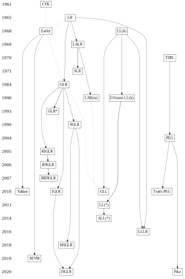

## Algorithms

> Parser users tend to separate themselves into bottom-up and top-down tribes. Top-down users value the readability of recursive descent (`RD`) implementations of `LL` parsing along with the ease of semantic action incorporation. Bottom-up users value the extended parsing power of `LR` parsers, in particular the admissibility of left recursive grammars, although `LR` parsers cannot cope with hidden left recursion and even `LR(0)` parse tables can be exponential in the size of the grammar, while an `LL` parser is linear in the size of the grammar.
>
> -- [GLL Parsing](https://www.sciencedirect.com/science/article/pii/S1571066110001209)

List of algorithms (based on [this page](https://w3.cs.jmu.edu/lam2mo/cs630_2015_01/files/09-parsing3.txt)):

- `CYK` ([Cocke–Younger–Kasami](https://www.iith.ac.in/~subruk/4510/cyk.pdf)) algorithm
  - bottom-up, dynamic programming, chart parser
  - supports any context-free grammar in Chomsky Normal Form
  - `O(n^3)`
  - [online demo 1](https://www.xarg.org/tools/cyk-algorithm/), [online demo 2](http://lxmls.it.pt/2015/cky.html), [list of part-of-speech tags](https://spacy.io/api/annotation#pos-tagging)
- `Earley` parser ([Jay Earley, 1968](https://web.archive.org/web/20040708052627/http://www-2.cs.cmu.edu/afs/cs.cmu.edu/project/cmt-55/lti/Courses/711/Class-notes/p94-earley.pdf)):
  - dynamic programming, chart parser
  - supports any context-free grammar
  - `O(n^3)`

> `Earley` gave an outline of a method for turning his recognizers into parsers but **it turns out that this method is incorrect**. Tomita's `GLR` parser returns a shared packed parse forest (SPPF) representation of all derivations of a given string from a given CFG but is worst-case unbounded polynomial order.
>
> -- [SPPF-Style Parsing From Earley Recognisers](https://www.sciencedirect.com/science/article/pii/S1571066108001497?via%3Dihub)

### LL

left-to-right, leftmost derivation (top-down), "recursive descent"

- `LL(k)` (Lewis and Stearns, 1968)
  - `k` tokens of lookahead
  - very expensive (when introduced)
- `LL(1)`
  - exactly one token lookahead
  - much more efficient
  - uses `FIRST()` and `FOLLOW()` to build parse tables
  - [online demo 1](https://www.cs.princeton.edu/courses/archive/spring20/cos320/LL1/), [online demo 2](http://jsmachines.sourceforge.net/machines/ll1.html)
- `Efficient LL(k)` ([Terence Parr, 1990](https://www.researchgate.net/publication/27230083_A_Practical_approach_to_LLk_LLmn))
  - `k` tokens of lookahead
  - `k` is gradually increased w/ backtracking as a failback
  - basis of original `ANTLR`

> In terms of recognition strength, `LL` techniques are widely held to be inferior to `LR` parsers. The fact that any `LR(k)` grammar can be rewritten to be `LR(1)`, whereas `LL(k)` is stronger than `LL(1)`, appears to give `LR` techniques the additional benefit of not requiring k-token lookahead and its associated overhead. **In this paper, we suggest that `LL(k)` is actually superior to `LR(1)` when translation, rather than acceptance, is the goal.** Further, a practical method of generating efficient `LL(k)` parsers is presented. This practical approach is based on the fact that most parsing decisions in a typical `LL(k)` grammar can be made without comparing k-tuples and often do not even require the full k tokens of look ahead. We denote such `"optimized" LL(k)` parsers

- `GLL` Generalised `LL` ([Bernard Lang, 1974](https://www.researchgate.net/publication/220898271_Deterministic_Techniques_for_Efficient_Non-Deterministic_Parsers) & [Scott and Johnstone, 2010](http://dotat.at/tmp/gll.pdf))
  - `LL` analogue to `GLR`
  - maintains multiple parsing descriptors on a stack

> Recursive Descent (RD) parsers are popular because their control flow follows the structure of the grammar and hence they are easy to write and to debug. However, the class of grammars which admit RD parsers is very limited. Backtracking techniques may be used to extend this class, but can have explosive run-times and cannot deal with grammars with left recursion. Tomita-style `RNGLR` parsers are fully general but are based on `LR` techniques and do not have the direct relationship with the grammar that an RD parser has. We develop the fully general `GLL` parsing technique which is recursive descent-like, and has the property that the parse follows closely the structure of the grammar rules, but uses `RNGLR`-like machinery to handle non-determinism. **The resulting recognisers run in worst-case cubic time and can be built even for left recursive grammars.**

- `LL(*)` ([Terence Parr and Kathleen Fisher, 2011](https://www.antlr.org/papers/LL-star-PLDI11.pdf))
  - `LL` analogue to `LAR(m)`
  - regular lookaheads w/ cyclic DFAs
  - basis of `ANTLR 3` (?)

> Despite the power of Parser Expression Grammars (`PEG`s) and `GLR`, parsing is not a solved problem. Adding nondeterminism (parser speculation) to traditional `LL` and `LR` parsers can lead to unexpected parse-time behavior and introduces practical issues with error handling, single-step debugging, and side-effecting embedded grammar actions. This paper introduces the `LL(*)` parsing strategy and an associated grammar analysis algorithm that constructs `LL(*)` parsing decisions from ANTLR grammars. At parse-time, decisions gracefully throttle up from conventional fixed k≥1 lookahead to arbitrary lookahead and, finally, fail over to backtracking depending on the complexity of the parsing decision and the input symbols. `LL(*)` parsing strength reaches into the context-sensitive languages, in some cases beyond what `GLR` and `PEG`s can express. By statically removing as much speculation as possible, `LL(*)` provides the expressivity of `PEG`s while retaining `LL`’s good error handling and unrestricted grammar actions.

- `ALL(*)` Adaptive `LL(*)` ([Parsing: The Power of Dynamic Analysis, Terence Parr, Sam Harwell, and Kathleen Fisher, 2014](https://tupl.cs.tufts.edu/papers/allstar-techreport.pdf))
  - parallel regular lookaheads
  - dynamic; adapts to input sentences
  - simulates augmented recursive transition networks (ATNs)
  - basis of `ANTLR 4`

> Despite the advances made by modern parsing strategies such as `PEG`, `LL(*)`, `GLR`, and `GLL`, parsing is not a solved problem. Existing approaches suffer from a number of weaknesses, including difficulties supporting side-effecting embedded actions, slow and/or unpredictable performance, and counter-intuitive matching strategies. This paper introduces the `ALL(*)` parsing strategy that combines the simplicity, efficiency, and predictability of conventional top-down `LL(k)` parsers with the power of a `GLR`-like mechanism to make parsing decisions. The critical innovation is to move grammar analysis to parse-time, which lets `ALL(*)` handle any non-left-recursive context-free grammar. **`ALL(*)` is O(n4) in theory but consistently performs linearly on grammars used in practice, outperform in general strategies such as `GLL` and `GLR` by orders of magnitude.** ANTLR 4 generates `ALL(*)` parsers and supports direct left-recursion through grammar rewriting.

- `LLLR` ([LLLR Parsing: a Combination of LL and LR Parsing, Boštjan Slivnik, 2016](https://core.ac.uk/download/pdf/62921535.pdf))

> A new parsing method called `LLLR` parsing is defined and a method for producing `LLLR` parsers is described. An `LLLR` parser uses an `LL` parser as its backbone and parses as much of its input string using `LL` parsing as possible. To resolve `LL` conflicts it triggers small embedded `LR` parsers. An embedded `LR` parser starts parsing the remaining input and once the `LL` conflict is resolved, the `LR` parser produces the left parse of the substring it has just parsed and passes the control back to the backbone `LL` parser. The `LLLR(k)` parser can be constructed for any `LR(k)` grammar. It produces the left parse of the input string without any backtracking and, if used for a syntax-directed translation, it evaluates semantic actions using the top-down strategy just like the canonical `LL(k)` parser. An `LLLR(k)` parser is appropriate for grammars where the `LL(k)`conflicting nonterminals either appear relatively close to the bottom of the derivation trees or produce short substrings. In such cases an `LLLR` parser can perform a significantly better error recovery than an `LR` parser since the most part of the input string is parsed with the backbone `LL` parser. `LLLR` parsing is similar to `LL(∗)` parsing except that it (a) uses `LR(k)` parsers instead of finite automata to resolve the `LL(k)` conflicts and (b) does not perform any backtracking.

### LR

left-to-right, rightmost derivation ("bottom-up"), "shift/reduce"

- Canonical `LR` ([Don Knuth, 1965](https://www.sciencedirect.com/science/article/pii/S0019995865904262))
  - allows duplicated states
  - fewer conflicts; much larger parse tables
  - [online demo](http://jsmachines.sourceforge.net/machines/lr1.html)
- `SLR` ([Frank DeRemer](https://www.win.tue.nl/~mvdbrand/courses/seminar/0809/papers/p453-deremer.pdf))
  - simple `LR`: `LR(0)` states and their transitions
  - `FOLLOW()` used to compute lookaheads
  - [online demo](http://jsmachines.sourceforge.net/machines/slr.html)
- `LALR` ([Frank DeRemer, 1969](https://hassan-ait-kaci.net/pdf/others/p615-deremer.pdf))
  - similar to `SLR` but w/ smaller lookaheads
  - equivalently, a simplified version of canonical `LR`
  - more complicated lookahead calculation
  - basis of yacc/bison
  - [recursive ascent (Thomas Penello, 1986)](https://dl.acm.org/doi/10.1145/12276.13326)
  - [online demo](http://jsmachines.sourceforge.net/machines/lalr1.html)
- `GLR` ([Masaru Tomita, 1984](https://www.aclweb.org/anthology/P84-1073.pdf))
  - generalized `LR(k)`: returns all valid parses
  - spawns parallel parsing processes on conflicts
  - graph-structured stack (`GSS`)
  - more efficient than Earley
- `LAR(m)` ([Practical arbitrary lookahead LR parsing, Bermudez and Schimpf, 1990](https://www.sciencedirect.com/science/article/pii/002200009090037L))
  - regular lookaheads w/ cyclic DFAs
- `GLR*` ([GLR\* - An Efficient Noise-skipping Parsing Algorithm For Context Free Grammars Alon Lavie and Masaru Tomita, 1993](https://www.aclweb.org/anthology/1993.iwpt-1.12.pdf))
- `SGLR` Scannerless `GLR` ([Scannerless generalized-LR parsing, Eelco Visser, 1999](https://www.researchgate.net/publication/2247116_Scannerless_generalized-LR_parsing))

> Current deterministic parsing techniques have a number of problems. These include the limitations of parser generators for deterministic languages and the complex interface between scanner and parser. Scannerless parsing is a parsing technique in which lexical and context-free syntax are integrated into one grammar and are all handled by a single context-free analysis phase. This approach has a number of advantages including discarding of the scanner and lexical disambiguation by means of the context in which a lexical token occurs. Scannerless parsing generates a number of interesting problems as well. Integrated grammars do not fit the requirements of the conventional deterministic parsing techniques. A plain context-free grammar formalism leads to unwieldy grammars, if all lexical information is included. Lexical disambiguation needs to be reformulated for use in context-free parsing.
> The `scannerless generalized-LR` parsing approach presented in this paper solves these problems. Grammar normalization is used to support an expressive grammar formalism without complicating the underlying machinery. Follow restrictions are used to express longest match lexical disambiguation. Reject productions are used to express the prefer keywords rule for lexical disambiguation. The `SLR(1)` parser generation algorithm is adapted to implement disambiguation by general priority and associativity declarations and to interpret follow restrictions. `Generalized-LR` parsing is used to provide dynamic lookahead and to support parsing of arbitrary context-free grammars including ambiguous ones. An adaptation of the `GLR` algorithm supports the interpretation of grammars with reject productions.

- `RIGLR` Reduction Incorporated Generalized `LR` ([Elizabeth Scott and Adrian Johnstone. Generalised bottom up parsers with reduced stack activity, 2005](https://www.researchgate.net/publication/220458273_Generalized_Bottom_Up_Parsers_With_Reduced_Stack_Activity))

> We describe a generalized bottom up parser in which non-embedded recursive rules are handled directly by the underlying automaton, thus limiting stack activity to the activation of rules displaying embedded recursion. Our strategy is motivated by Aycock and Horspool's approach, but uses a different automaton construction and leads to parsers that are correct for all context-free grammars, including those with hidden left recursion. The automaton features edges which directly connnect states containing reduction actions with their associated goto state: hence we call the approach reduction incorporated generalized LR parsing. Our parser constructs shared packed parse forests in a style similar to that of Tomita parsers. We give formal proofs of the correctness of our algorithm, and compare it with Tomita's algorithm in terms of the space and time requirements of the running parsers and the size of the parsers' tables.

- `RNGLR` Right nulled `GLR` parsers ([Elizabeth Scott and Adrian Johnstone. Right nulled GLR parsers, 2006](https://www.researchgate.net/publication/213884162_Right_nulled_GLR_parsers))

> The right nulled generalized `LR` parsing algorithm is a new generalization of `LR` parsing which provides an elegant correction to, and extension of, Tomita's `GLR` methods whereby we extend the notion of a reduction in a shift-reduce parser to include right nulled items. The result is a parsing technique which runs in linear time on `LR(1)` grammars and whose performance degrades gracefully to a polynomial bound in the presence of non `LR(1)` rules. Compared to other `GLR`-based techniques, our algorithm is simpler and faster.

- `BRNGLR` Binary Right Nulled GLR ([BRNGLR: a cubic Tomita-style GLR parsing algorithm, Elizabeth Scott, Adrian Johnstone, Rob Economopoulos, 2007](https://www.researchgate.net/publication/226490339_BRNGLR_a_cubic_Tomita-style_GLR_parsing_algorithm))

> Tomita-style generalised `LR` (`GLR`) algorithms extend the standard `LR` algorithm to non-deterministic grammars by performing all possible choices of action. Cubic complexity is achieved if all rules are of length at most two. In this paper we shall show how to achieve cubic time bounds for all grammars by binarising the search performed whilst executing reduce actions in a `GLR`-style parser. We call the resulting algorithm Binary Right Nulled `GLR` (`BRNGLR`) parsing. The binarisation process generates run-time behaviour that is related to that shown by a parser which pre-processes its grammar or parse table into a binary form, but without the increase in table size and with a reduced run-time space overhead. **BRNGLR parsers have worst-case cubic run time on all grammars, linear behaviour on `LR(1)` grammars and produce, in worst-case cubic time, a cubic size binary SPPF representation of all the derivations of a given sentence.**

- `IGLR` ([Incremental Analysis of Real Programming Languages, 2010](https://www.researchgate.net/publication/2573509_Incremental_Analysis_of_Real_Programming_Languages))

> A major research goal for compilers and environments is the automatic derivation of tools from formal specifications. However, the formal model of the language is often inadequate; in particular, `LR(k)` grammars are unable to describe the natural syntax of many languages, such as C++ and Fortran, which are inherently non-deterministic. Designers of batch compilers work around such limitations by combining generated components with ad hoc techniques (for instance, performing partial type and scope analysis in tandem with parsing). Unfortunately, the complexity of incremental systems precludes the use of batch solutions. The inability to generate incremental tools for important languages inhibits the widespread use of language-rich interactive environments.
> We address this problem by extending the language model itself, introducing a program representation based on parse DAGs that is suitable for both batch and incremental analysis. Ambiguities unresolved by one stage are retained in this representation until further stages can complete the analysis, even if the resolution depends on further actions by the user. Representing ambiguity explicitly increases the number and variety of languages that can be analyzed incrementally using existing methods.

- `MSGLR` Modular `SGLR` ([A Modular SGLR Parsing Architecture for Systematic Performance Optimization, Denkers, Jasper et al., 2018](https://repository.tudelft.nl/islandora/object/uuid:7d9f9bcc-117c-4617-860a-4e3e0bbc8988))

> `SGLR` parsing is an approach that enables parsing of context-free languages by means of declarative, concise and maintainable syntax definition. Existing implementations suffer from performance issues and their architectures are often highly coupled without clear separation between their components. This work introduces a modular `SGLR` architecture with several variants implemented for its components to systematically benchmark and improve performance. This work evaluates these variants both independently and combined using artificial and real world programming languages grammars. The architecture is implemented in Java as JSGLR2, the successor of the original parser in Spoofax, interpreting parse tables generated by SDF3. **The improvements combined result into a parsing and imploding time speedup from 3x on Java to 10x on GreenMarl with respect to the previous JSGLR implementation.**

- `ISGLR` ([SPLASH: G: Incremental Scannerless Generalized LR Parsing, Maarten P. Sijm, 2020](https://src.acm.org/binaries/content/assets/src/2020/maarten-p.-sijm.pdf))

> We present the Incremental Scannerless Generalized `LR`(`ISGLR`) parsing algorithm, which combines the benefits of Incremental Generalized `LR` (`IGLR`) parsing and Scanner-less Generalized LR (`SGLR`) parsing. The `ISGLR` parser can reuse parse trees from unchanged regions in the input and thus only needs to parse changed regions. We also present incremental techniques for imploding the parse tree to an Abstract Syntax Tree (AST) and syntax highlighting. Scannerless parsing relies heavily on non-determinism during parsing, negatively impacting the incrementality of `ISGLR` parsing. **We evaluated the `ISGLR` parsing algorithm using file histories from Git, achieving a speedup of up to 25 times over non-incremental `SGLR`**

### PEG

- `TDPL` or `TS` ([The tmg recognition schema, Alexander Birman, 1970](https://bford.info/packrat/ref/birman70tmg.pdf))
- `PEG`: parsing expression grammar ([Parsing Expression Grammars: A recognition-based Syntactic Foundation, Bryan Ford, 2004](https://pdos.csail.mit.edu/~baford/packrat/popl04/peg-popl04.pdf))
  - similar to CFG-based grammars, but alternation is inherently ordered
  - often implemented with "packrat" parsers that memoize partial results
  - recursive descent with backtracking

> For decades we have been using Chomsky’s generative system of grammars, particularly context-free grammars(CFGs)and regular expressions(REs), to express the syntax of programming languages and protocols. The power of generative grammars to express ambiguity is crucial to their original purpose of modeling natural languages, but this very power makes it unnecessarily difficult both to express and to parse machine-oriented languages using CFGs. Parsing Expression Grammars(`PEG`s) provide an alternative recognition-based formal foundation for describing machine-oriented syntax, which solves the ambiguity problem by not introducing ambiguity in the first place Where CFG express nondeterministic choice between alternatives, `PEG`s instead use prioritized choice. `PEG`s address frequently felt expressiveness limitations of CFGs and REs, simplifying syntax definitions and making it unnecessary to separate their lexical and hierarchical components. **A linear-time parser can be built for any PEG**, avoiding both the complexity and fickleness of `LR` parsers and the inefficiency of generalized CFG parsing. While PEGs provide a rich set of operators for constructing grammars, they are reducible to two minimal recognition schemas developed around 1970, `TS/TDPL` and `gTS/GTDPL`, which are here proven equivalent ineffective recognition power.

- [Direct Left-Recursive Parsing Expression Grammars, Laurence Tratt, 2010](https://tratt.net/laurie/research/pubs/html/tratt__direct_left_recursive_parsing_expression_grammars/)

> Abstract. Parsing Expression Grammars (`PEG`s) are specifications of unambiguous recursive-descent style parsers. PEGs incorporate both lexing and parsing phases and have valuable properties, such as being closed under composition. In common with most recursive-descent systems, raw `PEG`s cannot handle left-recursion; traditional approaches to left-recursion elimination lead to incorrect parses. In this paper, I show how the approach proposed for direct left-recursive Packrat parsing by Warth et al. can be adapted for ‘pure’ `PEG`s. I then demonstrate that this approach results in incorrect parses for some `PEG`s, before outlining a restrictive subset of left-recursive `PEG`s which can safely work with this algorithm. Finally I suggest an alteration to Warth et al.’s algorithm that can correctly parse a less restrictive subset of directly recursive `PEG`s.

- [Packrat Parsing with Elastic Sliding Window Kimio Kuramitsu, 2015](https://www.jstage.jst.go.jp/article/ipsjjip/23/4/23_505/_pdf/-char/en)

> Packrat parsing is a linear-time implementation method of recursive descent parsers. The trick is a memoization mechanism, where all parsing results are memorized to avoid redundant parsing in cases of backtracking. An arising problem is extremely huge heap consumption in memoization, resulting in the fact that the cost of memoizationis likely to outweigh its benefits. In many cases, developers need to make a difficult choice to abandon packrat parsing despite the possible exponential time parsing. Elastic packrat parsing is developed in order to avoid such a difficult choice. The heap consumption is upper-bounded since memorized results are stored on a sliding window buffer. In addition, the buffer capacity is adjusted by tracing each of nonterminal backtracking activities at runtime. Elastic packrat parsing is implemented in a part of our Nez parser. We demonstrate that the elastic packrat parsing achieves stable and robust performance against a variety of inputs with different backtracking activities.

- `Pika` ([Pika parsing: reformulating packrat parsing as a dynamic programming algorithm solves the left recursion and error recovery problems, 2020](https://arxiv.org/pdf/2005.06444.pdf))

> A recursive descent parser is built from a set of mutually-recursive functions, where each function directly implements one of the nonterminals of a grammar. A `packrat` parser uses memoization to reduce the time complexity for recursive descent parsing from exponential to linear in the length of the input. Recursive descent parsers are extremely simple to write, but suffer from two significant problems: **(i) left-recursive grammars cause the parser to get stuck in infinite recursion, and (ii) it can be difficult or impossible to optimally recover the parse state and continue parsing after a syntax error. Both problems are solved by the `pika` parser**, a novel reformulation of `packrat` parsing as a dynamic programming algorithm, which requires parsing the input in reverse: bottom-up and right to left, rather than top-down and left to right. This reversed parsing order enables `pika` parsers to handle grammars that use either direct or indirect left recursion to achieve left associativity, simplifying grammar writing, and also enables optimal recovery from syntax errors, which is a crucial property for IDEs and compilers. `Pika` parsing maintains the linear-time performance characteristics of `packrat` parsing as a function of input length. The `pika` `parser` was benchmarked against the widely-used Parboiled2 and ANTLR4 parsing libraries, and the pika `parser` performed significantly better than the other `parsers` for an expression grammar, although for a complex grammar implementing the Java language specification, a large constant performance impact was incurred per input character for the `pika` parser, which allowed Parboiled2 and ANTLR4 to perform significantly better than the `pika` parser for this grammar (in spite of ANTLR4’s parsing time scaling between quadratically and cubically in the length of the input with the Java grammar). **Therefore, if performance is important, `pika` parsing is best applied to simple to moderate-sized grammars, or to very large inputs, if other parsing alternatives do not scale linearly in the length of the input.** Several new insights into precedence, associativity, and left recursion are presented.

**See also**:

- [Packrat Parsing: A Literature Review](http://citeseerx.ist.psu.edu/viewdoc/download?doi=10.1.1.740.1787&rep=rep1&type=pdf)

> We show how one way of removing non-determinism from this formalism yields a formalism with the semantics of PEGs. We also prove, based on these new formalisms, how `LL(1)` grammars define the same language whether interpreted as CFGs or as `PEG`s, and also show how strong-`LL(k)`, right-linear, and LL-regular grammars have simple language-preserving translations from CFGs to `PEG`s
>
> -- [On the relation between context-free grammars and parsing expression grammars](https://www.sciencedirect.com/science/article/pii/S0167642314000276)

- [Adaptable Parsing Expression Grammars (APEG), 2014](https://repositorio.ufmg.br/bitstream/1843/ESBF-9TELDQ/1/leonardovieiradossantosreis.pdf)
- [Parsing Expression Grammars with Unordered Choices, 2017](https://www.jstage.jst.go.jp/article/ipsjjip/25/0/25_975/_pdf/-char/ja)
### Earley variations

- [Yakker Parser, 2010](https://dl.acm.org/doi/abs/10.1145/1706299.1706347)

> We present the design and theory of a new parsing engine, YAKKER, capable of satisfying the many needs of modern programmers and modern data processing applications. In particular, our new parsing engine handles (1) full scannerless context-free grammars with (2) regular expressions as right-hand sides for defining nonterminals. YAKKER also includes (3) facilities for binding variables to intermediate parse results and (4) using such bindings within arbitrary constraints to control parsing. These facilities allow the kind of data-dependent parsing commonly needed in systems applications, particularly those that operate over binary data. In addition, (5) nonterminals may be parameterized by arbitrary values, which gives the system good modularity and abstraction properties in the presence of data-dependent parsing. Finally, (6) legacy parsing libraries, such as sophisticated libraries for dates and times, may be directly incorporated into parser specifications...
> We prove the correctness of our translation of data-dependent grammars into these new automata and then show how to implement the automata efficiently using a variation of Earley's parsing algorithm.

- [Scannerless Earley Virtual Machines, 2019](https://www.bjmc.lu.lv/fileadmin/user_upload/lu_portal/projekti/bjmc/Contents/7_2_01_Saikunas.pdf)

> We present a new, virtual machine based approach to parsing, heavily based on the original Earley parser. We show how to translate grammars into virtual machine instruction sequences that are then used by the parsing algorithm. Additionally, we introduce an optimization that merges shared rule prefixes to increase parsing performance. Finally, we present and evaluate an implementation of Scannerless Earley Virtual Machine

### Regular grammars

- [Introducing Glush: a robust, human-readable, top-down parser compiler](https://www.sanity.io/blog/why-we-wrote-yet-another-parser-compiler)

## Chomsky hierarchy

| Grammar | Languages              | Automaton                                       | Complexity  |
| ------- | ---------------------- | ----------------------------------------------- | ----------- |
| Type-0  | Recursively enumerable | Turing machine                                  | undecidable |
| Type-0  | Recursive              |                                                 |             |
| Type-1  | Context-sensitive      | Linear-bounded non-deterministic Turing machine | exponential |
| Type-2  | non-determnisitic CFG  | Non-deterministic pushdown automaton            | polynomial  |
| Type-2  | deterministic CFG      | Deterministic pushdown automaton                |             |
| Type-3  | Regular expressions    | Finite state automaton                          | linear      |

**Note**: **CFG** - context-free grammars; **REG** - regular expressions; **CSG** - context-sensitive grammars; **DFA** - deterministic finite automaton;

Chomsky initially identified 4 types in his hierarchy, but then we discovered correspondence between language hierarchies and [computational complexity](https://www.youtube.com/watch?v=YX40hbAHx3s). So we can refine initial categorization with more classes, for example [mildly context-sensitive](http://www.sfs.uni-tuebingen.de/~gjaeger/publications/philtransSpecialIssue.pdf).

Side note: [diagram of the world of computability and complexity](https://people.cs.umass.edu/~immerman/), [complexity zoology: active inclusion diagram](https://www.math.ucdavis.edu/~greg/zoology/diagram.xml), [complexity zoo](https://complexityzoo.net/Complexity_Zoo), [computational complexity theory at SEP](https://plato.stanford.edu/entries/computational-complexity/).

Regular expressions can't specify, for example:

- Palindromes
- Strings with an equal number of 0's and 1's
- Matched parentheses
- Properly formed arithmetic expressions

REG is not enough for a general programming language (**PL**), CSG is too much (it is exponential), **so the default choice for PL is CFG**. BNF is used to formally specify PL (which is non-deterministic CFG), but I would say that deterministic CFG is preferred for parsing, for example, PEG.

Side note: [What's the Difference Between BNF, EBNF, ABNF?](http://xahlee.info/parser/bnf_ebnf_abnf.html), [On the Expressive Power of Programming Languages by Shriram Krishnamurthi](https://www.youtube.com/watch?v=43XaZEn2aLc).

### Tasks

Non-deterministic CFG algorithms useful for [natural language processing](https://stereobooster.com/posts/introduction-to-natural-language-processing/), but they tend to be slower (and non-deterministic, obviously). For PL parsing deterministic CFG seems to be more practical - they can be less expressive, but faster and much simpler to implement. This is the key idea of the PEG parser, it is deterministic by construction and not left recursive (but it is always possible to rewrite from left-recursive form to right recursive).

Typical tasks for programs working with deterministic CFG are:

- Identify if a given sentence is a member of language or not, for example, validate the email
- Generate valid sentences for a given language, for example, [generate fake emails](https://github.com/faker-ruby/faker)
- Parse given sentence, for example, generate AST for compiler/interpreter or highlight syntax

Current research:

- Parallel parsing algorithms - mainly for non-deterministic CFG
- Streaming parsers - to parse input from a socket
- Error recovery, for better error messages or to be able to highlight syntax in presence of an error
- Incremental parsing, for example, to be able to do syntax highlighting in IDE on each keystroke. See [tree-sitter](https://tree-sitter.github.io/tree-sitter/#underlying-research)

## PS

If you want to know more history of BNF and REG see [Guy Steele talk](https://youtu.be/dCuZkaaou0Q?t=825).

If you want to understand the terminology, like LR, LL, backtracking, etc. see [this course](https://web.stanford.edu/class/archive/cs/cs143/cs143.1128/).

If you want to learn more about dynamic programming read [this](https://people.eecs.berkeley.edu/~vazirani/algorithms/chap6.pdf).

Algorithms used in real-world applications: [wikipedia article on parser generators](https://en.wikipedia.org/wiki/Comparison_of_parser_generators).

Visualizing algorithms:

- [Generalised LR parsing algorithms](https://core.ac.uk/download/pdf/301667613.pdf)
- [Animating parsing algorithms](https://www.researchgate.net/publication/221538720_Animating_parsing_algorithms)

About ambiguity:

- [The Usability of Ambiguity Detection Methods for Context-Free Grammars](https://core.ac.uk/download/pdf/301636006.pdf)
- [Ambiguity Detection for Context-FreeGrammars in Eli](https://www.brics.dk/grammar/kruse.pdf)

More reading:

- [Unifying LL and LR parsing](https://www.researchgate.net/publication/2619317_Unifying_LL_and_LR_parsing)
- [Fast Context-Free Grammar Parsing Requires Fast Boolean Matrix Multiplication](https://arxiv.org/pdf/cs/0112018.pdf)
- [Comparison of Parsing Techniques](https://www.academia.edu/43432462/Comparison_of_Parsing_Techniques)
- [Critical Analysis of Extensible Parsing Tools andTechniques](https://www.bjmc.lu.lv/fileadmin/user_upload/lu_portal/projekti/bjmc/Contents/5_1_09_Saikunas.pdf)
