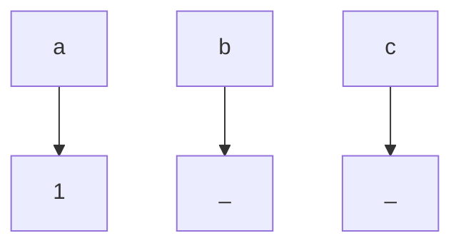
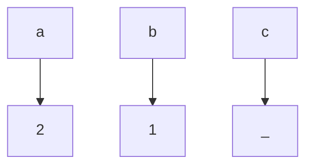
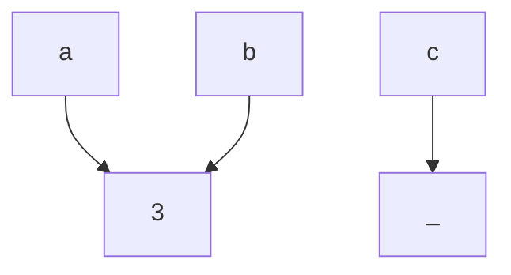
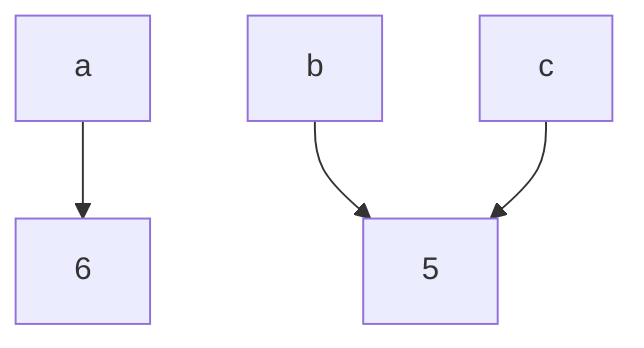
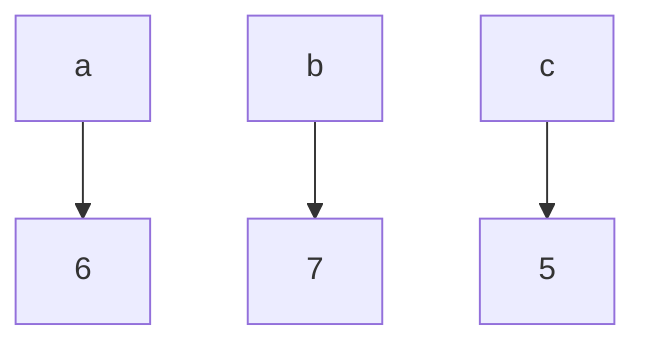

## Value vs reference

There are a lot of parameter-passing strategies. Let's start from two:

- **call-by-value**, the argument for a function parameter is a copy of the value of the argument
- **call-by-reference**, the function is given the address of the argument

For example, C uses **call-by-value** strategy for all arguments except pointers, for which it uses **call-by-reference**

## Variable assignment

Described strategies are always mentioned in the context of the variable binding for function calls, but they apply to all variable bindings e.g. assignments as well.

```c
int a = 1;
int* b = malloc(sizeof(*b));
int* c = malloc(sizeof(*c));
```



**call-by-value**

```c
*b = a;
// it copies value, so change of variable `a` isn't reflected in `b`
a = 2;
printf("a = %d, b = %d\n", a, *b);
```



**call-by-refernce**

```c
b = &a;
// change of variable `a` is reflected in `b`
a = 3;
printf("a = %d, b = %d\n", a, *b);
```



```c
// and vice versa - change of variable `b` is reflected in `a`
*b = 4;
printf("a = %d, b = %d\n", a, *b);
```


One more example of **call-by-reference**

```c
b = c;
// change of variable `b` is reflected in `c`
*b = 5;
// but change of variable `a` isn't reflected in `b` anymore
a = 6;
printf("a = %d, b = %d, c = %d\n", a, *b, *c);
```



We can think about the next example as **call-by-reference**, which creates a reference to a new "anonymous" variable

```c
// allocates new memory cell for b
b = malloc(sizeof(*b));
*b = 7;
printf("a = %d, b = %d, c = %d\n", a, *b, *c);
```



## Function call

```c
#include<stdio.h>

void modify(int p, int* q) {
    p = 10; // passed by value
    *q = 20; // passed reference
}

int main() {
    int a = 0;
    int b = 0;
    modify(a, &b);
    printf("a = %d, b = %d, c = %d\n", a, b); // a = 0, b = 20
    return 0;
}
```

## Call-by-sharing

Now the confusing part. Most popular languages, for example, Python, JavaScript, and Java use **call-by-sharing**. And people often confuse it with **call-by-reference**.

> We call the argument passing technique call by sharing because the argument objects are shared between the caller and the called routine. ... it is similar to argument passing in LISP.
> -- [CLU Reference manual](http://publications.csail.mit.edu/lcs/pubs/pdf/MIT-LCS-TR-225.pdf)

In **call-by-sharing**:

- primitive values, like numbers, booleans and similar behave, like in **call-by-value**
- non-primitive values, like objects, arrays and similar behave, like in **call-by-reference**
  - when you mutate reference you mutate all "aliases"
  - when you reassign reference you change "alias" - variable will contain a new reference and you can't reassign values in other "aliases"
  - **but** it is not possible to create a reference to a reference, like `int**`

In case of function calls it means that you can mutate variable in caller scope (because they are "shared"), but you can't reassign them in caller scope:

|                              | call-by-reference | call-by-sharing | call-by-value |
| ---------------------------- | ----------------- | --------------- | ------------- |
| can reassign in caller scope | + (see note)      | -               | -             |
| can mutate in caller scope   | +                 | +               | -             |

**Note**:

- to reassign, for example, integer or struct you need to use pointer `int*`, `struct Test*`
- to reassign, for example, an array you need to use "double" pointer `int**`

**Note 2**: "primitive values" are immutable

## Immutability and reassignment

If we would prohibit mutations and reassignment (like in many pure functional languages) 3 given strategies will look the same. **Call-by-value** is more expensive though because it needs to copy values.

## Code examples

**call-by-reference**

```c
#include<stdio.h>
#include <stdlib.h>

void mutate(int* a) {
    a[0] = 2;
}

// doesn't work
void reassign(int* a) {
    int b[1] = {3};
    a = b;
}

void reassign2(int** a) {
    int b[1] = {4};
    *a = b;
}

struct Test {
   int counter;
};

void reassign3(struct Test* c) {
    struct Test d = {counter: 5};
    *c = d;
}

int main() {
    // same as int a[1] = {1};
    int* a = malloc(sizeof(a));
    *a = 1;

    mutate(a);
    printf("a[0] = %d\n", a[0]);
    reassign(a);
    printf("a[0] = %d\n", a[0]);

    int** b = malloc(sizeof(b));
    b = &a;
    reassign2(b);
    printf("a[0] = %d\n", a[0]);

    struct Test c = {counter: 0};
    reassign3(&c);
    printf("c.counter = %d\n", c.counter);
    return 0;
}
```

**Call-by-sharing**:

```js
function mutate(a) {
  a[0] = 2;
}

// doesn't work
function reassign(a) {
  a = [3];
}

// not possible
// function reassign2(a) {}
// function reassign3(c) {}

let a = [1];

mutate(a);
console.log(a);
reassign(a);
console.log(a);
```

## PS

If you want to read more about other parameter-passing strategies, I recommend this [resource](https://opendsa.cs.vt.edu/ODSA/Books/PL/html/SLang2ParameterPassing.html).
