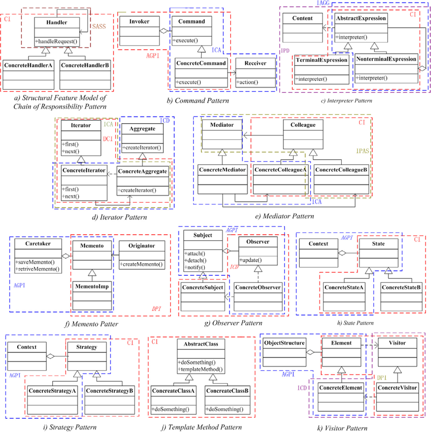

There is an ongoing discussion about the difference between object-oriented programming (OOP) and functional programming (FP). Let's talk about similarities instead.

In the previous post, we talked about "atoms": objects and functions. In this post let's talk about bigger building blocks.


## What is a design pattern?

Alexander et al. define a pattern as follows:

> A design pattern is a three-part rule, which expresses a relation between a certain context, a problem, and a solution. The pattern is, in short, at the same time a thing, ..., and the rule which tells us how to create that thing, and when we must create it.
>
> -- A Pattern Language: Towns, Buildings, Construction, 1977

They become popular after the book "Design Patterns: Elements of Reusable Object-Oriented Software" by Erich Gamma et al. (sometimes referred as Gang of Four - GoF).

There was prior work in this area, for example:

- SmallTalk introduced a lot of design patterns (including famous MVC)
- [Kent Beck talked about patterns in 1987](http://c2.com/doc/oopsla87.html), etc.

If we follow Alexander's definition there is nothing OOP specific (their book is about architecture anyway). For example, algorithms and data structures could be thought as patterns - if you need a list with O(1) access you can use arrays (or vectors), but the restriction is...

Currently when people say "design pattern" they most likely refer to GoF or similar OOP patterns.



Image source: Towards the Identification of Cross-Cutting Concerns: A Comprehensive Dynamic Approach Based on Execution Relations, Dongjin Yu, et al.

[Some people criticize the idea of design patterns](https://www.deconstructconf.com/2017/brian-marick-patterns-failed-why-should-we-care).

## What is a pattern in FP?

There is no same concept of "design pattern" in FP in sense of "bigger building blocks", the closest thing I can think of is categories from category theory. It is not bigger scale because function itself can be thought as a category.

I don't want to deep dive in category theory so I will give simplified picture, so we can do a simple comparison.

> Category theory is a toolset for describing the general abstract structures in mathematics.
>
> As opposed to set theory, category theory focuses not on elements x,y,⋯ – called objects – but on the relations between these objects...
>
> -- [ncatlab.org](https://ncatlab.org/nlab/show/category+theory)

You should have **approximate** understanding of what is category after this definition, not precise. We don't need precise because we will compare one pattern to the function as an example and stop there.

Typical critics of categories (in programming) is that it is hard to understand. By hard to understand I mean that they are very abstract and it is hard to relate to it.

> A monad is a monoid in the category of endofunctors, what's the problem?
>
> -- Joke from [A Brief, Incomplete, and Mostly Wrong History of Programming Languages](http://james-iry.blogspot.com/2009/05/brief-incomplete-and-mostly-wrong.html)

Other people may say that categories are easier to understand than design patterns because they are precisely defined (this is math). I look at it from this PoV: I was able to explain what pattern is (I hope), but for category theory, I gave only mare shadow of an explanation.

## Strategy vs function

There is a [big article which compares design patterns to categories](https://github.com/thma/LtuPatternFactory/blob/master/README.md). You can read it if you want more details. We will talk about one approachable example.

### Strategy pattern vs function (functor)

> The strategy pattern ... is a behavioral software design pattern that enables selecting an algorithm at runtime. Instead of implementing a single algorithm directly, code receives run-time instructions as to which in a family of algorithms to use

In OOP this pattern would be implemented as different objects (or classes) with the same method:

```js
// a11, a2
class AlphabeticCompare {
  compare(x, y) {
    /* ... */
  }
}

// a2, a11
class NaturalCompare {
  compare(x, y) {
    /* ... */
  }
}
```

In FP there is no need to construct objects for this, instead, we can pass functions as values:

```js
// a11, a2
const alphabeticCompare = (x, y) => {
  /* ... */
};

// a2, a11
const naturalCompare = (x, y) => {
  /* ... */
};
```

## Take away

My idea is to show that there are some core ideas which are same-ish in both paradigms.

