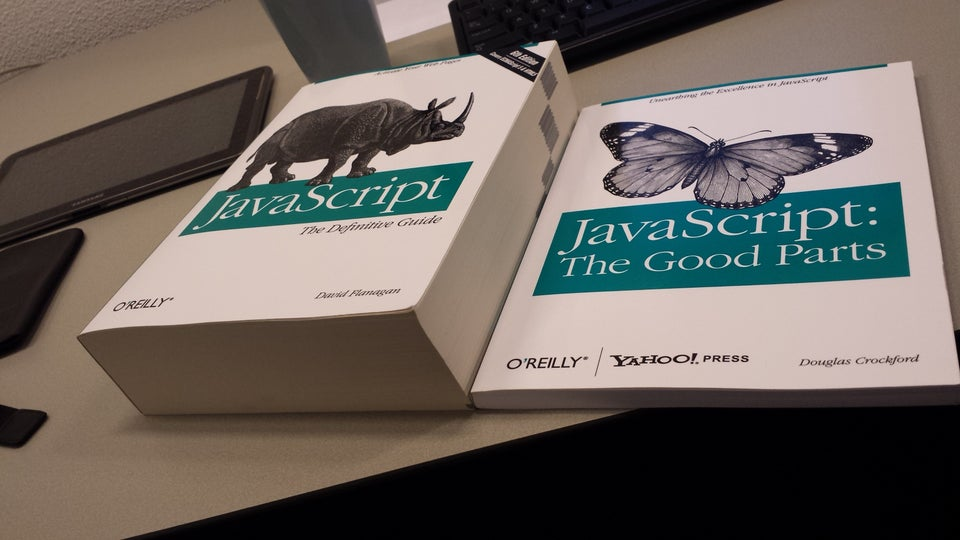

There is a famous book (at least it was some time ago), by the person who brought us JSON - JavaScript: good parts. It basically teaches which part of the languages are nice to use and won't get you in a trouble. Book was published way before ES6 and recent goodness. It was helpfull at the time.

(Image source: [reddit](https://www.reddit.com/r/ProgrammerHumor/comments/621qrt/javascript_the_good_parts/))

I had a thought: what if we can write down bad parts - things that you should avoid - for CSS.

- **Global styles**. Whenever I use styling based on tag names or use nested selectors I find conflict in styles eventually. Instead we can use unique class names for each element. This approach requires some tooling (for example, CSS Modules) or atomic styles.
- **Margins**. See [Margin considered harmful](https://mxstbr.com/thoughts/margin).
- **Z-index**. Whenever you start using z-index, eventually you will get `z-index: 999999999` or conflicting items (for example, custom select vs modal). Instead we can rely on order of elements in the DOM. See [Z Index Wars](https://reacttraining.com/reach-ui/dialog/#z-index-wars).

**What else would you recommend to avoid**?
