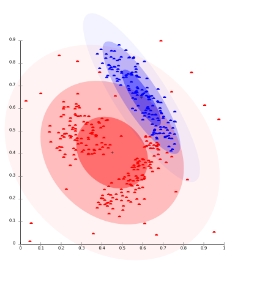
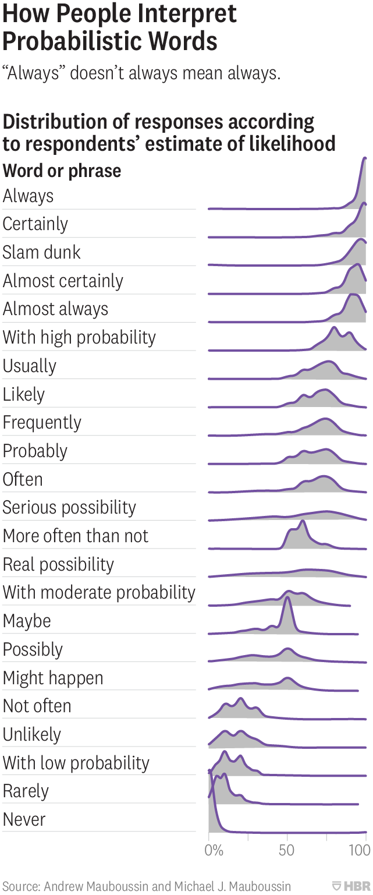

Definition as the system of meaning - we use symbols to communicate, to think, to store the information. Definition associate some symbol (word) with meaning (explained with other words, or conveyed by other means).

We can treat definitions as [formal systems](/content/posts/formal-system/index.md) - we give a small set of words which are defined without words, for example through images, gestures, etc. and then we can define all other words with the basic set.

On the other side some definitions come from trying to put some objects in one "bucket" by finding similarities (see clustering and [abstraction](/content/posts/abstraction/index.md)).

## From [Definitions in Arguments](http://www.mesacc.edu/~barsp59601/text/103/notes/5.html)

**A definition is simply the meaning we assign to a word-symbol.**

The Two Parts of a Definition:

- Definiendum - the thing (i.e., the 'term') being defined
- Definiens - the linguistic expression (i.e., the definition itself) of the definition, the qualities or properties asserted of the term.

Types of Definitions

- Intensional - (connotation) assigns meaning by indicating the qualities of the term
- Extensional - (denotation) assigns meaning by indicating the members of the class of the definiendum

Ways of Defining Terms

- Stipulative - assigning or giving a meaning to a term for a specific context
 - **Demonstrative** - (i.e., ostension) pointing to an object
 - **Extension/Enumeration** - naming the members of a class
 - **Difference** (i.e., negation) - listing what is not meant by a term; noting the distinctive characteristics of the term relative to what is not intended
 - **Genus** - the meta or larger class of things
 - **Species** - the smaller or subclass of things
- Lexical - The common meaning or usage of a term
 - **Synonymy** - giving other words which have the same meaning
 - **Enumeration** - listing the members of the class which the term denotes
 - **Etymology** - assigning meaning by noting a term's linguistic ancestry.
- **Theoretical** - assigning meaning based on the theoretical framework the term denotes.
- (Precising - assigning a meaning in a legal or theoretical context in order to clarify the contextual meaning of a word.)
- **Persuasive** - assigning meaning using emotive language intended to create an emotional response toward the definiendum.

Problems with Definitions

- Vagueness - lack of precision (a fuzzy definition)
 - Quantitative Vagueness - more precise numerical expression needed
 - Task-Related Vagueness
 - does it apply to a specific case
 - further factual information is not helpful in determining
- Ambiguity - more than one meaning is possible; it is unclear which is intended by the context
 - Referential Ambiguity - assuming the audience understands which of two possible references is meant.
 - Grammatical Ambiguity:
 - grammatical structure allows more than one interpretation
 - context does not clarify the meaning

## From [SEP](https://plato.stanford.edu/entries/definitions/)

**Nominal definitions** — definitions that explain the meaning of a term.

A **stipulative definition** imparts a meaning to the defined term, and involves no commitment that the assigned meaning agrees with prior uses (if any) of the term. Stipulative definitions are epistemologically special. They yield judgments with epistemological characteristics that are puzzling elsewhere.

**Descriptive definitions**, like stipulative ones, spell out meaning, but they also aim to be adequate to existing usage.

An **explication** aims to respect some central uses of a term but is stipulative on others. The explication may be offered as an absolute improvement of an existing, imperfect concept. Or, it may be offered as a “good thing to mean” by the term in a specific context for a particular purpose.

**Ostensive definitions** typically depend on context and on experience... Thus, Russell maintains in Human Knowledge that

> all nominal definitions, if pushed back far enough, must lead ultimately to terms having only ostensive definitions, and in the case of an empirical science the empirical terms must depend upon terms of which the ostensive definition is given in perception

The kinds into which we have sorted definitions are not mutually exclusive, **nor exhaustive**.

## From [Definitions, Dictionaries, and Meanings](https://www.sfu.ca/~swartz/definitions.htm)

| Kind of definition | Definiendum | Dictionary definition |
| ------------------ | ----------- | --------------------------------------------------------------------------------------------------------------------------------------------------------------------------------------------------- |
| Synonyms | asteroid | planetoid |
| Grammatical use | the | preceding an adj. or adv. in the compar. degree, the two words forming an adverbial phrase modifying the predicate |
| Species-genus | red | Having, or characterized by, the colour which appears at the lower end or least refracted end of the visible spectrum, and is familiar as that of blood, fire, the poppy, the rose, and ripe fruits |
| Opposite | pain | The opposite of 'pleasure' |
| Cause (implicit) | pain | The sensation which one feels when hurt |
| Cause (explicit) | jaundice | A morbid condition caused by obstruction of the bile and marked by yellowness of the conjunctiva |
| Functional | hammer | An instrument having a hard solid head, usually of metal, set transversely to the handle, used for beating, breaking, driving nails, etc. |
| Circular | odor | A smell; scent; aroma |
| | smell | Something that is smelled; odor; scent |
| | scent | 1. an odor. 2. the sense of smell. 3. a perfume. 4. an odor left by an animal, by which it is tracked |
| | aroma | A pleasant odor; fragrance |
| | fragrant | Having a pleasant odor |
| | perfume | 1. an aroma; fragrance. 2. a substance producing a pleasing odor, as a liquid extract of the scent of flowers |

Etymology - the study of the origins of words; where the meaning of a word comes from.

## Non-circular dictionary

If we would investigate natural language we would find that we use words to define words. Dictionary is built with words. This means that there either circular definition or some definitions rely on the ostensive definition (pictures or similar).

There is a specific type of vocabularies, which make sure there are no circular definitions ([a non-circular dictionary](http://learnthesewordsfirst.com/about/what-is-a-multi-layer-dictionary.html) or multi-layer dictionaries):

- **Basic vocabulary**: The most basic words are explained for beginning-level learners, using illustrations, translations, etc. These words are presented in a series of short lessons.
- **Defining vocabulary**: These intermediate-level words are explained using only the words from the basic vocabulary lessons.
- **Full dictionary**: This includes advanced-level words, all explained using only the defining vocabulary.

## Clustering

> 66. Consider for example the proceedings that we call "games". I mean board-games, card-games, ball-games, Olympic games, and so on. What is common to them all?—Don't say: "There must be something common, or they would not be called 'games' "—but look and see whether there is anything common to all.—For if you look at them you will not see something that is common to all, but similarities, relationships, and a whole series of them at that.
>
> -- Philosophical investigations, Ludwig Wittgenstein

Some objects share only part of characteristics associated with the group yet we can classify them as belonging to the group (e.g. fitting the definition). Objects create a network in which some has more similarities and other less.

There is a very vague definition of how much characteristics one object should have to be considered a member of the group or not. This process of dividing objects into a group based on properties is called clustering.

Image source: [wikipedia](https://en.wikipedia.org/wiki/Cluster_analysis#/media/File:EM-density-data.svg).

Cluster analysis divide data into groups (clusters) that are meaningful, useful, or both of it.

> There are a number of different methods that can be used to carry out a cluster analysis; these methods can be classified as follows:
>
> - Hierarchical methods
>   - Agglomerative methods, in which subjects start in their own separate cluster. The two "closest" (most similar) clusters are then combined and this is done repeatedly until all subjects are in one cluster. At the end, the optimum number of clusters is then chosen out of all cluster solutions.
>   - Divisive methods, in which all subjects start in the same cluster and the above strategy is applied in reverse until every subject is in a separate cluster. Agglomerative methods are used more often than divisive methods, so this handout will concentrate on the former rather than the latter.
> - Non-hierarchical methods (often known as k-means clustering methods)
>
> -- [Statistics: 3.1 Cluster Analysis](http://www.statstutor.ac.uk/resources/uploaded/clusteranalysis.pdf), Rosie Cornish. 2007

Image source: [@jxxf](https://twitter.com/jxxf/status/1149837396847947776)
