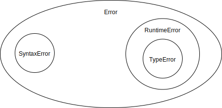
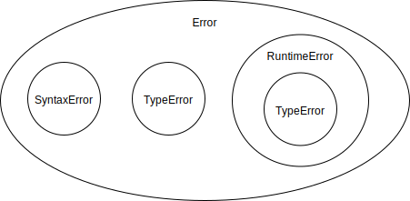
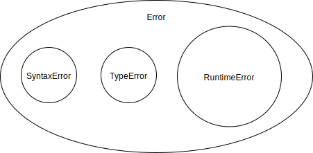

In [previous post](/posts/programming-language-to-write-or-not-to-write) we talked about parsing, evaluation and REPL. In this post, we will talk about errors.

<!--more-->

## What are errors?

> Definition of error
>
> 1: an act involving an unintentional deviation from truth or accuracy
>
> 2: an instance of false belief
>
> 3: something produced by mistake
>
> 4: the difference between an observed or calculated value and a true value
>
> 5: a deficiency or imperfection in structure or function
>
> -- [merriam-webster](https://www.merriam-webster.com/dictionary/error)

Errors are the product of a human's mind. Error happens when:

- human's expectations are not met
- when we don't know the answer (undefined behavior)
- when some knowledge (or belief) contradicts another (paradox)

### Undefined behavior

> Undefined: not clearly or precisely shown, described, or limited
>
> -- [merriam-webster](https://www.merriam-webster.com/dictionary/undefined)

For example, this what happens when you try to divide by 0 in a mechanical calculator.


Image credit: [popularmechanics.com](https://www.popularmechanics.com/technology/gadgets/a20152/dividing-by-zero-will-mechanical-calculator/).

### Paradoxes

> Paradox: a self-contradictory statement that at first seems true
>
> -- [merriam-webster](https://www.merriam-webster.com/dictionary/paradox)


Image credit: [illusionsindex](https://www.illusionsindex.org/i/impossible-triangle).

## Computer error


When computer (software or hardware) error happens this basically means, that creator of software or hardware, don't know or can't handle given situation and decided to "give up" and return the error to a higher level, which can be other software or hardware or user.

For example,

- don't know how to handle: `0/0`, `1 + "apple"`
- can't handle: connect to a remote server when the network is down, didn't get a response on time

Errors are the last retreat of the programmer. You can always return an error instead of the actual result.

## How computer communicates errors?

There are two ways how a computer (software or hardware) can communicate errors to a higher level:

- through return value: special values (for example [`NaN`](https://www.doc.ic.ac.uk/~eedwards/compsys/float/nan.html)) or "Either" monad or [Go's style pair of `[err, res]`](https://www.innoq.com/en/blog/golang-errors-monads/)
- through side-channel: exceptions, [panic](https://gobyexample.com/panic), [kernel panic](https://github.com/torvalds/linux/blob/master/kernel/panic.c)

> When an exception or interrupt occurs, the hardware begins executing code that acts in response to the exception. This action may involve killing a process, outputting an error message, communicating with an external device, or horribly crashing the entire computer system by initiating a "Blue Screen of Death" and halting the CPU
>
> -- [Exception and Interrupt handling in the MIPS architecture](http://people.cs.pitt.edu/~don/coe1502/current/Unit4a/Unit4a.html)

## Errors in a programming language

Let's get back to the main subject of this series - programming languages. What kind of errors do we need to deal with in programming languages?

There are different ways how we can classify errors, for example in our implementation of Calcy (small PL from the previous post), we have two stages - parsing and evaluation, so we can have two types of error: syntax errors (computer can't parse given program), runtime errors (computer can't evaluate given input).

We can further refine the classification of runtime errors to:

- general runtime errors, for example, missing function (the computer doesn't know this function)
- type errors, for example, try to subtract symbol from the number, but the computer can only subtract numbers from numbers. Read more about types [here](/posts/type-system-faq).

So our hierarchy can look like this:



But for example, we can introduce type checking prior evaluation (static type checking), if our type checker can't catch all errors and we still have to do some type checking at runtime it means that error hierarchy will look like this:



If our type checker is ideal and we can prevent all type errors, it will look like this:



**Note**: absence type errors at runtime, doesn't mean there is no dynamic type checking, it simply means that we handled all edge cases related to types (including unsuccessful dynamic type checks).

### Syntax errors

Current implementation of Calcy can have 3 syntax errors:

```js
try {
  parse(")");
} catch (e) {
  assert.equal(e.message, `Unexpected ")"`);
}
try {
  parse("(* 2 2");
} catch (e) {
  assert.equal(e.message, `Expected ")" at the end of the input`);
}
try {
  parse("()()");
} catch (e) {
  assert.equal(e.message, `Unexpected "(" after ")"`);
}
```

Three examples above are syntactically wrong:

- we require all parenthesis to match
- we require one root element

### Runtime errors

For now we handle only cases when there are 2 arguments in arithmetic operations:

```js
let [name, first, second] = ast;
if (name === "+") {
  return evaluate(first) + evaluate(second);
}
```

So the third and next arguments are silently ignored. I don't think this is user-friendly. We either need to handle any number of arguments or return an error.

Let's treat it as an error for now:

```js
const numberOfArguments = ast.length - 1;
if (name === "+") {
  if (numberOfArguments !== 2) {
    throw new TypeError(
      `"${name}" expects 2 arguments, instead got ${numberOfArguments}`
    );
  }
  return evaluate(first) + evaluate(second);
}
```

In Calcy we have two types of values:

- symbols: `+`, `-`, `*`, `x` etc. Used as identifiers of operations (or functions)
- numbers: `1`, `2`, `-3` etc.

What would happen if a user would use the symbol in a place where the number expected:

```lisp
(+ x 1)
```

At the moment it will propogate error result from underneath layer (JS), which in turn propagates it from it's underneath system (FPU - floating-point unit). I would like to handle error in consistent manner, so let's add type checking for this as well:

```js
if (name === "+") {
  // ...
  if (!isExpression(first) && typeof first !== "number") {
    throw new TypeError(
      `"${name}" expects number as the first argument, instead got "${first}"`
    );
  }
  if (!isExpression(second) && typeof second !== "number") {
    throw new TypeError(
      `"${name}" expects number as the second argument, instead got "${second}"`
    );
  }
  return evaluate(first) + evaluate(second);
}
```

Note: every expression in Calcy evaluates to a number.

There is one more obvious case for runtime error - unknown function:

```js
if (name === "+") {
  // ...
} else if (name === "-") {
  // ...
} else {
  throw new RuntimeError(`"${name}" is not a function`);
}
```

Tests:

```js
try {
  evaluate(parse("(* 2 2)"));
} catch (e) {
  assert.equal(e.message, `"*" is not a function`);
}
try {
  evaluate(parse("(+ 2 2 2)"));
} catch (e) {
  assert.equal(e.message, `"+" expects 2 arguments, instead got 3`);
}
try {
  evaluate(parse("(+ x x)"));
} catch (e) {
  assert.equal(
    e.message,
    `"+" expects number as the first argument, instead got "x"`
  );
}
```

There are some errors which we don't take into account: numbers overflow, stack overflow, not enough memory.

## Type checker

At the moment we are doing type checking at runtime (at evaluation time), but we can implement the additional function (program) which will do type check before execution. In case of REPL and deterministic PL without side effects, this doesn't add a lot of value, so I guess we will add this later.

## PS

In this post, we talked about errors and types a bit. In the next step probably we will add variables or user-defined functions.

Source code for this post is [here](https://github.com/stereobooster/write-a-language/tree/master/02.error).
