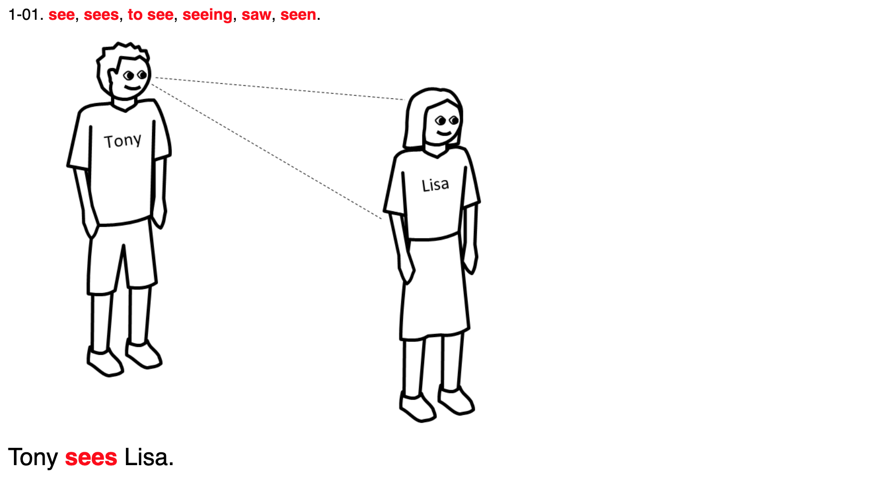

## Formal system

> A formal system is like a game in which **tokens** are manipulated according to **rules** in order to see what configurations can be obtained. Examples: chess, checkers, go, tic-tac-toe. Nonexamples: marbles, billiards, baseball.
>
> -- [What is a Formal System?](https://www.cs.indiana.edu/~port/teach/641/formal.sys.haug.html)

> ---
>
> A formal system consists of a language over some alphabet of **symbols** together with (axioms and) **inference rules** that distinguish some of the strings in the language as theorems.
>
> -- [Formal Systems](https://cs.lmu.edu/~ray/notes/formalsystems/)

> ---
>
> Each formal system has a formal language composed of primitive **symbols** acted on by certain **rules** of formation (statements concerning the symbols, functions, and sentences allowable in the system) and developed by inference from a set of axioms.
>
> In an axiomatic system, the primitive symbols are undefined; and all other symbols are defined in terms of them.
>
> -- [Britanica](https://www.britannica.com/topic/formal-system)

Given some set of [symbols](/posts/symbolic-thinking) (or tokens) and some rules on how we can put those symbols together, we can produce new configurations. This is a very simple idea which lies in the center of logic and math.

### Examples

Construction toys (like Lego), can be thought as formal systems. You have a set of tokens, and rules are based on physical restrictions.

The "MU Puzzle" proposed by Hofstadter in his [GEB book](https://ocw.mit.edu/high-school/humanities-and-social-sciences/godel-escher-bach/video-lectures/lecture-1-video/).

[Peano axioms](https://www.britannica.com/science/Peano-axioms) which describe natural numbers with `0` and `+1` (successor operation).

[Euclidean geometry](https://archive.org/details/firstsixbooksofe00byrn/page/n6) which builds a set of rules based on a small set of axioms.

[John Conway's Game of Life](https://bitstorm.org/gameoflife/) consists of a field of cels and rules which define the state of the board on the next move.

### Metalogic

> Metalogic has led to a great deal of work of a mathematical nature in axiomatic set theory, model theory, and recursion theory (in which functions that are computable in a finite number of steps are studied).
>
> -- [Britanica](https://www.britannica.com/topic/metalogic/Influences-in-other-directions)

## Axiom

> Axiom, in logic, an indemonstrable first principle, rule, or maxim, that has found general acceptance or is thought worthy of common acceptance whether by virtue of a claim to intrinsic merit or on the basis of an appeal to self-evidence. An example would be: “Nothing can both be and not be at the same time and in the same respect.”
>
> -- [Britanica](https://www.britannica.com/topic/axiom)

> ---
>
> 1. a statement accepted as true as the basis for argument or inference
> 2. an established rule or principle or a self-evident truth
> 3. a maxim widely accepted on its intrinsic merit
>
> -- [Merriam-Webster](https://www.merriam-webster.com/dictionary/axiom)

Axiom is some statement which is given without proof. Both symbols and rules from formal systems can be referred to as axioms.

> Cogito, ergo sum. (Latin for "I think, therefore I am")
>
> -- René Descartes

If axioms are unprovable how do we know what we know? Isn't it all just a castle built in the air.

### Dictionary

If we would investigate natural language we would find that we use words to define words. Dictionary is built with words.

There is a different approach to this problem - [A Non-Circular Dictionary](http://learnthesewordsfirst.com/about/what-is-a-multi-layer-dictionary.html):

- **Basic vocabulary**: The most basic words are explained for beginning-level learners, using illustrations, translations, etc. These words are presented in a series of short lessons.
- **Defining vocabulary**: These intermediate-level words are explained using only the words from the basic vocabulary lessons.
- **Full dictionary**: This includes advanced-level words, all explained using only the defining vocabulary.

### Defintion

> **Nominal definitions** — definitions that explain the meaning of a term.
>
> A **stipulative definition** imparts a meaning to the defined term, and involves no commitment that the assigned meaning agrees with prior uses (if any) of the term. Stipulative definitions are epistemologically special. They yield judgments with epistemological characteristics that are puzzling elsewhere.
>
> **Descriptive definitions**, like stipulative ones, spell out meaning, but they also aim to be adequate to existing usage.
>
> An **explication** aims to respect some central uses of a term but is stipulative on others. The explication may be offered as an absolute improvement of an existing, imperfect concept. Or, it may be offered as a “good thing to mean” by the term in a specific context for a particular purpose.
>
> **Ostensive definitions** typically depend on context and on experience... Thus, Russell maintains in Human Knowledge that
>
> all nominal definitions, if pushed back far enough, must lead ultimately to terms having only ostensive definitions, and in the case of an empirical science the empirical terms must depend upon terms of which the ostensive definition is given in perception
>
> The kinds into which we have sorted definitions are not mutually exclusive, **nor exhaustive**.
>
> -- [SEP](https://plato.stanford.edu/entries/definitions/)

> ---
>
> The Two Parts of a Definition:
>
> - Definiendum - the thing (i.e., the 'term') being defined
> - Definiens - the linguistic expression (i.e., the definition itself) of the definition, the qualities or properties asserted of the term.
>
> Types of Definitions
>
> - Intensional - (connotation) assigns meaning by indicating the qualities of the term
> - Extensional - (denotation) assigns meaning by indicating the members of the class of the definiendum
>
> Ways of Defining Terms
>
> - Stipulative - assigning or giving a meaning to a term for a specific context
>   - **Demonstrative** - (i.e., ostension) pointing to an object
>   - **Extension/Enumeration** - naming the members of a class
>   - **Difference** (i.e., negation) - listing what is not meant by a term; noting the distinctive characteristics of the term relative to what is not intended
>     - **Genus** - the meta or larger class of things
>     - **Species** - the smaller or subclass of things
> - Lexical - The common meaning or usage of a term
>   - **Synonymy** - giving other words which have the same meaning
>   - **Enumeration** - listing the members of the class which the term denotes
>   - **Etymology** - assigning meaning by noting a term's linguistic ancestry.
> - **Theoretical** - assigning meaning based on the theoretical framework the term denotes.
> - (Precising - assigning a meaning in a legal or theoretical context in order to clarify the contextual meaning of a word.)
> - **Persuasive** - assigning meaning using emotive language intended to create an emotional response toward the definiendum.
>
> Problems with Definitions
>
> - Vagueness - lack of precision (a fuzzy definition)
>   - Quantitative Vagueness - more precise numerical expression needed
>   - Task-Related Vagueness
>     - does it apply to a specific case
>     - further factual information is not helpful in determining
> - Ambiguity - more than one meaning is possible; it is unclear which is intended by the context
>   - Referential Ambiguity - assuming the audience understands which of two possible references is meant.
>   - Grammatical Ambiguity:
>     - grammatical structure allows more than one interpretation
>     - context does not clarify the meaning
>
> -- [Definitions in Arguments](http://www.mesacc.edu/~barsp59601/text/103/notes/5.html)

Table from [Definitions, Dictionaries, and Meanings
](https://www.sfu.ca/~swartz/definitions.htm).

| Kind of definition | Definiendum | Dictionary definition                                                                                                                                                                               |
| ------------------ | ----------- | --------------------------------------------------------------------------------------------------------------------------------------------------------------------------------------------------- |
| Synonyms           | asteroid    | planetoid                                                                                                                                                                                           |
| Grammatical use    | the         | preceding an adj. or adv. in the compar. degree, the two words forming an adverbial phrase modifying the predicate                                                                                  |
| Species-genus      | red         | Having, or characterized by, the colour which appears at the lower end or least refracted end of the visible spectrum, and is familiar as that of blood, fire, the poppy, the rose, and ripe fruits |
| Ppposite           | pain        | The opposite of 'pleasure'                                                                                                                                                                          |
| Cause (implicit)   | pain        | The sensation which one feels when hurt                                                                                                                                                             |
| Cause (explicit)   | jaundice    | A morbid condition caused by obstruction of the bile and marked by yellowness of the conjunctiva                                                                                                    |
| Functional         | hammer      | An instrument having a hard solid head, usually of metal, set transversely to the handle, used for beating, breaking, driving nails, etc.                                                           |
| Circular           | odor        | A smell; scent; aroma                                                                                                                                                                               |
|                    | smell       | Something that is smelled; odor; scent                                                                                                                                                              |
|                    | scent       | 1. an odor. 2. the sense of smell. 3. a perfume. 4. an odor left by an animal, by which it is tracked                                                                                               |
|                    | aroma       | A pleasant odor; fragrance                                                                                                                                                                          |
|                    | fragrant    | Having a pleasant odor                                                                                                                                                                              |
|                    | perfume     | 1. an aroma; fragrance. 2. a substance producing a pleasing odor, as a liquid extract of the scent of flowers                                                                                       |

Etymology - the study of the origins of words; where the meaning of a word comes from.

## Model

> To model a phenomenon is to construct a formal theory that describes and explains it. (In a closely related sense, you model a system or structure that you plan to build, by writing a description of it.)
>
> -- [SEP](https://plato.stanford.edu/entries/model-theory/)

> ---
>
> A map is not the territory it represents, but, if correct, it has a similar structure to the territory, which accounts for its usefulness.
>
> -- Science and Sanity, Alfred Korzybski

Model is not the same as reality. It is just a useful representation. The usefulness of the model comes from it impreciseness - some details removed, which allows us to focus on what matters (see [abstraction](/posts/abstraction)).

Because the model is just some symbolic representation of reality, it can "fit" for more than one reality. When we find similarities between different models we call it correspondence, for example, see [Physics, Topology, Logic, and Computation: A Rosetta Stone](https://arxiv.org/pdf/0903.0340.pdf).

| Category Theory | Physics | Topology  | Logic       | Computation |
| --------------- | ------- | --------- | ----------- | ----------- |
| object          | system  | manifold  | proposition | data type   |
| morphism        | process | cobordism | proof       | program     |

As well we can define more than one model to represent the same reality.
