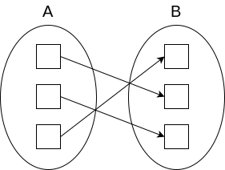

Minimal introduction: from theoretical concept of function to practical usage of closures in programming. I show the same concept from different point views, so you can build a deeper understanding.


## Function

Simplified definition:

> Functions assign a single output for each of their inputs.
> -- [khanacademy](https://www.khanacademy.org/math/algebra/algebra-functions/evaluating-functions/v/what-is-a-function)

More formal definition:

> A function is a relation that uniquely associates members of one set with members of another set. Function from `A` to `B` is an object `f` such that every `a in A` is uniquely associated with an object `f(a) in B`. A function is therefore a many-to-one (or sometimes one-to-one) relation. The set `A` of values at which a function is defined is called its `domain`, while the set `f(A) subset B` of values that the function can produce is called its `range`. Here, the set `B` is called the `codomain` of `f`.
> -- [Mathworld Wolfram](http://mathworld.wolfram.com/Function.html)

Example of function:

```math
f(x) = x
```

As well function can be called "lambda" or "λ" in terms of [lambda calculus](https://www.inf.fu-berlin.de/lehre/WS03/alpi/lambda.pdf):

```lambda
λx.x
```

_Side note_: I provide examples in lambda calculus, but they are not essential, you can skip it.

or "map" e.g. it maps from `A` to `B`:



or we can think about function as a table (set of tuples `(x, f(x))`):

| x   | f(x) |
| --- | ---- |
| 1   | 1    |
| 2   | 2    |
| ... | ...  |

or it can be represented as points in Cartesian coordinates:


In programming they are called functions or "anonymous functions" or "lambdas", for example in JS:

```js
const identity = x => x;
```

or "methods" - functions bounded to an object

```js
class Example {
  identity(x) {
    return x;
  }
}
```

## Variable

In the given example `x` is variable. There can be more than one variable:

```math
f(x, y, z) = x + y + z
```

As well it can be called "argument" or "parameter". All arguments together can be called "input".

We can use any symbols to represents variables, for example with more meaningful names

```math
f(longitude, latitude) = ...
```

## Specifying the function

Specification of the function is any kind of explanation about how input relates to the output. It can be a simple mathematical formula

```math
f(x) = x + 1
```

it can be any kind of instruction

```math
f(x) = <if x is even then x + 1; if x is odd then x - 1>
```

or another descriptive way.

In programming function is specified by the "body" of the function:

```js
const f = x => x + 1;
// or
const f = x => {
  return x + 1;
};
```

In lambda calculus, the function is specified by the expression

```math
function := λ<variable>.<expression>
```

where expression is

```bnf
<expression> := <variable> | <function> | <application>
<application> := <expression> <expression>
```

(Don't focus on this, for now, we will get back to the application and it will be more clear)

### Application

Function application or variable substitution is when you provide variable to get actual value of the function:

```math
f(x) = x + 1
for x = 1, f(1) = 1 + 1 = 2
for x = 2, f(2) = 1 + 2 = 3
etc.
```

In programming it is named "function call" or “evaluation” or “execution” or “computation”:

```js
const f = x => x + 1;
f(1); // is 2
f(2); // is 3
```

in JS there are two more ways to do it because in JS they need a way to bind special variable `this`. This is not essential information I provide it for the fullness of the picture

```js
f.call(null, 1); // is 2, first argument is for `this`, which we don't use
f.apply(null, [1]); // is 2, first argument is for `this`, which we don't use
```

In lambda calculus, they write application as

```lambda
λx.x y
or
(λx.x) y
```

the first expression is applied function (`λx.x`), the second expression is a value (`y`). Result of application is `y`.

### Function as a value

We can treat functions as values - pass it inside other functions of return from other functions. Functions which can return functions or take functions as input called higher-order functions, which is a bit of confusing from my point of view, because those three words which get abbreviated as HOF make it seem like as if there is something special about those functions, but they are just the same functions if you treat functions as values `¯\_(ツ)_/¯`.

There is a different term for functions as values - functions in this case called "first-class citizens" (am I alone who think this is somehow racist term?)

For example, treating functions as values can be used for polymorphism. Imagine you have list (or array), there is generic filter function, by providing different functions to the filter you can change it's behaviour:

```js
[1, 2, 3, 4, 5, 6]
  .filter(x => x % 2) // 1, 3, 5
  [(1, 2, 3, 4, 5, 6)].filter(x => !(x % 2)); // 2, 4, 6
```

Polymorphism is not the only example, we will see more examples of functions as values below. Treating functions as values allow to do some cool tricks.

Example in lambda calculus:

```lambda
λx.(λz.(z x))
```

z is a function in this example, we apply z to x in the end.

### Partial application

If our function has more than one variable, we don't have to provide all variables at once, we can provide just some of it first and the rest later

```math
f(x, y) = x + y
f1(y) = f(2, y) = 2 + y
f1(1) is 3
```

For example, we can imagine a function which defines the curve in 3-dimensional space and by "fixing" one of the variables (substituting by actual value) we are doing slice (or projection).

But what to do if we don't have a formula in front of us, what if we treat the function as a black box? We can say: okay let's keep in mind that we have some value for this variable and continue until we get all arguments for the function so we can "fully" apply function. This is typical for programming, we deal with functions as black boxes for encapsulation reasons. For example, we can introduce a function `partiallyApplyOne`:

```js
const partiallyApplyOne = (f, variableToBind) => y => f(variableToBind, y);
```

As you can see there is no immediate invocation of the function `f` instead we wrap it into another function which takes only one argument and we will call the original function as soon as we will get all variables

```js
const f = (x, y) => x + y;
const f1 = partiallyApplyOne(f, 2);
```

`f1` is the new function `(y) => f(variableToBind, y)`, we "keep in mind" that in this case `variableToBind` is 2. When we call `f1(1)` we substitute 1 for y in `(y) => f(variableToBind, y)` and now we have all required variables to call original `f` e.g. `f(2, 1)`.

We can say that partial application produces new function (returns function e.g. treats the function as a variable) with a smaller number of the variables (with smaller "arity").

In programming partial application can be called "binding" as well. In JS they have additional form of binding because they need a way to bind special variable `this`:

```js
const f = (x, y) => x + y;
const f1 = f.bind(null, 2); // first argument is for `this`, which we don't use
f1(1); // 3
```

In lambda calculus, they use the term "bind" to describe variables mentioned before dot, in contrast to "free" variables which are not mentioned

```lambda
λx.xy
```

In this example, `x` is a bound variable and `y` is a "free" variable.

## Closure

We mentioned this magic technique of "keeping variable in mind" before, without proper explanation. How to attach variable to the function? To do this we need to use closures. The closure is a function with an environment (context where it was defined or "created"). Closures are lexically scoped which means:

- that its scope is limited by the function body (variable of the function are in the scope as well)
- closures can be nested e.g. sub-function can access its own scope and all it's parents scopes
- but parent function can't access children scopes

Let's see the example:

```js_closures
const a = (x) => {
|  const i = 0;
|  const b = (y) => {
|  |  const j = 1;
|  |  const c = (z) => {
|  |  |  return i + j + x + y + z;
|  |  }
|  }
|  return b;
}
```

The first level is the scope of function `a`, it can "see" variables `b`, `i` and `x`, but not `y`, `j`, `c`, `z`. Strictly speaking function `a` can "see" variable `a` as well because it comes from a parent (top-most or global) scope.
The second level is the scope of function `b`: `c`, `y`, `j`, from the parent scopes `a`, `b`, `x`, `i`
The third level is the scope of function `c`: `z`, from the parent scopes `a`, `b`, `c`, `x`, `y`, `z`, `i`, `j`

On practice closures are implemented as "environment" which is get passed along with the function and used to resolve variables: evaluator asks for variables from the environment, if the environment doesn’t have required variable, evaluator asks for it from the parent environment and will continue to do so until gets an answer or reach top-most environment.

Closure typically use lexical scope, but there are different ways to resolve scope, for example, dynamic scope. Lexical scope is easier to reason about.

In lambda calculus terms: a closure consists of an (open) lambda term, plus an environment containing the values of its free variables.

### Closure on practice

Closures can be used in many interesting ways (we already saw binding), for example, we can write memoization function with the help of closures

```js
const memo = f => {
  const cache = WekMap(); //closure variable
  return x => {
    if (!cache.has(x)) {
      cache.set(x, f(x));
    }
    return cache.get(x);
  };
};
```

or we can write debounce function

```js
const debounce = (f, time) => {
  let timer; //closure variable
  return x => {
    clearTimeout(timer);
    timer = setTimeout(() => {
      f(x);
    }, time);
  };
};
```

_Side note 1_: in math, they don’t have mutations (the first example breaks this rule) and they have referential transparency e.g. can’t reassign variables (the second example breaks this rule), but those rules are not essential for the closure as the concept.

_Side note 2_: examples for the simplicity use one argument, but it is possible to have more than one.

## PS

There are some ideas which I didn't cover in this article, like recursion, currying, composition, and others - this is for the next article.
