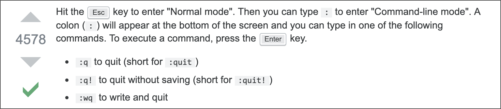
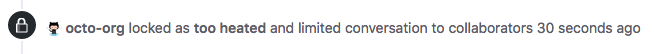
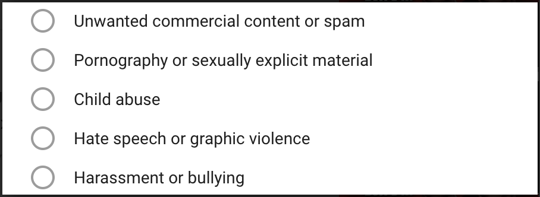
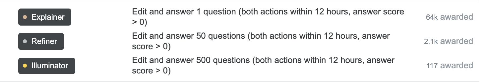
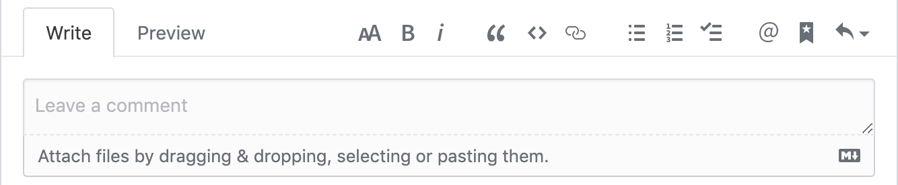

> The first rule of the internet: Don't read the comments.
>
> -- Ralph Breaks the Internet

**First** of all this is not a technological problem, the problem is sociological. People don't follow the same patterns when they communicate online and offline when they talk to people who they know and people who they don't know.

**Second** part of the problem is that text is a poor medium for conversation. Comments are bad, Twitter is the worst - it is build to escalate miscommunication and hot-takes.

**Third** part is the scale at which people got connected. It is very hard to moderate current volumes of information.

**There is no solution to the problem, but there are approaches.**

## Code of conduct

This is a social problem - no amount of technologies alone will solve it. Required step (IMO) is to have CoC.

For example: [dev.to CoC](https://dev.to/code-of-conduct), [Geek Feminism Blog comment policy](https://geekfeminismdotorg.wordpress.com/comment-policy/).

## Karma

Karma system can help to moderate at scale. Karma system is based on positive and negative reactions to comments (and blog posts). The tricky part here is to make the score invisible otherwise it gets gamified e.g. people try to increase karma to score higher ranks.

Example: dev.to doesn't have a scoreboard and doesn't show a number of followers in contrast to [hacker news](https://news.ycombinator.com/leaders) and [reddit](https://www.reddit.com/r/help/wiki/faq#wiki_how_does_karma_work.3F).

StackOverflow uses [reputation](https://meta.stackexchange.com/questions/7237/how-does-reputation-work) to [limit which actions are available for users](https://meta.stackexchange.com/questions/164899/the-complete-rate-limiting-guide).

## See no evil

> Photo by HUNTER LEONARD on Unsplash

The approach in which negative responses or reactions are hidden. This is done to avoid pitchforks. Moderators can contact person with a big number of negative reactions to inform, that this is an inappropriate comment. Or it can be a different situation - the comment was appropriate and negative reaction caused by intolerant people (and instead we can flag all of them).

Example: dev.to doesn't have public negative reactions.

## Reactions

Likes have been criticized because it is not a very big range of reactions, sometimes it is not appropriate.

On the other hand, some reactions, which are typically implemented as emojis are very confusing, for example, wink emoji (😉) can be confusing.

Example: GitHub comments have 8 reactions: 👍 👎 😄 🎉 😕 ❤️ 🚀 👀.

## Expiration date

Ability to comment on old posts can be misused by trolls to harass people. It can be very time consuming to answer all the posts, so instead of an obligation to answer to the posts infinitely, people can choose to lock comments after some period.

If people would like to continue the conversation they can create a new post.

Example: [GitHub lock bot](https://github.com/apps/lock)

## Rate limit

To avoid overheated conversation we can force some pauses between comments to prevent emotional responses people would regret later.

Example: [hackernews flame detector](https://github.com/minimaxir/hacker-news-undocumented/blob/master/README.md#flame-war-detector).

## Algorithms for spam detection

Algorithms can be used to detect spam. The algorithm can be as simple as track number of link per post or tracking keywords.

Examples: [Akismet](https://akismet.com/)

## Algorithms for tone detection

Modern algorithms (ML, AI) can be used to detect the tone of the message. The problem is that those algorithms are imprecise. The solution is to use tone detection, but don't block based on it instead show the score to commenter so they would be aware.

Examples: [Google’s Perspective API](http://perspectiveapi.com/#/home), [Conversation AI](https://conversationai.github.io/), [Tone Analyzer](https://tone-analyzer-demo.ng.bluemix.net/), [Sentiment Analysis](https://www.infoq.com/articles/sentiment-analysis-whats-with-the-tone/).

## Flags

To help to moderate comments system can provide flags, so the user can help with the moderation process. Flags are helpful if they are granular and clearly defined, examples of categories: spam, offtopic, NSFW, spoiler, etc.

### Logical fallacies

Typical set of flags can be extended with [logical fallacies](https://yourlogicalfallacyis.com/).

Examples: [arguman](https://en.arguman.org/fallacies).

## Gamification

Gamification should be avoided because the main purpose is to have a constructive conversation instead of triggering mechanical reactions in response to the game system.

I like [Discourse approach](https://meta.discourse.org/t/what-has-your-experience-been-with-badges-in-your-communities/69597/5) here:

> Hmm, there are really three kinds of badges:
>
> “learn the system” badges which are easy to get and bronze. I don’t know if there’s any downside to people doing this – the whole point is to learn how things work, so @name mentioning someone the very first time to “get a badge” is, I think, entirely the objective @Drew_Warwick. You can get these in a single day because they are the alternative to reading the manual, which nobody wants to do, and ain’t nobody gonna not never do nohow.
>
> “keep coming back” badges which are harder to get and silver. These take longer to get, and I doubt anyone who isn’t interested would bother.
>
> “long term contributor” badges which are gold. Good luck gaming these, if you game these then you just became a long term contributor, so… we all won?

## Layout

Possible layouts for comments:

- threaded comments (spatial-relation), for example, dev.to
- non-threaded comments (temporal-relation), for example, [Discourse](https://www.discourse.org/)
- inline comments (similar to comments with quotes), for example, [Notion](https://www.notion.so/Mentions-discussions-comments-3f4aa425e0ae44989247f30e08158b41)
- "debate graph", for example, [arguman](https://en.arguman.org/) or [debate tools](https://wiki.lesswrong.com/wiki/Debate_tools).

As well we can choose how to order comments:

- by time (oldest, newest)
- by popularity (number of reactions)

## Editor

There are two main approaches for editors: WYSIWYG and markdown + preview, for example:

- WYSIWYG: [Wordpress editor](https://en.support.wordpress.com/wordpress-editor/)
- markdown + preview: dev.to comments, GitHub issues.

### Images

Images and gifs can partially improve text as a medium. On the other side, they add a11y issues (alt text, [animations](https://a11yproject.com/posts/understanding-vestibular-disorders/)) and ambiguation.

### Other

There are a lot of other considerations to take into account, for example, edits, mentions, permalinks, etc. "[The Comments Lab](https://lab.coralproject.net/)" nicely show-offs all options.

## Resources

Main sources of inspiration for this post:

- "[The Hard Parts of Open Source](https://www.youtube.com/watch?v=o_4EX4dPppA)" by Evan Czaplicki
- [Coral project](https://guides.coralproject.net/helpful-links/)
- [Discourse](https://blog.discourse.org/2013/03/the-universal-rules-of-civilized-discourse/)
