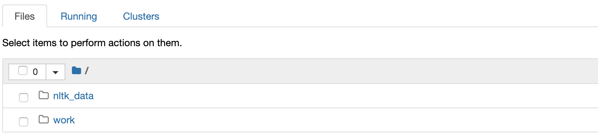
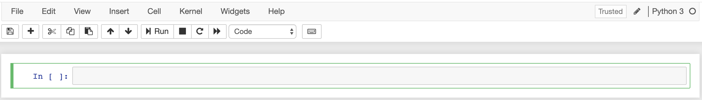
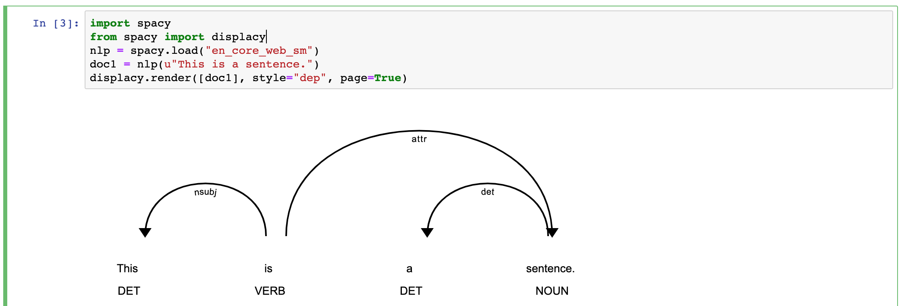
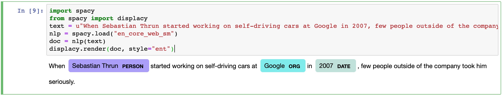

## What is NLP?

**Don't confuse** with neuro-linguistic programming :facepalm:

> Natural language processing allows computers to access unstructured data expressed as speech or text. Speech or text data does involve linguistic structure. Linguistic structures vary depending on the language
>
> -- [Bender](http://faculty.washington.edu/ebender/papers/Bender-SDSS-2019.pdf), 2019

<!--more-->

NLP is a class of tasks (computer algorithms) to work with text in natural languages, for example: named entity recognition (NER), part-of-speech tagging (POS), text categorization, coreference resolution, etc.


Image source: [Understanding Natural Language Understanding](https://nlp.stanford.edu/~wcmac/papers/20140716-UNLU.pdf)

See [paperswithcode](https://paperswithcode.com/area/natural-language-processing) and [nlpprogress](http://nlpprogress.com/) for bigger taxonomy of tasks.

## Getting started

I'm not an expert in machine learning (yet), but I know something about developer experience, so I will show how to get started with NLP fast and comfortably.

We will use:

- Docker
- [Jupyter notebooks](https://jupyter.org/)
- Python with [spaCy](https://spacy.io/)

There are a lot of tools in this field, but those seem to me as approachable and modern.

### Setup

Create `Dockerfile`:

```Dockerfile
FROM jupyter/datascience-notebook:1386e2046833
RUN pip install spacy
RUN python -m spacy download en_core_web_sm
```

We will use awesome [Jupyter Docker Stacks](https://jupyter-docker-stacks.readthedocs.io/en/latest/using/selecting.html#image-relationships).

Add `docker-compose.yml`:

```yml
version: "3"
services:
 web:
 build: .
 ports:
 - "8888:8888"
 volumes:
 - ./work:/home/jovyan/work
```

### Run

Run (in the terminal, in the same folder where you created files):

```sh
docker-compose up
```

This command will download, build and start development environment. You will see text

```sh
To access the notebook, copy and paste one of these URLs:
 http://127.0.0.1:8888/?token=...
```



- Open the URL in a browser
- Navigate to "work" folder
- Click "New" in the right top corner, select "Python 3" from the dropdown

Your notebook is ready for work.



Jupyter notebook is the mix of a runtime environment for experiments and a scientific journal.

### First experiment: POS

POS stands for part-of-speech tagging - we need to identify parts for speech for each word, for the given text, for example, noun, verb.

```python
import spacy
from spacy import displacy
nlp = spacy.load("en_core_web_sm")
doc1 = nlp(u"This is a sentence.")
displacy.render([doc1], style="dep", page=True)
```

Type in the program and click "Run".



[Here is the list of all tags](https://spacy.io/api/annotation#pos-tagging).

### Second experiment: NER

NER stands for named entity recognition. This task is about distinguishing specific entities, for example, people names, which consist of more than one part (Siddhartha Gautama), or country name (U.K.), or amount of money (\$1 billion).

```python
import spacy
from spacy import displacy
text = u"When Sebastian Thrun started working on self-driving cars at Google in 2007, few people outside of the company took him seriously."
nlp = spacy.load("en_core_web_sm")
doc = nlp(text)
displacy.render(doc, style="ent")
```

Type in the program and click "Run".



[Here is the list of all entity types](https://spacy.io/api/annotation#named-entities).

### Save your work

Rename your notebook (click "Untitled") to something more meaningful, for example, "experiments". Click the "Save" button.

Create `.gitignore` file:

```gitignore
work/.ipynb_checkpoints
```

Run (in the terminal, in the same folder where you created files):

```sh
git init
git add .
git commit -m "first commit"
```

Now you saved your work in the git.

## Tutorial

The purpose of those experiments was to show how it is easy to get started. If you want actually learn it you can use this [tutorial](https://course.spacy.io/chapter1).

Good luck!

## PS

Checkout [spaCy universe](https://spacy.io/universe) for more cool projects. spaCy is just one of the tools, you can use any alternative you like, for example, nltk, Stanford CoreNLP, etc.
