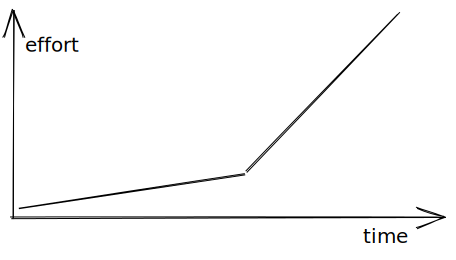

Typical discussion on CSS around the web looks like this:

<!--more-->

```text
A: CSS is hard
B: It's not hard. You need to learn it
C posts Meme about how family guy struggles to open blinds
```

Which is not a constructive conversation. So my question: is there a way to show what is objectively bad about CSS and maybe try to fix it? Stress in this question on objectivity, so it should not be a matter of taste or depend on how you define things, or how you used to do things.

In the article, I try to point out some objectively bad things. Please post your comments with more ideas.

## Not analyzable statically

Developers use linters (for example, ESlint), type checkers (for example, TyoeScript, Flow) to automate improve code quality. This is generally not possible with CSS, because how rules applied depends on:

- in which order CSS files included
- on HTML structures e.g. depending on nesting different styles can be applied
- different browsers have different built-in styles
- `!important`

Note: the only way to solve it is to use "CSS reset" and use only atomic styles (e.g. unique class names, no nested styles)

## Tricky learning curve

Okay, I said **objectively** bad and now I use the word "tricky". Wait for it.

You start learning CSS with selectors and basic properties like `color`, `font`, etc. It seems like it is the easiest language in the world. And you can get pretty far with this knowledge.

But then at some point, you need to center something or pull element in flexbox to right and there is no property for it. How to do it? Most developers just search the internet on how to do it and copy-paste snippets from StackOverflow. Next time you need to touch this code and you find that if you change something in one place something else is broken in different. And you get in the circle of doom when you change things until it works.

Or you **decide to learn** why it doesn't work the way you expect and you immediately need to learn so many concepts to fix one small thing, like what is box model, how layout algorithm works, etc. All those implementation details are failing on you at once and this is just too much...



This is what I call a tricky learning curve. It becomes a wall at some point.

(It's up to you to decide if this point is objective or not)

## No debug tools

For a long time the only debug tool was:

```css
* {
  border: 1px solid red;
}
```

At the moment there are a lot of great tools implemented by browser vendors, for example:

- [Debug z-index stacking content with 3D View in the Microsoft Edge DevTools](https://blogs.windows.com/msedgedev/2020/01/23/debug-z-index-3d-view-edge-devtools/)
- [CSS Grid Inspector: Examine grid layouts](https://developer.mozilla.org/en-US/docs/Tools/Page_Inspector/How_to/Examine_grid_layouts)

So things improved, but my point is those improvements come from browser vendors, they are **not in CSS spec** (or is it and I missed it?). People who designed are never bothered about how it is gonna be debugged.

## See also

- [Incomplete List of Mistakes in the Design of CSS](https://wiki.csswg.org/ideas/mistakes)
- [The stacking context](https://developer.mozilla.org/en-US/docs/Web/CSS/CSS_Positioning/Understanding_z_index/The_stacking_context)
- [Cascade and inheritance](https://developer.mozilla.org/en-US/docs/Learn/CSS/Building_blocks/Cascade_and_inheritance)
- [Mastering margin collapsing](https://developer.mozilla.org/en-US/docs/Web/CSS/CSS_Box_Model/Mastering_margin_collapsing)
- [Sizing items in CSS](https://developer.mozilla.org/en-US/docs/Learn/CSS/Building_blocks/Sizing_items_in_CSS)
