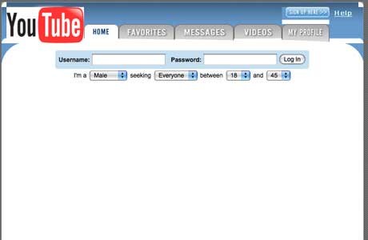

## Course changes overnight

Startups are looking for their business model. A startup can start with one idea but become mature wit different one, for example, youtube started as a dating site

<!--more-->

Image source: [@spencernoon](https://twitter.com/spencernoon/status/1016713164610732035?s=20).

Amazon started as a book store, now it is one of the biggest online retailers and the biggest cloud provider.

This means that you can start with one idea and end with a different one. For developers, it means that some work that they have been doing over three months can be discarded in one day.

Don't get attached to the code. Or find a way to make it open-source.

## Small team

The startup is a small team. Which means that everybody would be pretty busy and maybe shifting roles.

Be ready to help your teammates with some tasks beyond programming, for example, product decisions.

## Fight against time

Startups often fight with time - to make sure you did not run out of money or to make sure somebody else won't deliver your idea first.

It is hard to guess what will work and what will not, so prototyping is your best friend. Throw some quick PoC enough to test your hypothesis and let it fail (or sustain) fast. Show it to colleagues, show it to potential clients, show it to investors and ask what they think about it.
