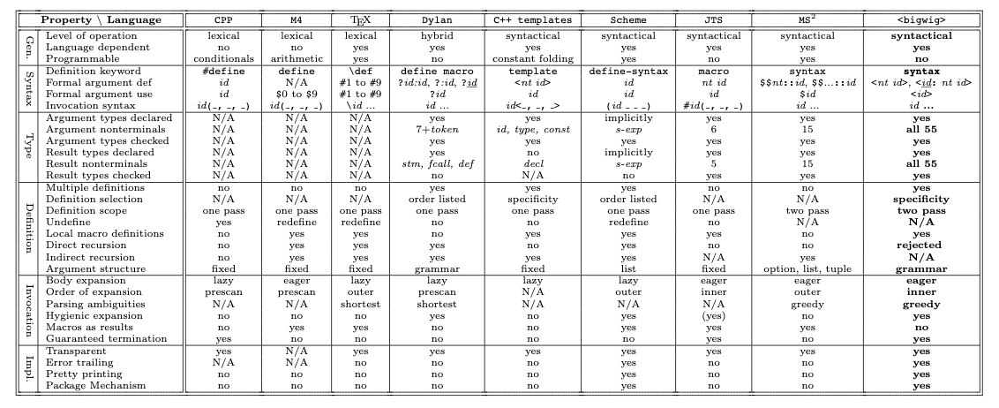

## What is metaprogramming?

Sadly there is no single definition on which everybody agrees. So let's investigate

<!--more-->

> Metaprogramming is a programming technique in which computer programs have the ability to treat other programs as their data.
>
> -- [Wikipedia](https://en.wikipedia.org/wiki/Metaprogramming)

> Metaprogramming refers to a variety of ways a program has knowledge of itself or can manipulate itself.
>
> -- [Popular answer at stackoverflow](https://stackoverflow.com/questions/514644/what-exactly-is-metaprogramming)

> "support for metaprogramming" means any way the user can effectively modify the language's syntax that's built into the language (like Lisp macros) or that's conventionally used with the language (like the C preprocessor).
>
> -- [rosettacode](https://rosettacode.org/wiki/Metaprogramming)

### Examples

We don't have one good definition, so let's see examples. When people talk about metaprogramming they may refer to:

- macros in Lisp ([1960](ftp://publications.ai.mit.edu/ai-publications/pdf/AIM-057.pdf))
- [preprpcessor in C](https://gcc.gnu.org/onlinedocs/cpp/Macros.html) (1973)
- hygenic macros in Scheme (1986)
- [C++ templates](https://www.youtube.com/watch?v=Am2is2QCvxY) ([1986](https://en.cppreference.com/w/cpp/language/history))
- "Dynamic" metaprogramming in Smalltalk (1980) and [Ruby](http://ruby-metaprogramming.rubylearning.com/) (1995-2005 ?)
- Reflections in Java (1997)

Those are just some examples - a lot of languages support metaprogramming.

## Two categories

Metaprogramming styles can be roughly divided into two categories:

- ones which work with source code (macros, preprocessors, templates). Often referred to as "macros"
- ones which are based on "OOP tricks" (like, dynamic dispatch and reflections) to provide additional behavior. I don't think it has a name, so I will call it "dynamic".

|                         | compile time | runtime |
| ----------------------- | ------------ | ------- |
| macros in Lisp          | ?            | +       |
| Preprocessor, templates | +            |         |
| Dynamic metaprogramming |              | +       |

## Dynamic metaprogramming

> Metaprogramming is writing code that manipulates language constructs (itself) at
> runtime.
>
> -- Metaprogramming Ruby

In Ruby, it seems, metaprogramming is used more often than in other dynamically typed languages, especially in Rails, for example: [Path and URL Helpers](https://guides.rubyonrails.org/routing.html#path-and-url-helpers).

The downside of dynamic metaprogramming is that there is no source code for the "thing": you see a function, but you don't understand where it is defined. It breaks "[grep test](http://jamie-wong.com/2013/07/12/grep-test/)".

The second downside is that it tends to be slower, for example, see [Rails/DynamicFindBy](https://docs.rubocop.org/rubocop-rails/cops_rails.html#railsdynamicfindby).

Languages:

- [Ruby](http://media.pragprog.com/titles/ppmetr/spells.pdf)
- [JavaScript](https://developer.mozilla.org/en-US/docs/Web/JavaScript/Guide/Meta_programming)
- [Python 2](https://python-3-patterns-idioms-test.readthedocs.io/en/latest/Metaprogramming.html), [Python 3](https://www.youtube.com/watch?v=sPiWg5jSoZI)

Main use cases:

- remove code repetition (DRY). For example, David Beazley shows a lot of examples in [the talk](https://www.youtube.com/watch?v=sPiWg5jSoZI).
- create embedded domain-specific language (EDSL). [Martin Fowler calls them Internal DSLs](https://www.martinfowler.com/bliki/DomainSpecificLanguage.html). For example, [Sass](https://github.com/sass/ruby-sass) (Ruby EDSL that translates to CSS), [haml](https://haml.info/) (Ruby EDSL that translates to HTML), Active Record Query Interface (Ruby EDSL that translates to SQL), rake (Ruby EDSL to replace `make`), chief
- "extend language"

### About extending the language

How can we extend the language? We can add more words to it (extend lexicon), we can add more rules on how words can combine (extend syntax).

We can easily add more words, for example, define new functions, modules, variables. But not all kinds of words - most likely we limited to what grammar of language allows to use as identifiers (for example, I can't define new word `:?:`). In Ruby and Python it is possible to overload operators (`+,-,>,<`, etc.) but not to define new ones.

As far as I can tell none of those languages allow me to define new syntax rules, for example, I can't define my version of `if/else`.

But programmers always find a way around it - it is possible to reuse existing syntax, to make it look like another syntax. For example, there is a beautiful concept of pattern matching in functional languages. [OCaml](https://ocaml.org/learn/tutorials/data_types_and_matching.html):

```ocaml
match value with
| pattern    ->  result
| pattern    ->  result
```

or [Scheme](https://www.gnu.org/software/guile/manual/html_node/Pattern-Matching.html):

```lisp
(let ((l '(hello (world))))
  (match l
    ((x y)
     (values x y))))
```

And this is how it can be done in JavaScript:

```js
const { matches } = require("z");
const result = matches(1)(
  (x = 2) => "number 2 is the best!!!",
  (x = Number) => `number ${x} is not that good`,
  (x = Date) => "blaa.. dates are awful!"
);
```

It's an old syntax, but if you squint enough it looks like pattern matching in OCaml. Behind the scene, it uses `toString` to inspect actual code, because there are (were?) no first-class reflections.

Another noticeable technique in this area is "chaining" (for example, jQuery and Active Record Query Interface).

## Macros

> We have closely investigated the following eight macro languages and their individual semantic characteristics: the C preprocessor, CPP[11, 19]; the Unix macro preprocessor, M4; TEX's built-in macro mechanism; the macro mechanism of Dylan[18]; the C++ templates[21]; Scheme's hygienic macros[10, 13]; the macro mechanism of the Jakarta Tool Suite, JTS[2]; and the Meta Syntactic Macro System, MS2[26]. The JSE system [1] is a version of Dylan macros adapted to Java and is not treated independently here. This survey has led us to **identify and group 32 properties** that characterize a macro language and which we think are relevant for comparing such work.
>
> -- [Growing Languages with Metamorphic Syntax Macros](http://www.itu.dk/people/brabrand/macro.pdf)



Macros are quite a broad category, but let's see examples of usage to get the idea.

### Syntax extension

In Lisp `if/elsse` expression looks like this:

```lisp
(if condition
  (print 1)
  (print 2))
```

It is easy to define a function with the same structure:

```lisp
(my-if condition
  (print 1)
  (print 2))
```

the problem is that in Lisp arguments are eagerly evaluated, which means it will execute both `then` and `else` branches, before even passing them to the function. That is where macros come into play. With macros, it is possible to implement `my-if` which would behave as you expect.

See also:

- [Idris Syntax Extensions](http://docs.idris-lang.org/en/latest/tutorial/syntax.html)
- [Racket Module Syntax](https://docs.racket-lang.org/guide/Module_Syntax.htm), [Racket Macros](https://docs.racket-lang.org/reference/Macros.html)

### DSL

> JSX is an XML-like syntax extension to ECMAScript without any defined semantics
>
> -- [Draft: JSX Specification](https://facebook.github.io/jsx/)

It is essentially a DSL. And babel plugin responsible for compiling it is a preprocessor. You can use other metaprogramming techniques to achieve the same-ish result - see [alternatives to JSX](https://blog.bloomca.me/2019/02/23/alternatives-to-jsx.html).

### Polymorphism

> ...polymorphic languages in which some values and variables may have more than one type. Polymorphic functions are functions whose operands (actual parameters) can have more than one type. Polymorphic types are types whose operations are applicable to values of more than one type.
>
> -- [On Understanding Types, Data Abstraction, and Polymorphism](http://lucacardelli.name/Papers/OnUnderstanding.A4.pdf)

It came to me as a surprise. There are:

- dynamically typed languages, which are very flexible (but is also easy to shoot yourself in the foot)
- statically typed languages with full polymorphism support, like OCaml, Haskell, etc.
- statically typed languages without polymorphism (Pascal, Go) or with some limitations in polymorphism

Programming languages from the last category may use metaprogramming to achieve something that feels like polymorphism ("improve flexibility").

In golang there is no parametric polymorphism (or "type parameters", or "generics"). So people created workarounds, for example, [gengen](https://github.com/joeshaw/gengen) (similar solutions [genny](https://github.com/cheekybits/genny), [generic](https://github.com/taylorchu/generic), [gen](https://github.com/clipperhouse/gen)):

```go
package list

import "github.com/joeshaw/gengen/generic"

type List struct {
    data generic.T
    next *List
}
```

Then you need to run the preprocessor

```sh
$ gengen github.com/joeshaw/gengen/examples/list string
```

And you will get code with exact types:

```go
package list

type List struct {
    data string
    next *List
}
```

See also: [Who needs generics? Use ... instead!](https://appliedgo.net/generics/), [The Next Step for Generics](https://blog.golang.org/generics-next-step).

### DRY

> Template metaprogrammers exploit this machinery to improve: source code flexibility and runtime performance
>
> -- [Walter E. Brown "Modern Template Metaprogramming: A Compendium, Part I"](https://youtu.be/Am2is2QCvxY?t=607)

In C++ there is function overloading (i.e. kind of polymorphism), but it creates a lot of repetion:

```cpp
double abs(double x) {
  return (x >= 0) ? x : -x;
}
int abs(int x) {
  return (x >= 0) ? x : -x;
}
```

Instead you can write (function template):

```cpp
template<typename T>
T abs(T x) {
  return (x >= 0) ? x : -x;
}
```

### Performance

It is often claimed that macro expansion at compile time can improve performance. It sounds reasonable to me, but I don't have good examples.

Related: [Compile-time reflection and compile-time code execution in Zig](https://ziglang.org/#Compile-time-reflection-and-compile-time-code-execution).

## Macros and types

Lisp (and Scheme) macros are very powerful, but... they don't work well with static type checkers. We can assume that we have macros that are guaranteed to terminate and we can expand them at compile time (syntax sugar) and type check generated code, the next problem is that type error can be reported in the generated code and it will be confusing.

There are different attempts to make macros work better with static types, for example:

- [Hackett](https://lexi-lambda.github.io/hackett/index.html)
- [Inferring Type Rules for Syntactic Sugar](https://cs.brown.edu/~sk/Publications/Papers/Published/pk-resuarging-types/paper.pdf)
- [unseemly](https://github.com/paulstansifer/unseemly) Macros have types!
- [finkel](https://finkel.readthedocs.io/en/latest/contents/macros.html) Haskell in S-expression

See also:

- [Dependent Type Systems as Macros](https://www.ccs.neu.edu/home/stchang/pubs/cbtb-popl2020.pdf)
- [Typed Lisp, A Primer](https://alhassy.github.io/TypedLisp.html)
  - [The Typed Racket Guide](https://docs.racket-lang.org/ts-guide/)
  - [Lux](https://luxlang.github.io/lux/lux_macro/#macros)
  - [Shen](http://shenlanguage.org/osmanual.htm#5.9%20Macros)
- [Typer: An infix statically typed LISP](https://www.youtube.com/watch?v=tjPG7TAoMUY)
- [Composable Type-Specific Languages](http://www.cs.cmu.edu/~aldrich/papers/ecoop14-tsls.pdf)
  - [wyvernlang](http://wyvernlang.github.io/)
- [Type-sound Syntactic Language Extension](https://depositonce.tu-berlin.de/bitstream/11303/5033/1/lorenzen_florian.pdf)
  - [SoundX](https://github.com/florenzen/soundx)
- [Sound Type-Dependent Syntactic Language Extension](https://www.informatik.uni-marburg.de/~seba/publications/soundx-popl16.pdf)
- [sugar-lang](https://github.com/sugar-lang)

## Other languages

Other languages with interesting metaprogramming facilities which I haven't explored closely, but want to check later:

- [Agda](https://agda.readthedocs.io/en/v2.6.1.1/language/reflection.html)
- [GHC’s Template Haskell](https://chrisdone.com/posts/haskell-doesnt-have-macros/), [Typeclasses](https://youtu.be/5QQdI3P7MdY?t=675)
- [Rust](https://danielkeep.github.io/tlborm/book/README.html), [tt-call](https://github.com/dtolnay/tt-call)
- [Elixir](https://elixir-lang.org/getting-started/meta/domain-specific-languages.html)
- [Red](https://www.red-lang.org/2016/12/entering-world-of-macros.html)
- [Marco: Safe, Expressive Macros for Any Language](https://www.cs.utexas.edu/users/mckinley/papers/marco-ecoop-2012.pdf)
- [Julia](https://docs.julialang.org/en/v1/manual/metaprogramming/)
- [D-Expressions: Lisp Power, Dylan Style](http://people.csail.mit.edu/jrb/Projects/dexprs.pdf)
- [Crystal](https://crystal-lang.org/reference/syntax_and_semantics/macros/index.html)


### Quotation

Interestingly, some languages, which doesn't seem to support macros have quotation facilities. I need to dig deeper there:

- [F#](https://docs.microsoft.com/en-us/dotnet/fsharp/language-reference/code-quotations)
- [Haskell](https://wiki.haskell.org/Quasiquotation)
- [Scala](https://docs.scala-lang.org/overviews/quasiquotes/intro.html)
