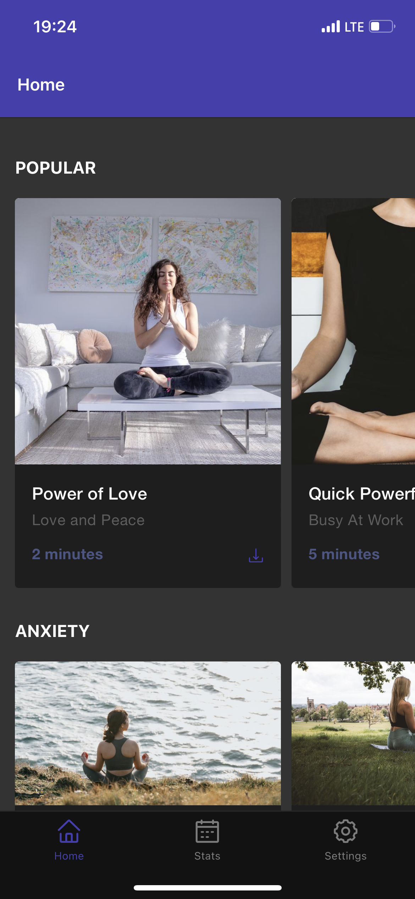
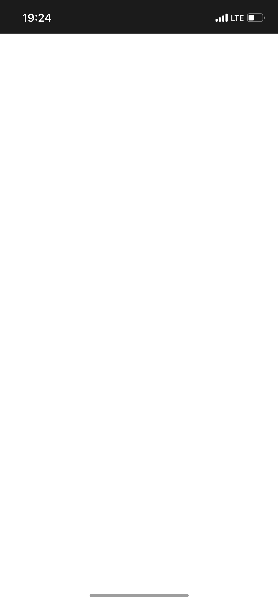
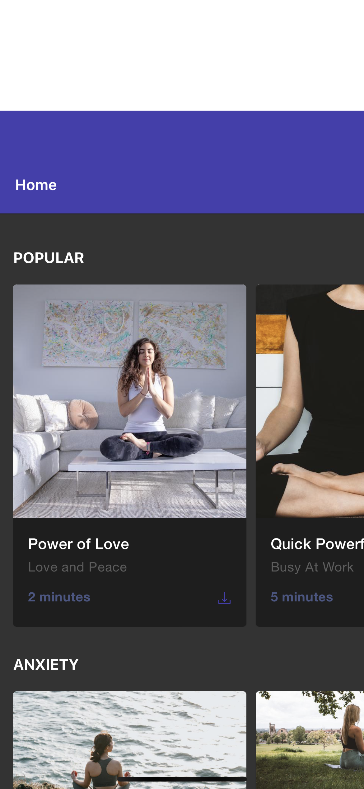
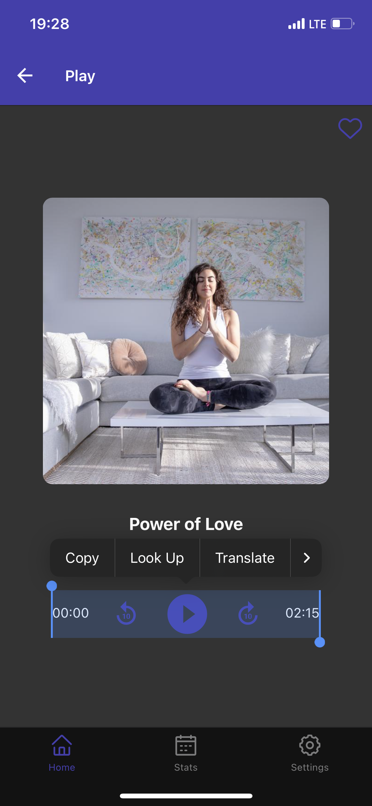
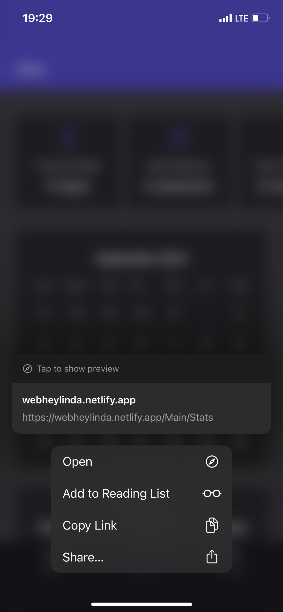
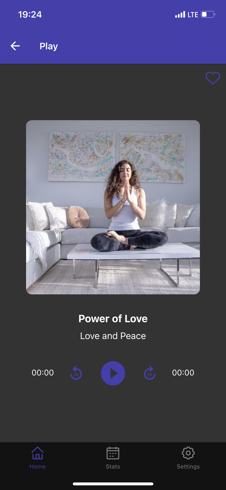
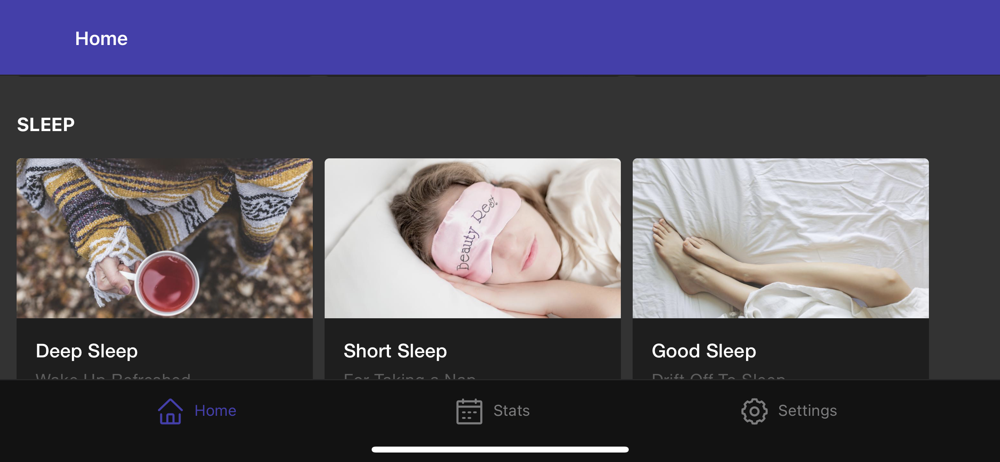

To illustrate ideas from my [previous article](/posts/native-like-pwa). Let's take a look at [heylinda-app](https://github.com/heylinda/heylinda-app). No hard feelings - it was first open-source ReactNative app compiled to PWA, that I found.

ReactNative was built specifically for mobile platforms, so it was interesting for me to see how it works for PWA.

| Feature                       | yes/no  |
| ----------------------------- | ------- |
| Installable                   | yes     |
| AppShell                      | kind of |
| Bottom navigation             | yes     |
| Offline support               | no      |
| Splash-screen                 | no      |
| Over-scrolling fixed          | no      |
| Text-selection blocked        | no      |
| Smooth transitions/animations | no      |
| Gestures                      | no      |
| Dark theme                    | yes     |

## Detailed report

| Comment                                                                                                                                                                                                                    | Screenshot   |
| -------------------------------------------------------------------------------------------------------------------------------------------------------------------------------------------------------------------------- | ------------ |
| There is an **icon**. When launched from home screen, it opens in **standalone** mode.                                                                                                                                     |  |
| There is header and **bottom navigation bar**. Which counts as **AppShell**, but there is no offline support. **Fix:** use ServiceWorker, for example [workbox](https://developer.chrome.com/docs/workbox/).               |  |
| There is no **splash screen**. **Fix:** use `<link rel="apple-touch-startup-image" href="..." >`                                                                                                                           |  |
| **Over-scrolling** is possible. **Fix:** `html { overscroll-behavior: none;`                                                                                                                                               |  |
| **Text can be selected** by accident, when trying to tap button. **Fix:** `* { user-select: none; }`                                                                                                                       |  |
| **Callout Safari actions** are not blocked. **Fix**: `html { -webkit-touch-callout: none; }`                                                                                                                               |  |
| There are no **smooth transitions/animations**. I expect that this screen would slide out from right. And there is no **gestures** support - I expect to be able to swipe this screen to right, to get back to main screen |  |

### Landscape orientation

You can't see it on screenshot, but there is "notch" which covers left part of the screen. Either landscape orientation needs more work, or it should be locked potrait mode.
