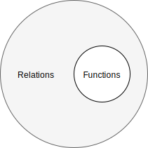
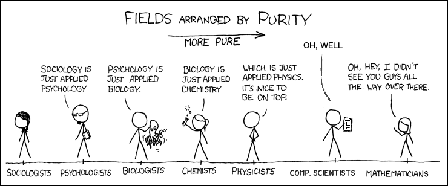

In [the previous post](/posts/from-function-to-closure/) we talked about what is a function. In this post let's talk about things that look like a function, but actually are not.


## By definition

Not all equations are functions. `y = x + 1` is a function, but `y² + x² = 1` is not, because "function is a many-to-one (or sometimes one-to-one) relation" (in this case there are 1 or 2 values of `y` corresponds to one `x`).

Not all graphs (set of points in Cartesian coordinates) are functions. This graph represents a function:


But this one is not:


Not all tables (set of tuples `(x, y)`) are functions. This one is represents a function:

| x   | y   |
| --- | --- |
| 1   | 1   |
| 2   | 2   |
| ... | ... |

But this one is not:

| x   | y   |
| --- | --- |
| 2   | 1   |
| 2   | 2   |
| ... | ... |

All functions are relations, but not all relations are functions.



If we will draw a table of all possible relations between sets `A` and `B`, only two of those are functions (marked with `f`)

|                      | corresponds to a 0-1 element in set B | 0-M | 1   | 1-M |
| -------------------- | ------------------------------------- | --- | --- | --- |
| 0-1 element in set A |                                       |     |     |     |
| 0-M                  |                                       |     |     |     |
| 1                    |                                       |     | f   | \*  |
| 1-M                  |                                       |     | f   | \*  |

\* Multivalued functions (or multiple-valued functions) are relations that map single points in the domain to possibly multiple points in the range (in the theory of complex functions).

## More about domain

> Function from `A` to `B` is an object `f` such that every `a in A` is uniquely associated with an object `f(a) in B`. The set `A` of values at which a function is defined is called its `domain`.
>
> -- [Mathworld Wolfram](http://mathworld.wolfram.com/Function.html)

So here is a possibly confusing bit - function requires every element of input set (domain) to correspond to some element in the output set (codomain).

What about `y = 1/x`, there is no output for 0 ([at least not one version which all agrees about](https://www.hillelwayne.com/post/divide-by-zero/)). Explanation here is the following: 0 is not part of the domain of the given function, or you can say that function `1/x` is not defined for zero.

Consequence: if `y₁=x²/x` and `y₂=x` than `y₁≠y₂` because `y₁` is defined for all real numbers except 0, but `y₂` is defined for all reals (`ℝ`).

### Total function

In programming they have related terminology:

> Total functions — that is, a function
>
> - which is defined for all possible inputs
> - and is guaranteed to terminate.
>
>   -- [The Idris Tutorial](http://docs.idris-lang.org/en/latest/tutorial/theorems.html#totality-checking)

🤔 It means that the **domain** of the function is not the same thing as the **type** of "all possible inputs". Or maybe programming we need a slightly different definition of a function.

🤔 There are two conditions here (1) defined for all inputs and (2) function terminates. It seems to me that the second condition is redundant here because if function never terminates, we never have an answer thus the result of the operation is not defined. For example, this what happens when you try to divide by 0 in a mechanical calculator.


Image credit: [popularmechanics.com](https://www.popularmechanics.com/technology/gadgets/a20152/dividing-by-zero-will-mechanical-calculator/).

## Non-functions in programming

### No input

Should we consider "functions" which doesn't have input to be a function?

🤔 Is it even appropriate to call it a function? Maybe a better name would be coroutine or procedure?

If they produce more than one output than one output than no:

```js
Math.random(); // 0.8240352303263008
Math.random(); // 0.1830674266691794
Date.now(); // 1562502871898
Date.now(); // 1562502872905
```

🤔 What if they produce one output, for example, a function which returns singleton? Probably not (to explain in more details we need to talk about effects, which is a subject for an upcoming post).

### More than one output for the same input

Not a function:

```js
let counter = 0;
const inc = x => (counter = counter + x);
inc(1); // 1
inc(1); // 2
```

🤔 Interesting that we consider one output as "one output over the time" (e.g. consequent calls). What about more than one output at once?

```js
const y = x => {
  if (x > 1 || x < -1)
    throw new Error("Function undefined for x > 1 or x < -1");
  const result = Math.sqrt(1 - x * x);
  return [-result, result];
};
```

First, we need to define what is the same output means - how we can compare two values in programming.

### Comparison

When two values are equal in programming? We can consider two options:

- nominal comparison (identity) - objects are equal only when they are identical e.g. they have some unique nominal identifier which is in case of computers can be memory reference (or pointer).
- structural comparison (equality) - objects are equal if all of it's "members" are equal, in the most simplified case we can compare memory bit by bit.

_Side note_: for primitive values, like integers, which values are so small that they are directly placed on stack instead of heap nominal comparison and structural comparison is the same thing.

For the given example:

```js
y(0.5) === y(0.5); // false
```

`y` doesn't produce nominally "same" results.

```js
y(0.5)[0] === y(0.5)[0]; // true
y(0.5)[1] === y(0.5)[1]; // true
```

but it produces a structurally "same" result. We can choose any type of comparison and depend on this `y` will be or will **not** be a (mathematical) function.

As well we can make `y` to return nominally identical results:

```js
const memoize = f => {
  const cache = new Map();
  return x => {
    if (!cache.has(x)) {
      cache.set(x, f(x));
    }
    return cache.get(x);
  };
};
const y1 = memoize(y);
```

as you can see `y1` returns nominally identical results for the same input

```js
y1(0.5) === y1(0.5); // true
```

the trade-off here is that we need more memory to store outputs. Most likely it will allocate a bigger slice of memory for `new Map()` upfront, so we need to pay price (memory) even if we don't call `y1`.

On the other hand, structural comparison requires more CPU cycles - in the worst case we need to compare memory bit by bit.

_Side note_: in garbage-collected languages we can use less memory for nominal comparison, because we can track if output object is in use or not, and if it is not in use we can remove it from cache (similar to how [`WeakMap`](https://developer.mozilla.org/en-US/docs/Web/JavaScript/Reference/Global_Objects/WeakMap) works, except for values instead of keys).

There is no universal answer to this question, structural comparison will fail for recursive (cyclic graph) data structure, for example:

```js
const a = {};
a.a = a;
```

the nominal comparison will not work if we would want to compare values from two different functions

```js
JSON.parse("[-0.8660254037844386,0.8660254037844386]") === y1(0.5); // false
```

🤔 How to compare functions (if we talk about functions as values)? If we would want to compare them structurally, shall we compare bytecode that they produce? What if bytecode for two functions was produced by different compilers? What if it is the same function, but implementations are different, for example:

```js
const fact1 = n => {
  let res = 1;
  for (let i = 1; i <= n; i++) {
    res = res * i;
  }
  return res;
};
const fact2 = n => (n < 2 ? 1 : n * fact(n - 1));
```

🤔 How to implement nominal comparison for deserialized objects? Should we store all deserialized strings to always return the same reference?

On practice programming languages (machines) can use a combination of those two approaches, for example:

- compare references first, and fallback to structural comparison if the first check is falsy
- or compare structurally primitives (integers, strings, etc.) and compare nominally other variables (arrays, objects, etc.)
- etc.

So it's up to you, developer, to decide which comparison use.

### Are lists and structures valid function results?

Function `y` declared above represents the same relation between `x` and `y` as `y² + x² = 1`. But earlier we concluded that `y² + x² = 1` is equation and not a function. 🤔 Does this mean that `y` is not a function?

Well, I would say that it is still a function (`y` has a single output - list). This is one of the examples of how the idea of mathematical function (platonic idea), doesn't always directly translates to computations (which are in more closer relation to physics).



(a modified version of https://xkcd.com/435/)

In math, they do not talk about computational complexity ("big O notation"), as long as for the same input it produces the same output mathematicians would consider those to be the same functions, for example, bubble sort and merge sort. From a computer science point of view [they have different time and space complexity](https://www.cs.usfca.edu/~galles/visualization/ComparisonSort.html).

**Where is the (platonic) idea of function is very useful in math in computer science it may need some adjustment or reinterpretation.**
