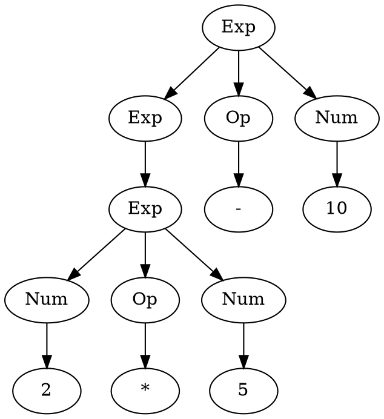
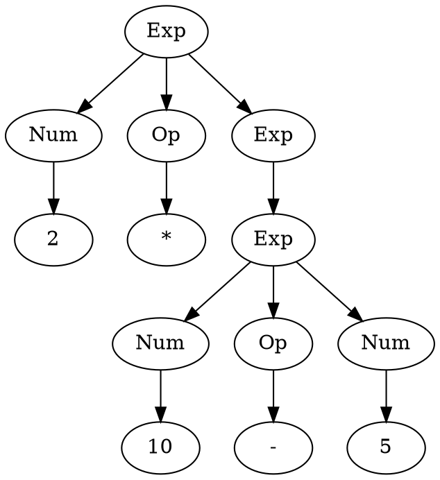
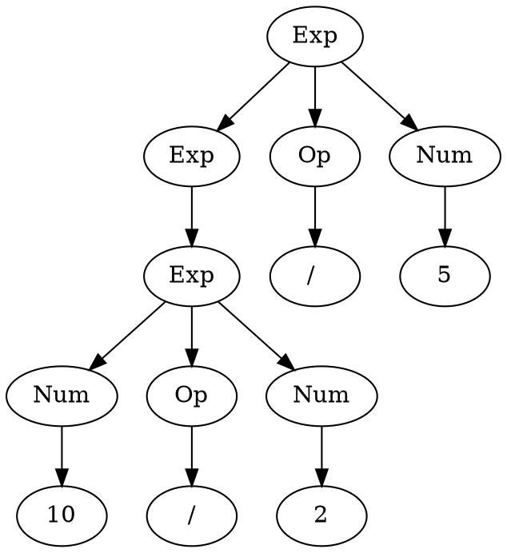
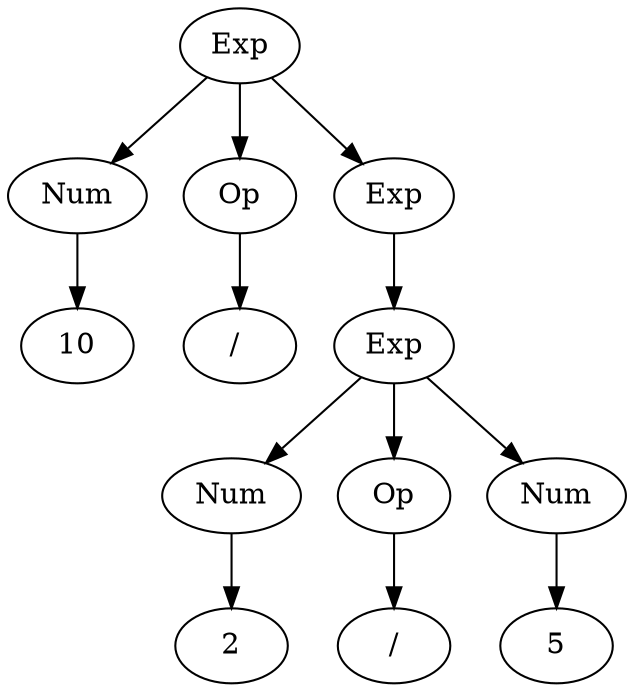

When I tried to read [papers on parsing algorithms](/posts/an-overview-of-parsing-algorithms/) I found a lot of terminologies (sometimes used inconsistently), a lot of abbreviations, and contradictory claims.

I decided to make some notes - write down definitions and abbreviations to understand papers.


Those notes are mainly based on [cs143](https://web.stanford.edu/class/archive/cs/cs143/cs143.1128/), but I had to consult a lot of other sources. For example, this course misused the terminology "alphabet", didn't provide a definition of "token", considered only Chomsky's formalism... I'm saying this not to insult authors of the crouse, just to show how hard it can be to get good introductory material on the subject.

## Introduction

A language is a set of strings - all possible sentences that you can say in this language.

Language can be described with a formal system - (generative) grammar. Grammar can be used to:

- generate strings (sentences) in a given language
- recognize if a given string belongs to a language or not
- convert string to corresponding parse tree (AST or CST in case of programming language)

There is more than one type of formal systems that can describe language:

- [Chomsky hierarchy](https://www.academia.edu/4073170/Noam_Chomsky_Syntactic_Structure), for example CFG (see below)
- [Parsing Expression Grammar](https://pdos.csail.mit.edu/~baford/packrat/popl04/peg-popl04.pdf) (PEG)
- [Grammar Flow Graph](https://apps.cs.utexas.edu/tech_reports/reports/tr/TR-2102.pdf) (GFG)
- [Syntax Definition Formalism](https://eelcovisser.org/publications/2020/AmorimV20.pdf). SDF is based on two notions: context-free grammars, disambiguation filters.

Chomsky divided grammars into 4 types - Chomsky hierarchy. Later it was observed that for each type of grammar it is possible to construct some type of automaton that would recognize language described by a given grammar.

Automaton - an abstract computing device or "machine". Automatons have more granular categoriastion so it's possible to refine original Chomsky hieararchy:

| Chomsky type | Grammar                            | Automaton                                       |
| ------------ | ---------------------------------- | ----------------------------------------------- |
| Type 0       | **Unrestricted**                   | Turing machine                                  |
| Type 1       | **Context-sensitive**              | Linear-bounded non-deterministic Turing machine |
| Type 2       | Non-determnisitic **context-free** | Non-deterministic pushdown automaton            |
|              | Deterministic **context-free**     | Deterministic pushdown automaton                |
| Type 3       | **Regular**                        | Finite state automaton                          |

### Side notes

Regular grammar corresponds to regular expressions e.g. `grep`, `egrep` etc. Regular expressions can't specify, for example:

- Palindromes
- Strings with an equal number of 0's and 1's
- Matched parentheses
- Properly formed arithmetic expressions

A lot of programming languages can be parsed with CFG (context-free grammars). Some may require context-sensitive grammar (**TODO**: give an example for C or Haskell), but in practice, they use CFG with workarounds.

A lot of programming languages can be parsed with PEG.

Language can be described with more than one grammar. There is a way to transform grammars, for example, to eliminate left recursion or to transform to Chomsky Normal Form.

Some parsing algorithms may require grammar of a specific form, for example, `CYK` works only with grammar in Chomsky Normal Form.

## Formal definition of a language

An **alphabet** is a finite, non-empty set of symbols (`Σ` - sigma). Example: `0, 1` (binary).

A **string** is a finite sequence of symbols chosen from `Σ`. Example: `0,1,00,01,10...`.

- `Σk` - is the set of all strings of length `k`
- `Σ* = ΣO ⋃ Σ1 ⋃ Σ2 ...` (Kleene Closure - think of `*` in regex)
- `Σ+ = Σ1 ⋃ Σ2 ⋃ Σ3 ...` (Positive Closure - think of `+` in regex)

**Empty string** denoted as `ε` (epsilon) or `null` (`ΣO = {ε}`).

A **grammar** is a finite set of rules by which valid strings (sentences) in a language are constructed.

A **nonterminal** (sometimes called a variable) is a grammar symbol that can be replaced/expanded to a sequence of symbols (nonterminals or terminals).

A **terminal** is a string of symbols from the alphabet (`Σ`); these are the symbols in a grammar that cannot be replaced by anything else. "terminal" is supposed to conjure up the idea that it is a dead-end — no further expansion is possible.

A terminal is sometimes called a word, but this is not the same as a word in a natural language (which is confusing).

A **production** (or a production rule) is a grammar rule that describes how to replace/exchange symbols. The general form of a production rule for a nonterminal is:

```text
X → Y1Y2Y3...Yn
```

The nonterminal `X` is declared equivalent to the concatenation of the symbols `Y1Y2Y3...Yn`. The production means that anywhere where we encounter `X`, we may replace it with the string `Y1Y2Y3...Yn`. Eventually, we will have a string containing nothing that can be expanded further, i.e., it will consist of only terminals.

- `→` or `->` is the production symbol (in Chomsky notation). BNF uses `::=`. PEG uses `←` or `<-`.
- Left-hand side (l.h.s) of the production rule (before production symbol) is sometimes called a head.
- Right-hand side (r.h.s) of the production rule (after production symbol) is sometimes called a body.

A **start symbol** (`S`) is a symbol from which all strings derive: `S → X1X2X3...Xn`. All strings are derived from `S` by successive replacement using the productions of the grammar.

A **formal grammar** (`G`) is a 4-tuple `{S, P, N, T}`. `S` is the start symbol (with `S ∈ N`), `P` is the set of (production) rules, and `N` is a finite set of nonterminals, and `T` is a finite set of nonterminals (`N ⋂ T = Ø`, `T ⊆ Σ*`).

A **sentence** is a string of symbols in `T` derived from `S` using one or more applications of (production) rules in `P`.

The **language** `L(G)` defined by grammar `G` is the set of sentences derivable using `G` (`L ⊆ Σ*`). Example: `000,0100,0010...`.

`T ⊆ Σ*` and `L ⊆ Σ*`, but it isn't always true that `T ⊆ L`. For example, think of JS REPL: `5` is a sentence and a terminal, but `if` is a terminal and not a sentence.

**Equivalence**. Two grammars `G` and `G'` are said to be equivalent if the languages they generate, `L(G)` and `L(G')`, are the same.

In general [equivalence is undecidable](https://www.cs.wcupa.edu/rkline/fcs/grammar-undecidable.html).

## Chomsky Hierarchy

**Type 0** - free or unrestricted or recursively enumerable grammars. These are the most general. Production rules are of the form `u → v` where both `u` and `v` are arbitrary strings of terminals and nonterminals, with `u` non-empty string. There are no restrictions on what appears on the left or right-hand side other than the left-hand side must be non-empty.

**Type 1** - context-sensitive grammars. Production rules are of the form `uXw → uvw` where `u`, `v` and `w` are arbitrary strings of terminals and nonterminals, with `v` non-empty, and `X` a single nonterminal. In other words, `X` may be replaced by `v` but only when it is surrounded by `u` and `w`. (i.e., in a particular context).

**Type 2** - context-free grammars. Productions are of the form `X → v` where `v` is an arbitrary string of terminals and nonterminals, and `X` is a single nonterminal. Wherever you find `X`, you can replace it with `v` (regardless of context).

**Type 3** - regular grammars. Productions are of the form `X → a`, `X → aY`, or `X → ε` where `X` and `Y` are nonterminals and `a` is a terminal. That is, the left-hand side must be a single nonterminal and the right-hand side can be either empty, a single terminal by itself, or with a single nonterminal. These grammars are the most limited in terms of expressive power.

## Parsing

**Parsing** is the process where we take a particular string and check to see if we can construct a list (list of lists) of (production) rules which would produce a given string for a given language.

Parsing is similar to the recognition task, the difference is that **recognition** task gives an answer in the form "yes" or "no", where is parsing gives an answer as a list of rules ("yes" answer) or "no" answer.

Another name for a recognition task is **membership** problem e.g. check if the given string belongs to language (if this is a sentence in a given language).

List in the given description considered to be ordered e.g. sequence, not a set.

A list of lists can be visually represented as a tree hence the name **parse tree**. Another name for the tree is the directed acyclic graph (DAG).

Example: `2 * 5 - 10`



There are two ways of constructing a **parse tree** whose root is the **start symbol** and whose leaves are strings:

- **Top-down**: we start with the start symbol and apply the (production) rules (replacing l.h.s. with r.h.s.) until we derive the string

- **Bottom-up**: we start with the string, and apply the production rules in reverse (ie. replacing r.h.s. of the rule with the l.h.s.) until we derive the start symbol.

**TODO**: this needs a visualization.

### Issues in parsing: Ambiguity

If grammar permits more than one parse tree for some string (sentence), it is said to be **ambiguous**. For example, consider the following arithmetic expression grammar:

```text
Exp → Exp Op Exp | ( Exp ) | Num
Op  → + | - | * | /
```

Expression `2 * 5 - 10` can result in the following parse tree



Compare it to the tree from the previous section. Both trees are "legal" in the given grammar.

```text
Exp → Exp Op Exp | ( Exp ) | Num
```

is the same as

```text
Exp → Exp Op Exp
Exp → ( Exp )
Exp → Num
```

A parser can choose any rule to match ("path to follow"). The choice is non-deterministic. A parser can do the following in this case:

- Backtracking: follow any path and get back in case the path leads to a dead end. If all paths lead to a dead-end it means that the given string is not a part of the language. Think of depth-first search (DFS) in a graph.
- Follow all paths simultaneously. Abadon paths with a dead end. Think of breadth-first search (BFS) in a graph.

Some parsers will return all possible parse trees ("parse forest") for a given string, for example, Tomita's `GLR`.

Ambiguity is not desirable for programming languages. In some cases, it is possible to create another unambiguous grammar that would generate (accept) the same language.

[CFG ambiguity problem is undecidable in general](https://www.ijert.org/research/different-approaches-for-ambiguity-detection-IJERTCONV1IS02004.pdf).

Typically creation of another grammar is the task done by a programmer without formal proof.

**Option 1**. Introduce **presedence** rules - `()` > multiplicative group > additive group:

```text
AddOp  → + | -
AddExp → AddExp AddOp AddExp | MulExp
MulOp  → * | /
MulExp → MulExp MulOp MulExp  | NumOrParen
NumOrParen → (AddExp) | Num
```

This would solve the issue described above, but we still have an issue if there is more than one operator with the same precedence next to each other: `10 / 2 / 5`.



or



The first graph evaluates to 1, second to 25.

**Option 2**. Introduce **associativity** rules (in addition to presedence) - make `+,-,*,/` left-to-right associative (or simply left associative).

```text
AddOp  → + | -
AddExp → AddExp AddOp MulExp | MulExp
MulOp  → * | /
MulExp → MulExp MulOp NumOrParen | NumOrParen
NumOrParen → (AddExp) | Num
```

**Option 3**. Forbid such situations - in this case, we can require parenthesis around each subexpression. But this would be a different language.

The problem is that it obscures original intent and there are no mechanical means to convert ambiguous grammar into unambiguous one.

In `PEG` there is no non-deterministic choice (`|`). Instead, it has alternation (`/`) - it will always match rules in the given order. As the result, there is no ambiguation in `PEG`, but it is possible to have unreachable rules.

In `SDF` they have disambiguation filters - instead of obscuring original grammar, you can add annotations for associativity, precedence (priority), longest match, etc.

```text
AddExp → AddExp AddOp AddExp {left}
```

### Issues in parsing: recursive rules

If the nonterminal appears on both sides of (production) rule it is called recursive, for example:

```text
A → u | Av
```

If the recursive nonterminal is at the left of the right-side (body) of the (production) rule, e.g. `A → u | Av`, it is called **left-recursive**.

If the recursive nonterminal is at the right of the right-side (body) of the (production) rule, e.g. `A → u | vA`, it is called **right-recursive**.

The other two possibilities are: `A → u | vAw` and `A → u | AvA`. `v,u,w` can be terminals and nonterminals.

There is a technique for rewriting the grammar to move the recursion to the other side. For example, consider this left-recursive rule:

```text
X → Xa | Xb | AB | C | DEF
```

To convert the rule, we introduce a new nonterminal `X'` that we append to the end of all non-left-recursive productions for `X`. The expansion for the new nonterminal is the reverse of the original left-recursive rule. The re-written productions are:

```text
X  → ABX' | CX' | DEFX'
X' → aX' | bX' | ε
```

The problem with recursion is that it is not always obvious, like in the examples above. Sometimes it can be transitive. Here is an example with one additional link in recursion (but there can be more):

```text
A → B | u
B → A
```

Some algorithms may have troubles with some types of recursion, for example, packrat (`PEG` parser) will go into an infinite loop in case of left recursive grammar. A typical solution is to rewrite it to the right-recursive form, but be careful to not mess up associativity.

Most of the time you should worry about left recursion, more than other types of recursion because parsers typically read input from left to right.

## Scanners and parsers

A lot of parse algorithms expect a sequence of tokens as an input instead of a "raw" string.

A **token** is a sequence of characters that has an atomic meaning, for example, keywords, literals, etc.

In some literature rules that match tokens are called tokens and tokens called lexemes. This creates more confusion because a token corresponds to a word in a natural language, not to a lexeme.

> Word - a speech sound or series of speech sounds that symbolizes and communicates a **meaning usually without being divisible into smaller units capable of independent use**
>
> -- [merriam-webster](https://www.merriam-webster.com/dictionary/word)

**Scanner** (or tokenizer, or lexer) is a preprocessor that turns a raw string into a sequence of tokens.

In practice this means that you would need to write two grammars:

- "lexical" grammar, which is typically regular grammar i.e. regex-like
- "parser" grammar, which is typically CFG

Nonteminals from lexical grammar becomes terminals in parser grammar.

It can happen that two separate programs responsible for generating parsers from those grammars, for example, [Lex](https://wolfram.schneider.org/bsd/7thEdManVol2/lex/lex.pdf) (lexical parser) and Yacc ("parser parser"). Or it can be one program, for example, [ANTLR4](https://github.com/antlr/antlr4/blob/master/doc/grammars.md).

This approach leads to some problems ("lexical ambiguity"):

- What to do if more than one rule (in lexical grammar) matches the token? Workaround - prefer rule which produces the longest token.
- What to do if more than one rule (in lexical grammar) matches token of the same length? Workaround - prefer rule which appears first in grammar (deterministic choice).

But this is a bit artificial separation because regular grammars are a subset of CFG. `PEG` parser generators (packrat, pika) handle this beautifully - there is one grammar and there is no separate scanner step. There are other **scannerless** parsers, for example, `SGLR` (Scannerless `GLR`).

There is a limited set of errors that the scanner can detect: `EOF` within a string literal (missing closing `"`), invalid character, and similar.

## To be continued

Still need to cover the following subjects:

- `LL`, `LL(k)`, `SLR(k)`...
- `LR`, `LR(K)`, `SLL(k)`...
- leftmost/rightmost derivation
- recursive descent/ascent
- lookahead (automaton)
- parser generators/parser interpreters
- dynamic programming, chart parser
- [Parsing with derivatives](https://www.academia.edu/2622848/Parsing_with_derivatives_a_functional_pearl)
- [Chomsky Normal Form](https://people.cs.clemson.edu/~goddard/texts/theoryOfComputation/9a.pdf)

## Abbreviations

- CFG - context-free grammar
- PDA - pushdown automaton
- NFA/NDFA - non-deterministic finite-state automaton
- DFA - deterministic finite automaton
- BNF - Backus-Naur Form, this is just a variant of a context-free grammar, with different notation, for example, it uses `::=` instead of `→`
- DAG - directed acyclic graph aka tree
