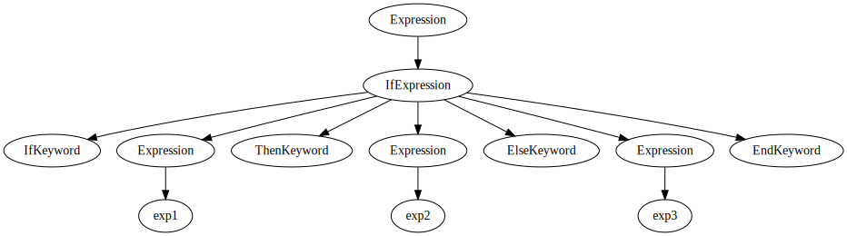
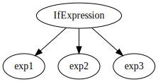

After reading more about the subject I realized that section "Scanners and parsers" from my [previous post](/content/posts/notes-on-parsing-theory-1/index.md) needs a correction.


## Lexical vs syntax grammar

From Chomsky grammar's point of view, there is no distinction between lexical and syntax grammar. For example, let's examine simple pseudo-english language (Chomsky's form):

```text
Letter       → "a" | "b" | "c" | "d" | "e" | "f" | "g"
Word         → Letter | Letter Word
SentencePart → Word | Word " " SentencePart
Sentence     → SentencePart "."
TextPart     → Sentence | Sentence " " TextPart
Text         → TextPart ε
S            → Text
```

It's kind of hard to read and work with. Let's rewrite it as [EBNF](https://www.cs.tufts.edu/~nr/cs257/archive/niklaus-wirth/ebnf.pdf):

```ebnf
Letter   = "a" | "b" | "c" | "d" | "e" | "f" | "g" .
Word     = Letter { Letter } .
Sentence = Word { (" " Word) } "." .
Text     = Sentence { " " Sentence } .
```

or as PEG:

```text
Letter   <- [a-g]
Word     <- Letter+
Sentence <- Word (" " Word)* "."
Text     <- Sentence (" " Sentence)*
```

It's so much easier to see structure in the later notation. But if we will build a parse tree according to those rules letters will be in the leaves of the tree. Which is good enough for a recognition task, but not useful to see a "big picture".

What if instead of letters in leaves we would have the smallest meaningful items in our language? If we talk about programming language this would be a token (or lexeme), for example, number literal, keyword, identifier.

> Lexeme is a meaningful linguistic unit that is an item in the vocabulary of a language.
> Etymology: Greek `lexis` word
>
> -- [merriam-webster](https://www.merriam-webster.com/dictionary/lexeme)

If we talk about natural language it can be a word (for example, "fly") or a lexical expression (for example, "fruit fly").

The interesting part is to see the subtle difference between the recognition task and parsing. Virtually this is the same process, but to make parsing useful we need some extra efforts.

To achieve this we can separate our grammar into two parts:

- **lexical** - rules which are responsible for word identification
- **syntax** - rules which are responsible for structure identification

As far as I can tell this separation is not specified formally. Chomsky's grammar, PEG, BNF, EBNF don't have it. [SDF3](http://www.metaborg.org/en/latest/source/langdev/meta/lang/sdf3/reference.html) has this separation - the most prominent difference (from my PoV) is that when syntax rules normalized `layout` symbol inserted between each symbol in syntax rule, but not for lexical rules. The syntax is responsible for overall structure - it doesn't care about layout symbols (space, newline, comment, etc.) or how much of them.

For example following expression:

```js
let a /* comment */ = 123;
```

from syntax, PoV is the same as:

```js
let a = 123;
```

Non-terminals from lexical grammar are used as terminals in syntax grammar. This way we can have lexical units (words) in the leaves of the parse tree.

There can be different approaches for what we allow as terminals in syntax rules. Do we allow only symbols defined in lexical grammar or other symbols as well?

If we require all symbols to be defined in lexical grammar before they can be used in syntax grammar:

```ebnf
(* lexical *)
if = "if".
then = "then".
end = "end".
(* syntax *)
IfExpression = if Expression then Expression end.
```

This approach brings **keywords** (or reserved words). Or we can allow defining those words inline (like in SDF3):

```ebnf
(* syntax *)
IfExpression = "if" Expression "then" Expression "end".
```

Firs approach is less flexible - as soon as we define `if` as a keyword, it can't be used as variable, for example, in JS there are reserved words that you can't use as variables (identifiers):

```js
let if = 1;
```

But for example, in Lisp this is not a problem:

```lisp
(def if 1)
```

In practice it doesn't seem to be a good idea to use `if` as a variable, so why bother? I tried to show that lexical grammar may be limited in power. Depending on the implementation of the algorithm it may or may not have access to information of syntax grammar. If it has access it can identify that `if` in this context used as a variable (identifier), not as a keyword.

This example shows ambiguity in lexical grammar. It is easier to understand it with an example from natural language: the word "attack". Is this a noun or a verb? You can't tell unless you see it in the sentence.

How to resolve lexical ambiguation? Depends on how your algorithm is implemented. If you have two-step parsing:

- scanner - which uses lexical grammar and produce tokens
- parser - which uses syntax grammar and tokens produced by the scanner

Not much you can do except rely on some ad-hock solutions:

- What to do if more than one rule in lexical grammar matches the token? Workaround - prefer rule which produces the longest token.
- What to do if more than one rule in lexical grammar matches token of the same length? Workaround - prefer rule which appears first in lexical grammar (deterministic choice).

On the other side, if your parser doesn't have a scanner as a separate step (**scannerless** parser), there is a chance you can resolve disambiguation based on syntax grammar.

### About clarity of the structure

Let's take a look at the following piece of code:

```pony
if exp1 then exp2 else exp3 end
```

It can be represented (depending on algorithm and grammar) as:



But there are algorithm and grammars which can produce dencer tree, for example, SDF3:



In this case, based on position it is possible to tell that the first item is a condition, the second is the "then" branch, third is the "else" branch.

This can be written as an S-expression:

```lisp
(IfExpression exp1 exp2 exp3)
```

### About semantics

> **Semantics is the meaning or relationship of meanings** of a sign or set of signs
>
> -- [merriam-webster](https://www.merriam-webster.com/dictionary/semantics)

At the lexical level, the meaning is assigned to each "word", but sometimes it is not possible to assign meaning unambiguously without "context".

At the syntax level, the meaning is in the structure.

Scanner (tokenizer) can return tokens as:

- strings - no meaning assigned
- as pairs - string and rule that matched that string. The rule is the meaning e.g. how to interpret the string. Rules represent: keywords (including punctuation signs), identifiers (name of variables, functions, modules), literal types (numbers, strings, chars, symbols, etc.)
