Based on [Theory of Computation (CS3102), Spring 2017](http://www.cs.virginia.edu/~robins/cs3102/), videos are [here](http://www.cs.virginia.edu/~robins/videos.html).


## Definitions

Let's start with refinement of terminology from [part 1](/posts/notes-on-parsing-theory-1/).

**Alphabet** (`Σ` - sigma) is a _finite_, non-empty set of ~~symbols~~ letters. Example: `Σ = {a, b}`.

**String** (`w`) is a _finite_ sequence of ~~symbols~~ letters chosen from `Σ`. Example: `ababba`.

**Language** (`L`) a (_possibly infinite_) set of strings. Example: `L = {a, aa, aaa}`.

**String length** is a number of letters in it: `|aba| = 3`.

**String concatenation**: `w₁w₂`. Example: `ab•ba = abba`.

**Empty string**: `ε` (epsilon). `|ε| = 0`, `∀w w•e = e•w = w` (`∀` - for all).

**Language concatenation**: `L₁L₂ = {w₁w₂ | w₁∈L₁, w₂∈L₂}` - Cartesian product of two sets (`∈` - in). Example: `{1,2}•{a,b,...} = {1a,2a,1b,2b,...}`

**String exponentiation**: `wᵏ = ww...w` (k times). Example: `a³=aaa`

**Language exponentiation**: `Lᵏ = LL...L` (k times). `LL = L²`, `Lᵏ = LLᵏ⁻ⁱ`, `L⁰ = {e}`. Example: `{0,1}³²` - all binary words of length of 32.

**String reversal**: `wᴿ`. Example: `(aabc)ᴿ=cbaa`.

**Language reversal**: `Lᴿ = {wᴿ | w∈L}`. Example: `{ab, cd}ᴿ = {ba, dc}`.

**Language union**: `L₁⋃L₂ = {w | w∈L₁ or w∈L₂}` - set union. Example: `{a}⋃{b,aa} = {a,b,aa}`.

**Language intersection**: `L₁∩L₂ = {w | w∈L₁ and w∈L₂}` - set intersection. Example: `{a,b}∩{b,c} = {b}`.

**Language difference**: `L₁ - L₂ = {w | w∈L₁ and w∉L₂}` - set difference (`∉` not in). Example: `{a,b} - {b,d} = {a}`.

**Kleene closure**: <code>L<sup>\*</sup> = L⁰⋃Lⁱ⋃L²...</code>, <code>L<sup>+</sup> = Lⁱ⋃L²⋃L³...</code>. Example <code>{a}<sup>\*</sup> = {ε,a,aa,aaa...}</code>, <code>{a}<sup>+</sup> = {a,aa,aaa...}</code>

All finite strings (over `Σ`): <code>Σ<sup>\*</sup></code>, <code>L⊆Σ<sup>\*</sup> ∀L</code>. **Note**: Robins doesn't provide a rule for alphabet exponentiation, so here is how I interpret this: If `ℒ` is a language which contains all strings of length 1 over alpahbet `Σ` (`ℒ=Σ`) then <code>L⊆ℒ<sup>\*</sup> ∀L</code>.

**"Trivial” language**: `{ε}`. `{ε}•L = L•{ε} = L`.

**Empty language**: `Ø`. <code>Ø<sup>\*</sup> = {ε}</code>.

Theorem: <code>Σ<sup>\*</sup></code> contains only finite string (but posibliy infinite number of strings).

Theorem: `(L*)* = L*`

Theorem: `L+ = LL*`.

<!--
Theorem: <code>Σ<sup>\*</sup></code> is countable, <code>|Σ<sup>\*</sup>|</code> = `|ℕ|`

Theorem: <code>2<sup>Σ<sup>\*</sup></sup></code> is uncountable (it is a powerset). -->

## The extended Chomsky Hierarchy

Originally Chomsky proposed 4-types of grammar classes. Since then hierarchy was refined with the more granular division.

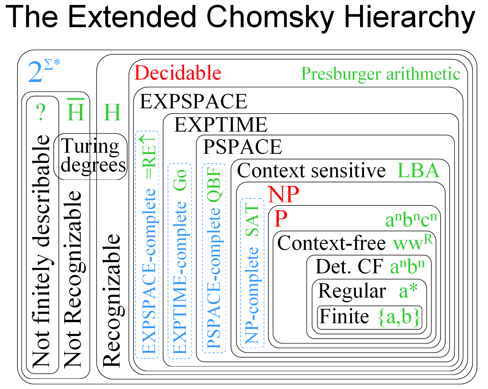

I can now understand some notations on this diagram `aⁿbⁿcⁿ` (a string which contains equal size sequences of a, b, c), `wwᴿ` (palindrome), `aⁿbⁿ`, `a*` (Kleene star), `{a, b}` finite set.

But what about `P`, `NP`, `LBA`, etc? Those notations come from 3 different branches:

- **Computability** theory: What problems are solvable for computers?
  - Decidable vs undecidable (Turing degrees)
- **Complexity** theory: What makes some problems easy or hard for computers?
  - `P`, `NP`, `PSPACE`, `EXPTIME`, `EXPSPACE`
- **Automata** theory: What formal model of computation is required for a problem?
  - `LBA` (linear bounded automaton), `DPA` (deterministic pushdown automaton) etc.

## Automata theory

Notes based on [Automata Theory course from Stanford](https://cs.stanford.edu/people/eroberts/courses/soco/projects/2004-05/automata-theory/basics.html).

**Automatons** are abstract models of machines that perform computations on an input by moving through a series of states or configurations. At each state of the computation, a transition function determines the next configuration on the basis of a finite portion of the present configuration. As a result, once the computation reaches an accepting configuration, it accepts that input. The most general and powerful automata is the Turing machine.

The behavior of these discrete systems is determined by the way that the system is constructed from storage and combinational elements. Characteristics of such machines include:

- **Inputs**: assumed to be sequences of ~~symbols~~ letters selected from a finite set of input signals (string <code>w∈Σ<sup>\*</sup></code>).
- **Outputs**: sequences of ~~symbols~~ letters selected from a finite set Z.
- **States**: finite set Q, whose definition depends on the type of automaton.

There are four major families of automaton :

- Finite-state machine (FSM) or finite automata (automaton)
  - deterministic finite automata (DFA) and non-deterministic FA (NFA)
- Pushdown automata (PDA)
  - Deterministic PDA or non-deterministic PDA (NPDA, NPA)
- Linear-bounded automata (LBA)
- Turing machine (TM)

### Finite-state machine

FSM is a "machine" that changes states while processing symbols, one at a time. FSM is a 5-tuple `M=(Q, Σ, δ, q₀, F)` (`M` for a machine)

- Finite set of states: `Q = {q₀, q₁, q₂, ..., qₓ}`
- Transition function: `δ: Q×Σ → Q`
- Initial state: `q₀∈Q`
- Final states: `F⊆Q` (is a subset of `Q`)

**Acceptance**: end up in a final state (`F`).

**Rejection**: anything else (including hang-up/crash)

For example: automata that accepts <code>abababab...= (ab)<sup>\*</sup></code>.

```
M=({q₀,q₁}, {a,b}, {((q₀,a),q₁), ((q₁,b),q₀)}, q₀, {q₀})
```

As a graph:

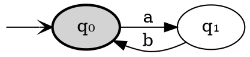

<!-- Bug: b -> a doesn't work with splines=curved with default layout-->

`×` is a Cartesian product, `→` is a mapping (function or more generally relationship). As a result of the Cartesian product of two sets, we get a set of tuples. We can think of tuples as 2-d coordinates, so we can plot the function as 3-d scatter plot or as a table:

|     | a   | b      |
| --- | --- | ------ |
| →q₀ | q₁  |        |
| q₁  |     | **q₀** |

For example, state changes for accepting string `abab`:

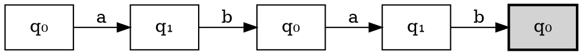

But sometimes it is drawn like this (this is confusing IMO):

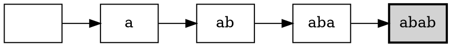

This machine will "crash" on input string "abba". To fix this we can add more edges (make machine total):

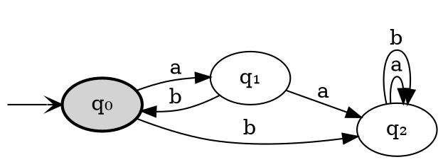

We can have unconnected nodes (`q₃` is final state, but it's unreachable from start state `q₀`):

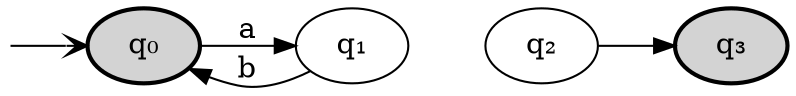

If we extend transition function to strings (from symbols) <code>δ: Q×Σ<sup>\*</sup> → Q</code> we can represent machine compactly.

`δ(q₀,ww₁) = δ(δ(q₀,w),w₁)`, where `δ(qₓ,ε) = qₓ`.

Example 1: `δ(q₀,ab) = δ(δ(q₀,a),b)`

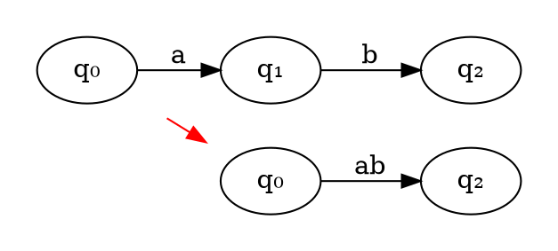

<!-- subgraph name needs to start with "cluster" otherwise it won't work as expected -->

Example 2:

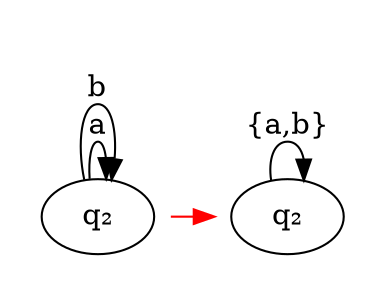

Note: `{a,b}` = PCRE `/^[ab]$/`

**Language of M** is <code>L(M) = {w∈Σ<sup>\*</sup> | δ(q₀,w)∈F}</code>

Language is **regular** iff (if and only if) it is accepted by some FSM.

**Note**: this is one more way to formally specify language, the first one was with grammar (`L(G)`)

### Non-detemenistics FSM

Non-determinism: generalizes determinism, where many "next moves" are allowed at each step. New definition of transition function:

<pre><code>δ: 2<sup>Q</sup>×Σ → 2<sup>Q</sup></code></pre>

Computation becomes a "tree".
**Acceptance**: any path from the root (start state) to some leaf (a final state).

**Example**

A machine that accepts regular language in which each word has `b` as the second symbol before the end. `L = {ba, bb, aba, abb, bba, bbb ...}`.

As regular expression: <code>{a,b}<sup>\*</sup>b{a,b}</code>.
AS PCRE (Perl Compatible Regular Expressions): `/^[ab]*b[ab]$/`.
As a graph:

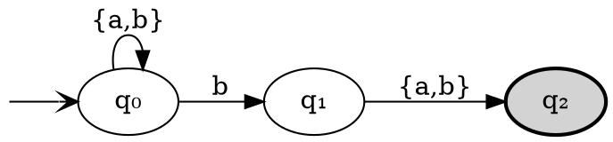

As a table:

|     | a      | b      |
| --- | ------ | ------ |
| →q₀ | q₀     | q₀, q₁ |
| q₁  | **q₂** | **q₂** |
| q₂  |        |        |

**Note** that we have two possible states in the top right cell. This is a nondeterministic choice - with the same input machine can be in two different states.

The machine reads symbols of the string **from left to right**.

Let's see state transitions for string "bb".

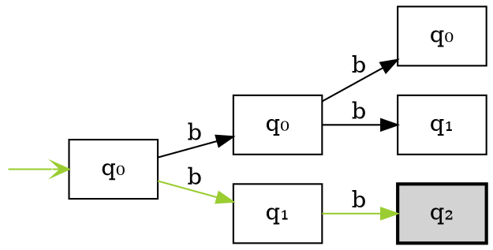

Let's see state transitions for string "bbb".

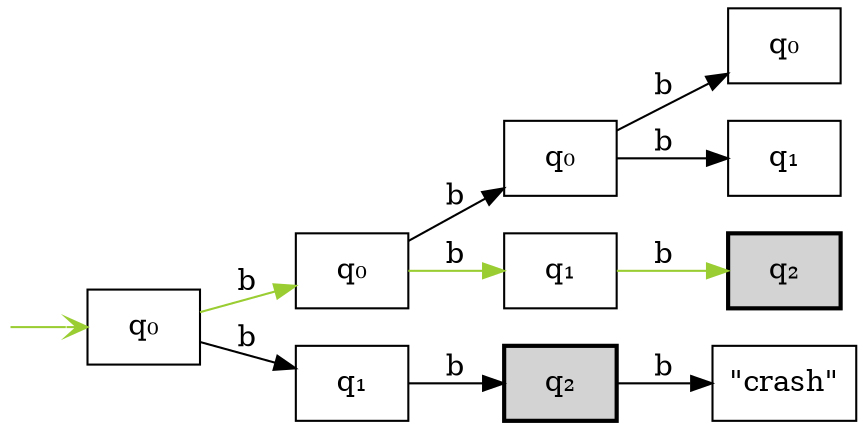

**Theorem**: <mark>Non-determinism in FAs doesn’t increase power.</mark>

Proof by simulation:

- Construct all super-states, one per each state subset.
- New super-transition function jumps among super-states, simulating the old transition function
- Initial super state is those containing the old initial state.
- Final super states are those containing old final states.
- Resulting DFA accepts the same language as the original NFA but can have exponentially more states.

Let's convert previously defined NFA to DFA. We take the initial transition table and convert the first row to sets:

|       | a    | b        |
| ----- | ---- | -------- |
| →{q₀} | {q₀} | {q₀, q₁} |

Now we have one new state `{q₀, q₁}` let's construnct transitions for it:

|          | a       | b            |
| -------- | ------- | ------------ |
| {q₀, q₁} | {q₀,q₂} | {q₀, q₁, q₂} |

Continue:

|              | a        | b            |
| ------------ | -------- | ------------ |
| {q₀, q₂}     | {q₀}     | {q₀, q₁}     |
| {q₀, q₁, q₂} | {q₀, q₂} | {q₀, q₁, q₂} |

Let's draw a graph:

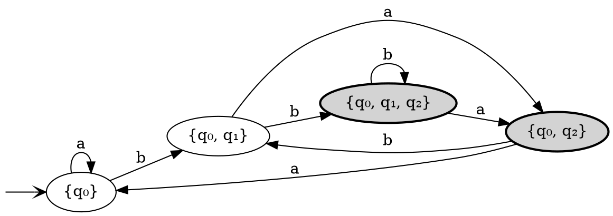

Let's see state transitions for string "bb":

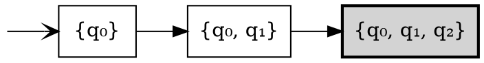

Let's see state transitions for string "bbb":

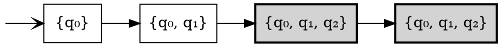

Read more about conversion of NFA to DFA [here](http://www.cs.um.edu.mt/gordon.pace/Research/Software/Relic/).

As we can see NFAs and DFAs have the same computational power, but NFAs are more compact and "clearly communicate intention".

### Regular Expressions

Regular expressions are used to denote regular languages. They can represent regular languages and operations on them compactly.
The set of regular expressions over an alphabet `Σ` is defined recursively as below. Any element of that set is a regular expression.

```ebnf
Regexp = Ø              (* empty language *)
      | {ε}             (* trivial language *)
      | {x}             (* singleton language *)
      | Regexp + Regexp (* union *)
      | Regexp Regexp   (* concatenation *)
      | Regexp*         (* Kleene closure *)
```

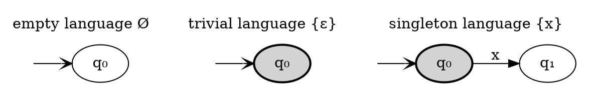

Union `R + S`:

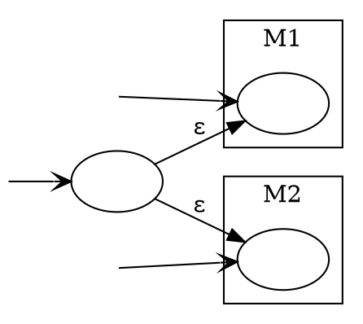

**Note**: Language union `{a} ∪ {b} = {a,b}` ~ RE union `a + b` ~ PCRE `/^[ab]$/` or `/^(a|b)$/`.

Concatenation `RS`:

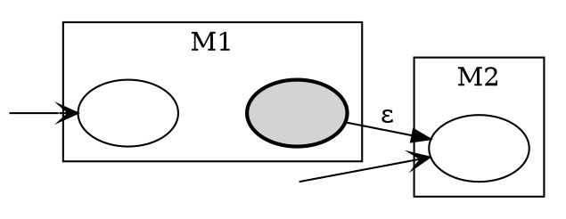

Kleene closure <code>R<sup>\*</sup></code>:

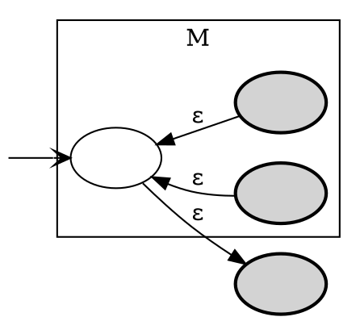

**Theorem**: Any regular expression is accepted by some FA.

A FA for a regular expression can be built by composition.

**Note** here suppose to be an example but I'm lazy to draw it. [See original lecture slide on page 28](http://www.cs.virginia.edu/~robins/cs3102/slides/Theory_Slides_Formal_Languages_and_Machines_v52.pdf).

## FA Minimization

### Merging nodes

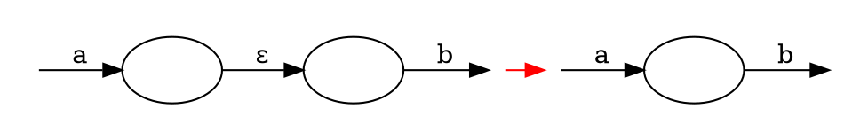

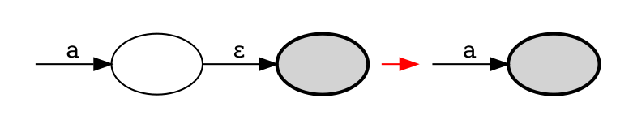

### Merging edges

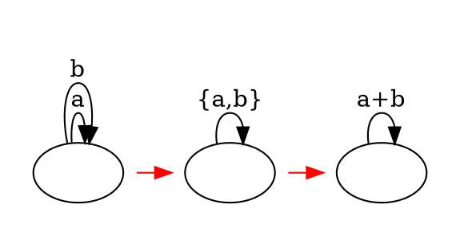

**Theorem** [Hopcroft 1971]: the number N of states in a FA can be minimized within time `O(N log N)`. Based on earlier work [Huffman 1954] & [Moore 1956].

**Conjecture**: Minimizing the number of states in a nondeterministic FA can not be done in polynomial time. (Is this because non-deterministic FA corresponds to deterministic FA with an exponential number of nodes?)

**Theorem**: Minimizing the number of states in a pushdown automaton (or TM) is undecidable.

**Theorem**: Any FA accepts a language denoted by some RE. **Proof**: use "generalized finite automata" where a transition can be a regular expression (not just a symbol), and: Only 1 super start state and 1 (separate) super final state. Each state has transitions to all other states (including itself), except the super start state, with no incoming transitions, and the super final state, which has no outgoing transitions.

Now reduce the size of the GFA by one stateat each step. A transformation step is as follows:

```dot
digraph graphname {
  compound=true;
  rankdir="LR";

  subgraph cluster_0 {
    color=none;
    1[label=""];
    2[label=""];
    3[label=""];
    1 -> 2[label=P];
    1 -> 3[label=R];
    3 -> 2[label=T];
    3 -> 3[label=S];
  }
  subgraph cluster_1 {
    color=none;
    4[label=""];
    5[label=""];
    4 -> 5[label=P];
    4 -> 5[label="RS*T"];
  }
  subgraph cluster_2 {
    color=none;
    6[label=""];
    7[label=""];
    6 -> 7[label="P + RS*T"];
  }

  1 -> 4 [ltail=cluster_0,lhead=cluster_1, color=red];
  4 -> 6 [ltail=cluster_1,lhead=cluster_2, color=red];
}
```

Such a transformation step is always possible, until the GFA has only two states, the super-start, and super-final states:

The label of the last remaining transition is the regular expression corresponding to the language of the original FA

**Corollary**: FAs and REs denote the same class of languages.

## To be continued

Lectures from Robins are quite good...

I didn't cover:

- ε-transitions in NFAs
- transformation and minimisation of FSMs
- Regular Expressions Identities
- Decidable Finite Automata Problems

See also:

- [Automata theory. An algorithmic approach, Javier Esparza](https://www7.in.tum.de/~esparza/autoskript.pdf)
- [A taxonomy of finite automata construction algorithms, Bruce W. Watson](http://alexandria.tue.nl/extra1/wskrap/publichtml/9313452.pdf)
  - Thompson's construction
  - Berry-Sethi construction
  - The McNaughton-Yamada-Glushkov construction. See: [Introducing Glush: a robust, human-readable, top-down parser compiler](https://www.sanity.io/blog/why-we-wrote-yet-another-parser-compiler)
  - The Aho-Sethi-Ullman DFA construction
  - The Myhill-Nerode construction
  - Brzozowski construction. Related: **parsing with derivatives**
  - DeRemer construction
