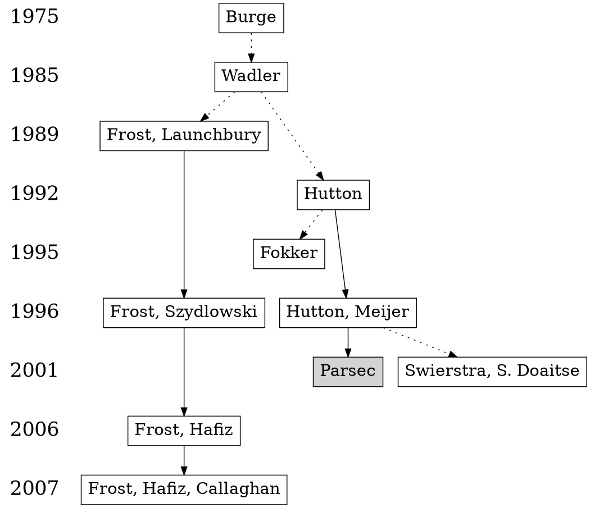

In my [first post](/content/posts/an-overview-of-parsing-algorithms/index.md) I didn't mention "parser combinators".

Parser combinator is the way to construct recursive descent parsers in functional programming using functions. Higher-order functions can be used to combine parsers, to represent sequencing, choice, and repetition.

Recursive descent parsers were known since the 60's - the main innovation is that parser can be directly modeled as functions, no need to generate parsing table as it is done in "classical" algorithms, like YACC (hence the name - yet another compiler compiler). There are other algorithms, that don't need the compilation step, so-called "interpreter" parsers - they don't compile grammar, but execute it script (like scripting language).

The second innovation is that parsers are easy to combine and reuse. This was quite an innovative idea at the time (90's). But since then other parser algorithms appeared which can do this as well - so-called "scannerless" parsers, for example, PEG.

As far as I know there are two approaches for parsing designed specifically for functional languages:

- parser combinators
- parsing with derivatives

I need to read more about parser combinators - for now, I collected "classic" works on the subject.

## History

1975 W.H. Burge. [Recursive Programming Techniques](https://archive.org/details/recursiveprogram0000burg).

1985 Wadler, Philip. [How to replace failure by a list of successes a method for exception handling, backtracking, and pattern matching in lazy functional languages](https://rkrishnan.org/files/wadler-1985.pdf).

1989 Frost, Richard; Launchbury, John. [Constructing natural language interpreters in a lazy functional language](https://www.researchgate.net/publication/220460071_Constructing_Natural_Language_Interpreters_in_a_Lazy_Functional_Language).

1992 Hutton, Graham. [Higher-order functions for parsing](http://www.cs.nott.ac.uk/~pszgmh/parsing.pdf).

1995 Fokker, Jeroen. [Functional parsers](https://www.researchgate.net/publication/2426266_Functional_Parsers).

1996 Hutton, Graham; Meijer, Erik. [Monadic parser combinators](http://www.cs.nott.ac.uk/~pszgmh/monparsing.pdf).

1996 Frost, Richard A.; Szydlowski, Barbara. [Memoizing Purely Functional Top-Down Backtracking Language Processors](https://richard.myweb.cs.uwindsor.ca/PUBLICATIONS/SCOMP_96.pdf).

2001 Swierstra, S. Doaitse. [Combinator parsers: From toys to tools](https://www.researchgate.net/publication/222837975_Combinator_Parsers_From_Toys_to_Tools).

2001 Leijen, Daan; Meijer, Erik. [Parsec: Direct Style Monadic Parser Combinators For The Real World](https://www.microsoft.com/en-us/research/wp-content/uploads/2016/02/parsec-paper-letter.pdf).

2006 Frost, Richard A.; Hafiz, Rahmatullah. [A New Top-Down Parsing Algorithm to Accommodate Ambiguity and Left Recursion in Polynomial Time](https://www.researchgate.net/publication/220177599_A_new_top-down_parsing_algorithm_to_accommodate_ambiguity_and_left_recursion_in_polynomial_time).

2007 Frost, Richard A.; Hafiz, Rahmatullah; Callaghan, Paul. [Modular and Efficient Top-Down Parsing for Ambiguous Left-Recursive Grammars](https://www.researchgate.net/publication/30053225_Modular_and_efficient_top-down_parsing_for_ambiguous_left-recursive_grammars).
