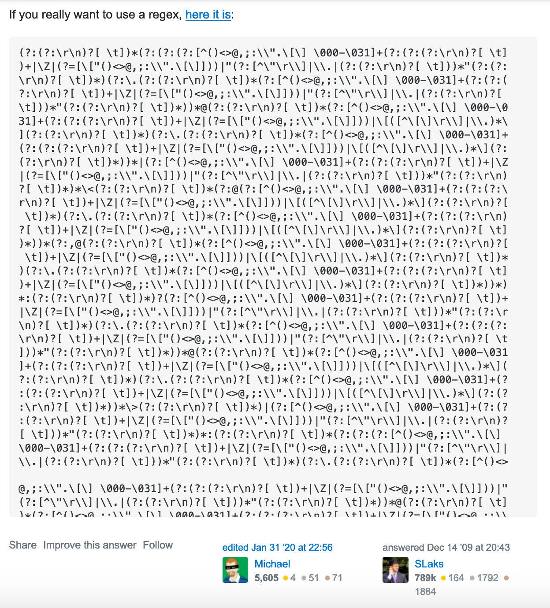

## Why do we need parsers?

The first obvious use case is computer languages. (I use the term computer language because not everybody considers HTML a programming language). This includes:

- compilers
- interpreters
- syntax highlighting
- static analysis tools, like linters and language servers

But also:

- network protocols
- serialization and deserialization
- configuration files
- command-line arguments
- natural language processing
- query languages (search box on the website)
- validation, like email validation

## The irony

Parser generators have been studied since the '60s. In practice, this knowledge is mostly used for compilers and interpreters. I guess this is because the subject typically introduced in course about compilers, for example [cs143](https://web.stanford.edu/class/archive/cs/cs143/cs143.1128/), [15-411/611](https://csd.cmu.edu/course-profiles/15-411_611-compiler-design), [CS-321, 322](http://web.cecs.pdx.edu/~harry/compilers/syllabus.html), [COP5621](http://www.cs.fsu.edu/~engelen/courses/COP5621/).

For other tasks, people typically use ad-hoc solutions and regular expressions. The obvious problem is that ad-hoc solutions are error-prone and harder to maintain.

Regular expressions (I'm talking about the first implementation - `grep`; not about the formal system by Kleene) were created to be used within the command-line. The command-line interface typically requires one-liners, hence terse notation (though it is possible to open editor and pipe text from the buffer).

I don't think that author meant it to be used to validate emails, for example, see [this answer on StackOverflow](https://stackoverflow.com/questions/201323/how-to-validate-an-email-address-using-a-regular-expression).

Two potentially better solutions:

- [rfc5322](https://www.ietf.org/rfc/rfc5322.txt) provides formal grammar (ABNF), so it should be possible to generate a parser
- Use something like [Rosie](https://rosie-lang.org/about/) - the notation is not so terse. Rosie uses [PEG](https://bford.info/packrat/), which was introduced only in 2004.

Second example of ad-hoc solution is syntax highlighting with regular expressions, for example [TextMatte language grammars](https://macromates.com/manual/en/language_grammars). Compare ad-hoc solution (on the left) and real context-free language parser (on the right):

Credit: image taken [here](https://marketplace.visualstudio.com/items?itemName=georgewfraser.vscode-tree-sitter).

## Even more irony

There is a lot of research about parsing and the most complex problems are:

- handling ambiguous grammar
- handling left-recursive grammar
- clear error reporting and error recovery
- incremental parsing

Most of those problems could be avoided with [projectional editing](https://www.reddit.com/r/nosyntax/wiki/projects) and the source code can be stored as AST, for example, like in [unison](https://www.unisonweb.org/).

It is relatively easy to create a parser for non-ambiguous, non-left recursive CFG, like s-expressions or JSON, with linear complexity.

## PS

I may sound a bit dramatic here, for example, there are a lot of [binary parsers](https://github.com/dloss/binary-parsing), but admit there is a bit of irony in the situation.
