Based on:

- [Theory of Computation (CS3102), Spring 2017](http://www.cs.virginia.edu/~robins/cs3102/slides/Theory_Slides_Formal_Languages_and_Machines_v52.pdf), videos are [here](http://www.cs.virginia.edu/~robins/videos.html)
- [It’s Time for a New Old Language, 2017](https://groups.csail.mit.edu/mac/users/gjs/6.945/readings/Steele-MIT-April-2017.pdf), [talk](https://www.youtube.com/watch?v=dCuZkaaou0Q) by Guy L. Steele Jr.
- [Parsing with Derivatives, 2011](http://matt.might.net/papers/might2011derivatives.pdf) by Matthew Might, David Darais, Daniel Spiewak, [video](https://www.youtube.com/watch?v=ZzsK8Am6dKU).


## History of notation

All material I have read on the subject use slightly different notation. Apparently, there is some history behind it.

Slide 21 from Guy L. Steele Jr. presentation:

- **1951** Stephen Kleene develops regular expressions to describe McCulloch-Pitts (1943) nerve nets (uses `∨` for choice; considers postfix `∗`, but decides to make it a binary operator to avoid having empty strings: `x∗y` means any number of copies of `x`, followed by `y`).
- **1956** Journal publication of Kleene’s technical report: binary `∗` only.
- **1958** Copi, Elgot, and Wright formulate REs using `·` and `∨` and postfix `∗`.
- **1962** Janusz Brzozowki uses binary `+` for `∨` and introduces postfix `+`.
- **1968** Ken Thompson’s paper "Regular Expression Search Algorithm" uses `|`.
- **1973** Thompson creates `grep` from `ed` editor for use by Doug McIlroy.
- **1975** Alfred Aho creates `egrep` (includes `( )`, `|`, `*`, `+`, `?`).
- **1978** CMU Alphard project uses regular expressions with `*`, `+`, and `#`.
- **1981** CMU FEG and IDL use regular expressions with `*`, `+`, and `?`.

For example, Robins (see [lecture notes from the previous post](/content/posts/notes-on-parsing-theory-3/index.md)) uses Brzozowki notation (`+` for union).

Matthew Might (in Parsing with derivatives) uses a variation of Copi, Elgot, and Wright notation:

- `◦` instead of `·`
- `∪` instead of `∨`
- uses `ϵ` - the same as Niklaus Wirth in "What can we do about the unnecessary diversity of notation for syntactic definitions?"

Almost everybody uses `*` the same way - postfix unary operator. The difference is that some notations use superscript and some use plain variation.
To add more confusion: `ϵ`, `ε` are both the same Greek letter - epsilon - in different styles.

| Name             | RE³ Robins | RE³ Might | Chomskian grammar | PCRE⁴                | Language                      |
| ---------------- | ---------- | --------- | ----------------- | -------------------- | ----------------------------- |
| empty language   | `∅`        | `∅`       |                   |                      | `{}`                          |
| trivial language |            | `ϵ`       | S → ε             | `^$`¹ or `^.{0}$`¹   | `{ε}`                         |
| singleton lang.  | `a`        | `a`       | S → a             | `^a$`                | `{a}`                         |
| concatenation    | `ab`       | `a∘b`     | S → ab            | `^ab$`               | `{ab}` or `{a}∘{b}`           |
| union            | `a+b`      | `a⋃b`     | S → a \| b        | `^[ab]$` or `^a\|b$` | `{a,b}` or `{a}⋃{b}`          |
| Kleene star²     | `a*`       | `a★`      | S → ε \| aS       | `^a*$` or `^a{0,}$`  | `{ε,a,aa, ...}`               |
| Kleene plus      | `aa*`      | `a∘a★`    | S → a \| aS       | `^a+$` or `^a{1,}$`  | `{a,aa, ...}`                 |
|                  |            | `a⋃ϵ`     | S → a \| ε        | `^a?$` or `^a{0,1}$` | `{a,ε}` or `{a}⋃{ε}`          |
| alphabet         |            |           | S → a \| b \| ... | `^.$`¹               | `{a,b,c,d, ...}` or `Σ`       |
| difference       |            |           | S → b \| c \| ... | `^[^a]$`¹            | `{b,c,d,e, ...}` or `Σ - {a}` |

¹ approximation
² aka repetition
³ RE - regular expressions
⁴ [PCRE](http://www.pcre.org/current/doc/html/pcre2pattern.html#SEC1) - Perl Compatible Regular Expressions

## Dynamic programming

In the context of programming, it is an optimization technique developed by Richard Bellman in the 1950s. It can be applied to a specific class of recursive problems. For example, calculation of Fibonacci numbers or finding the shortest path in a graph.

In general, it allows to turn algorithms with exponential complexity to polynomial complexity (but may require more space). I won't go into more details - but very primitively it boils down to memoization and cycle detection.

You can watch [this MIT course](https://ocw.mit.edu/courses/electrical-engineering-and-computer-science/6-006-introduction-to-algorithms-fall-2011/lecture-videos/lecture-19-dynamic-programming-i-fibonacci-shortest-paths/) where it's explained better.

## Brzozowki derivative

In [1964 Brzozowki](http://krchowdhary.com/me-tfl/5-derivatives-of-regex-brzozowski.pdf) proposed idea of derivatives for regular expressions. Note: he uses `λ` for `ϵ` and `φ` for `∅`.

Formally derivative defined as `Dₐ(R) = { t | at ϵ R }`. Basically, it is the opposite of concatenation.

For example:

- if we have language `{ abb, abc, bbb }`
- derivative by `a` will give `{ bb, bc }`
- then derivative by `b` will give `{ b, c }`
- then derivative by `c` will give `{ ε }`

More formally:

- `Dₐa = ϵ`
- `Dₐb = ∅`
  - `Dₐϵ = ∅`
  - `Dₐ∅ = ∅`
- `Dₐ(P*) = (DₐP)P*`
- `Dₐ(PQ) = (DₐP)Q + δ(P)DₐQ`
- `Dₐ(P+Q) = DₐP + DₐQ`

Brzozowki shows how derivatives can be used to construct Mealy and Moore automata (finite state machines). Also, he shows how identity rules can be used to simplify automata.

## Parser combinators

In [1985 Wadler](https://rkrishnan.org/files/wadler-1985.pdf) proposed to represent parsers as functions and to construct bigger parsers by composing functions. The key idea is to start from parsers for atomic languages:

```haskell
-- empty language
fail xs       = []            -- Dx(∅)   = ∅
-- trivial language - empty string
empty v xs    = [(v, xs)]     -- Dϵ(P)   = P
-- singleton language
lit 'a' "abc" = [('a', "bc")] -- Da(abc) = bc
lit 'b' "abc" = []            -- Db(abc) = ∅
```

Atomic languages as finites state machines:

```dot
digraph graphname {
  compound=true;
  rankdir="LR";

  subgraph cluster_0 {
    label="empty language ∅"
    color=none;
    start0[label="", fixedsize="false", width=0, height=0, shape=none];
    start0 -> 0[arrowhead=vee];
    0[label=q₀];
  }

  subgraph cluster_1 {
    label="trivial language ϵ"
    color=none;
    start1[label="", fixedsize="false", width=0, height=0, shape=none];
    start1 -> 1[arrowhead=vee];
    1[label=q₀ style="bold, filled"]
  }

  subgraph cluster_2 {
    label="singleton language {x}"
    color=none;
    start2[label="", fixedsize="false", width=0, height=0, shape=none];
    start2 -> 2[arrowhead=vee];
    2[label=q₀ style="bold, filled"]
    21[label=q₁];
    2 -> 21[label = x]
  }

  0 -> start1 [style=invis]
  1 -> start2 [style=invis]
}
```



Then atomic parsers can be composed with union (`alt`), concatenation (`seq`), and Kleene star (`rep`) to create parsers for "bigger" languages.

It is a bit harder to see correspondence of derivatives to those parsers:

```haskell
alt (lit 'a') (lit 'b') "abc" = [('a', "bc")]
seq (lit 'a') (lit 'b') "abc" = [("ab", "c")]
rep (lit 'a') "aac"           = [("aa", "c"), ("a", "ac"), ("", "aac")]
```

The problem here is that the derivative corresponds to the recognizer. Parsers are a bit trickier, than recognizers.

[Ruzzo in 1979](https://link.springer.com/chapter/10.1007/3-540-09510-1_39) showed that any recognizer can be transformed to parser with the overhead of `O(log n)` at most.

Wadler shows the importance of lazy evaluation in this approach. He reminds that this approach corresponds to recursive descent (with backtracking ?) e.g. it can't handle left recursive grammars.

## Parsing with derivatives

The idea was proposed by [Matthew Might et al in 2010](http://david.darais.com/assets/papers/parsing-with-derivatives/pwd.pdf).

They extend the idea of Brzozowki derivative from regular to context-free languages. Then they create a set of functions that can be composed to represent grammars - the same way as in parser combinators. They rely on laziness and fixed point (essentially cycle detection) to make sure that the algorithm won't do infinite recursion. Then they transform the recognizer into a parser and introduce the idea of derivative for the parser. And the last step is performance optimization - memoization is supposed to improve performance, but the problem is that on every parse it produces new grammar which grows exponentially (I guess exponentially). To solve the problem with growing grammar they added a compaction step after each parse cycle (Brzozowki had the same idea).

What is good:

- small code size
- supports CFG including left recursive grammars
- can handle ambiguous grammar - returns all possible parse trees
- acceptable performance for such small code

What is bad:

- no error reporting - it either produces all possible parse trees or none
- not so trivial to implement if the language doesn't provide some features. More about this later.

The initial intention was to ["kill yacc"](http://matt.might.net/articles/parsing-with-derivatives/) e.g. provide a simpler parsing algorithm (at least for learning purposes). It is indeed simple, but without fixing the problems listed above I don't think it will "take over the world".

What else I would expect from parser - yacc is not that high bar IMO, it is based on LR algorithm from the '60s, people since then invented a lot:

- not optimal parse "forest" representation. It is represented as a set of all trees. For example, Spoofax produces one tree with special "ambiguity" nodes, which mark where ambiguity happened
- no special way to resolve the ambiguity. For example, Spoofax, Marpa provide special instructions to mark associativity and precedence of operators
- no special way to distinguish lexical and syntactical rules. For example, in Spoofax, ANTLR, and basically in all "scannerless" parsers this is possible
- no error tolerance - it can't be used to highlight code in IDE, which can be partially correct

### Implementation

Canonical implementation provided in [Racket](https://racket-lang.org/) (Scheme). To make sure I understand how it works I decided to [reimplement it in JavaScript](https://github.com/stereobooster/parsing-with-derivalives).

Laziness is essential for this algorithm. Not a lot of languages provide it out of the box (in Scheme and Lisp it is trivial to emulate it with macros). In JS I decide to use Proxy and anonymous functions (lambdas).

To implement memoization we need to use a "hash map" (aka dictionary, aka associative array). Not all languages allow to use objects (aka structs) as keys, for example, I use `WeakMap` instead of `Map` in JS. Also, not all languages provide "weak" hash maps, which means that memory won't be cleaned up by garbage collectors.

JS doesn't support recursive `let`, so I implemented a special function `letrec` to define recursive grammars.

JS doesn't provide ordered sets. I decided to avoid `npm` packages, so I use an array and remove duplicates upon insertion.

JS doesn't provide functional pattern matching - I use `switch/case` and `if/else` instead 🤷‍♀️.

It takes some time to understand how to implement a feature that is not built in the language. It is hard to debug - I wasn't sure if there was an error in the algorithm or my reimplementation of laziness, memoization.

## PS

One way or another it was a good learning exercise. More thoughts after:

I don't understand yet is why Wadler says that parsing combinators are decent recursive **with backtracking** - it produces all parse trees. Backtracking corresponds to depth-first search, lookahead corresponds to breadth-first search, right? Does it make sense to differentiate backtracking for all branches and lookahead of infinite depth? They both will walk through all nodes in the graph eventually, but in a different order 🤔.

Language can be defined in 3 ways:

- as a set
- as production rules (quadruple alphabet, terminals, non-terminals, and rules)
- as a recognizer automata

The first definition is unique but impractical. The other two are not unique e.g. two different grammars can describe the same language, for example: `S → ε | aS`, `S → ε | Sa`, `a*`.

I wonder if this algorithm can be trivially implemented only in functional languages or not? If the answer is yes, does it mean that JS is not so "functional" as people tend to think 🤔?

This exercise shows how JS lags behind, especially in meta-programming and standard libraries. I wonder how easier it would be to implement in Python or Ruby, which provides better standard library and meta-programming facilities.
