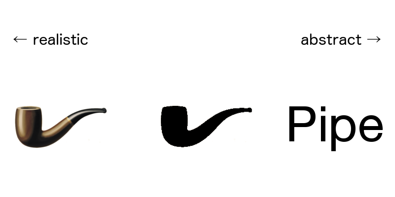
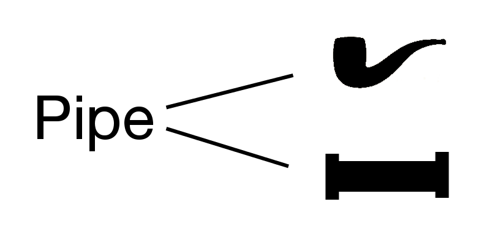

I talked about [categorical](/posts/categorical-thinking/) and [abstract](/posts/abstraction/) thinking, let's talk about symbolic thinking.

## What is symbolic thinking?

> the ability to think about objects and events that are not within the immediate environment. It involves the use of signs, symbols, concepts, and abstract relations, as evidenced by language, numeracy, and artistic or ritual expression.
>
> -- [APA Dictionary of Psychology](https://dictionary.apa.org/symbolic-thinking)

The key concept of symbolic thinking is that we use one thing (symbol) to represent a different one, often some meaning. The symbol can be a picture, a sound, a gesture, a word or a different physical object basically anything.

The idea is pretty simple and can be viewed as unimportant, but its power comes from wide applicability. You can find it everywhere

### Symbols in communication

Symbols are the basis for (intentional) communication. When you need to pass some message, you would use a symbol which is understood by both parties.

For example, vervet monkeys are vulnerable to a variety of predators, including leopards, eagles, and large snakes, and studies in the 1970s and 80s found that the monkeys produced different alarm vocalizations in response to each. They have different symbols, for different dangers. See "Cheney DL, Seyfarth RM. How Monkeys See the World: Inside the Mind of Another Species. Chicago: University of Chicago Press; 1990".

### Symbols in computation

> The machine is supplied with a "tape" (the analogue of paper) running through it, and divided into sections (called "squares") each capable of bearing a "symbol". At any moment there is just one square, say the r-th, bearing the symbol <2>(r) which is "in the machine".
>
> -- [ON COMPUTABLE NUMBERS, WITH AN APPLICATION TO
THE ENTSCHEIDUNGSPROBLEM, By A. M. TURING; 1936.](https://www.cs.virginia.edu/~robins/Turing_Paper_1936.pdf)

Computation can be viewed as manipulation on symbols.

### Symbolic thinking in children's development

According to [Piaget theory](http://psych.colorado.edu/~colunga/p4684/piaget.pdf), there are four stages in children's development:

- Sensorimotor stage (birth to 2 years)
- Preoperational stage (2 to 7 years)
- Concrete operational stage (7 to 12 years)
- Formal operational stage (12 years and up)

Symbolic thinking is a key part of the preoperational stage. Children play with dolls imitating adults, but the same time those dolls are symbols (they represent someone or something).

### Symbolism vs abstraction

Symbols can represent real objects, but most often they represent abstractions. Word "numbers" is a symbol for numbers as an abstraction.

Symbols and abstractions used together so often that sometimes get confused. Some researches distinguish "symbol" and "sign", but their definition of a symbol is closer to the definition of abstraction or concept.

Even more, some visual symbols, like icons or pictograms, are formed by using abstraction for visual representation.

### Symbols and neural networks

**Disclaimer**: this section is my layman's theory, I do not have enough knowledge in this area.

The issue with current implementations of machine learning is that even if it provides you the answer, there is no way to understand how this answer was formed, you need to do additional action to prove it is correct. For example, [Explainable Artificial Intelligence (DARPA project)](https://www.darpa.mil/program/explainable-artificial-intelligence) is working on this problem. And one way to solve this is by introduction symbol systems, as soon as ML will be able to create a correspondence between some region of neurons and some symbols, maybe it will be possible to understand the reasoning of the machine.

[Thought Vectors](http://gabgoh.github.io/ThoughtVectors/) can be interpreted as symbols.

One of the critiques of AlphaGo is that it takes too long to learn to play the game. From one side child can learn rules much faster, from another side AlphaGo Zero started from completely random behavior and self-trained.
[It trained for approximately 40 days (29 million games of self-play)](https://www.nature.com/articles/nature24270.epdf?author_access_token=VJXbVjaSHxFoctQQ4p2k4tRgN0jAjWel9jnR3ZoTv0PVW4gB86EEpGqTRDtpIz-2rmo8-KG06gqVobU5NSCFeHILHcVFUeMsbvwS-lxjqQGg98faovwjxeTUgZAUMnRQ). In this sense DeepLearning is closer to [amoeba which can approximate solutions for np-hard problem](https://phys.org/news/2018-12-amoeba-approximate-solutions-np-hard-problem.html) - it doesn't have understanding "crystallized" with symbols instead it just optimize for inputs.

I believe that symbols and abstraction play important role in human intelligence, they amplify understanding (amplify regions of neural network?). Again, as I said earlier this is layman's theory - I need to read more to actually prove it or even understand if it makes sense or not.

## Issue of symbolic thinking

### One object can be represented by many symbols

Which creates confusion. Why there are two (or more) symbols? Are they referring to different but very similar concepts? And sometimes, people find this difference even if it doesn't exist.

### One symbol can represent many objects

Humans use context to understand which exact meaning symbol has in case of ambiguity. Context often implicit and can be omitted and this creates problems in communication.

> Cover image: The Treachery of Images (French: La Trahison des images) is a 1929 painting by surrealist painter René Magritte.
