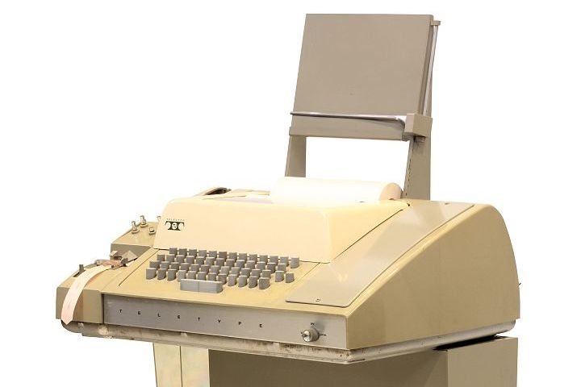
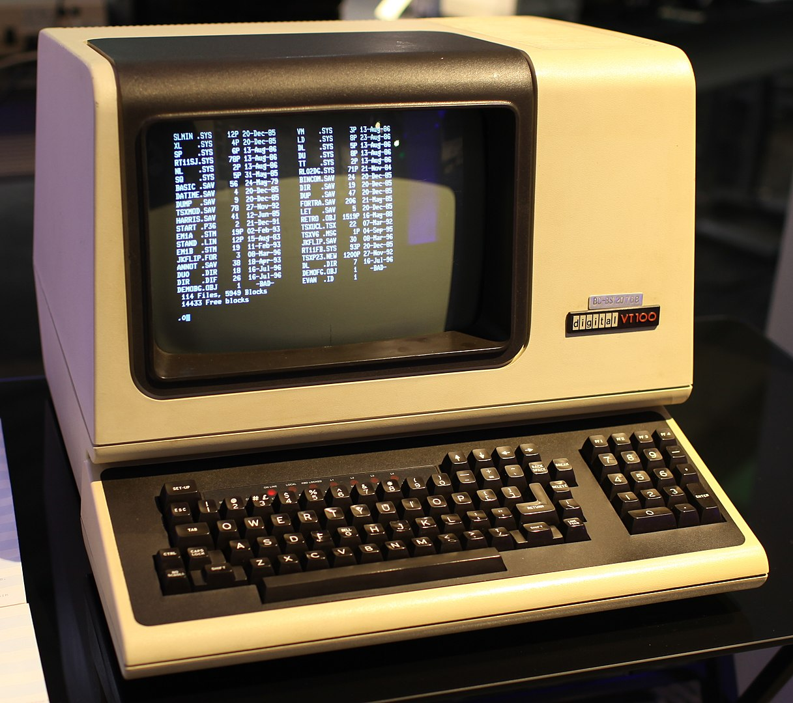
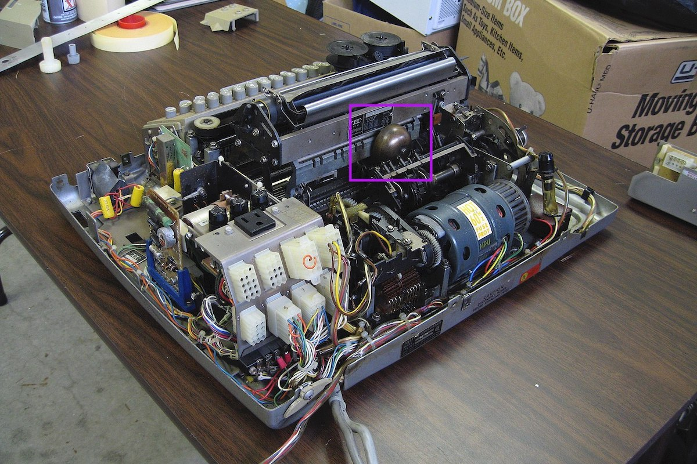
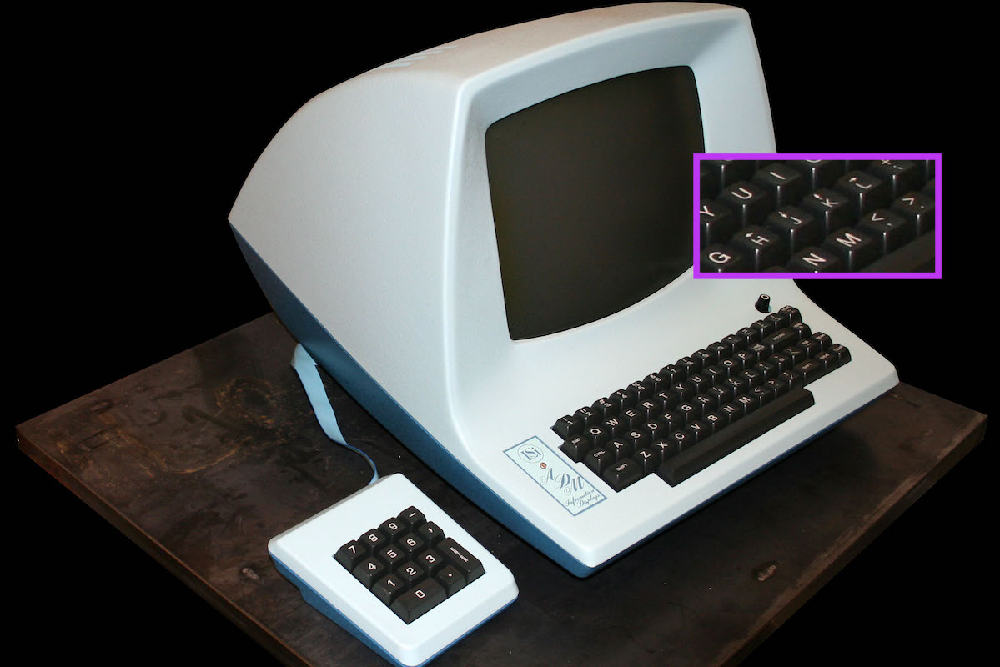
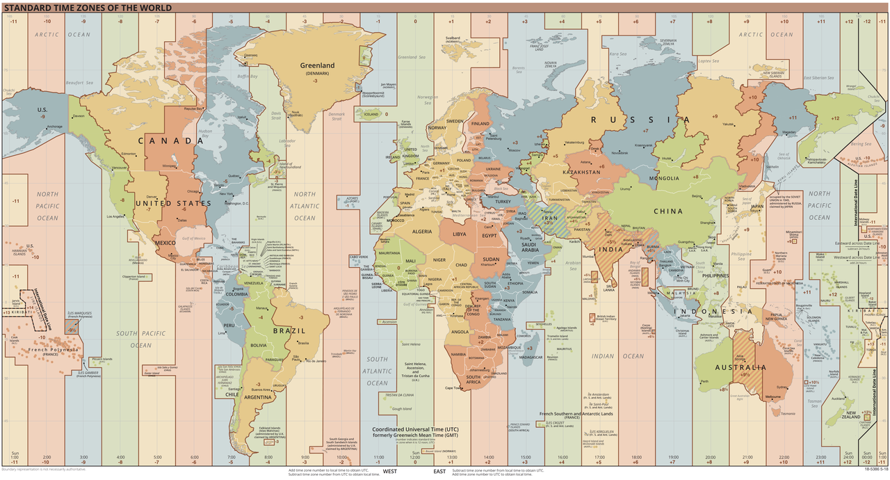
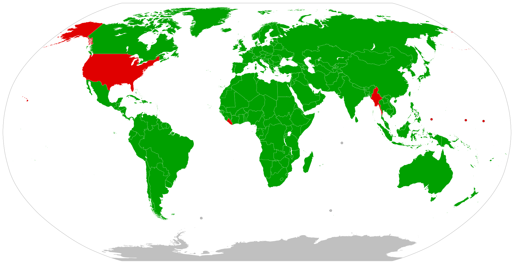
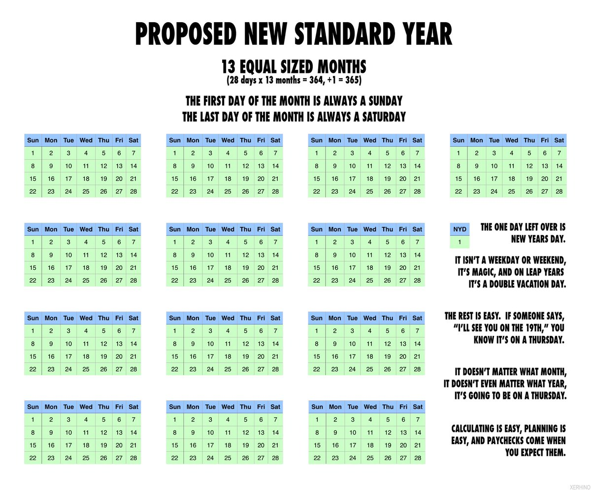

## Traditions

> an inherited, established, or customary pattern of thought, action, or behavior (such as a religious practice or a social custom)
>
> -- [Merriam-Webster](https://www.merriam-webster.com/dictionary/tradition)

There are things which we do without questioning. Why we do it that way? Because this is how we've been taught to do things or this is how everybody else doing it. Those unformalized rules (traditions), as well can be called [known unknowns](https://www.destroyallsoftware.com/talks/ideology) or [ideology](https://www.youtube.com/watch?v=ql80Klk4pSU).

Have you seen or written this kind of code:

```js
for (var i = 0; i < ls.length; i++) {
  /* ... */
}
```

Do you know why they use `i`? Because this is how you declare integer variables in Fortran, which first appeared at 1957.

> Variable names starting with one of these letters i j k l m n are integer variable.
>
> -- [The four basic Fortran data types](https://www.cs.mcgill.ca/~ratzer/lectures/lecture4.htm)

The language is out of wide use a long time ago, but we still use this convention. This how traditions work - transparently, behind the scene, you know it without knowing.

## Standards

> something established by authority, custom, or general consent as a model or example
>
> -- [Merriam-Webster](https://www.merriam-webster.com/dictionary/standard)

Standard in contrary to tradition is formalized and written down (known knowns). Standards typically produced by some committee in developers world. For example, "IEEE 754: floating point in modern computers", "ECMAScript 6", "International Standard ISO/IEC 14882:2017(E) – Programming Language C++".

Standard is the way to reach some kind of public agreement, for example, when more than one vendor involved.

The downside of the committee based standardization process is that it can be slow and painful. For example, they discussed JavaScript v4 for 10 years and never released it. Instead, they released a smaller subset of v4 as v5 (JS5).

### Conflicting standards

Sometimes people can't agree on one standard, then we have a problem with conflicting standards. Which do we support? Shall we try to make one unified standard?


Image source: [xkcd](https://xkcd.com/927/).

### Legacy

Some standards outlive their initial use-case because they are preserved for backward compatibility.

For example, ASCII (American Standard Code for Information Interchange), is a character encoding standard for electronic communication. The Teletype Model 33 was introduced in 1963. It was one of the first products to use ASCII.



Image source: [wikipedia](https://en.wikipedia.org/wiki/Teletype_Model_33).

Because they were cheap and accessible they got used as terminals (TTY) to communicate with mainframes. So it was natural to use ASCII as encoding in mainframes as well.

Later smart terminals were introduced (with monochrome screens instead of paper), like DEC VT100 (1978). Those terminals supported ASCII as well.



Image source: [wikipedia](https://en.wikipedia.org/wiki/VT100).

Eventually, those terminals were replaced with personal computers, but ASCII was preserved because it was used in the software. If you open a terminal in your modern OS and paste char for `0x0B` you will hear a sound. Because this is the same code which was used to ring a bell in the Teletype Model 33 🔔.



[Gary Bernhardt has a good talk about terminals and legacy standards](https://www.destroyallsoftware.com/talks/a-whole-new-world).

Why vi uses h j k l for navigation? Because it was written for ADM-3A (1976).



Image source: [wikipedia](https://en.wikipedia.org/wiki/ADM-3A).

The [QWERTY](https://en.wikipedia.org/wiki/QWERTY) design is based on a layout created for the Sholes and Glidden typewriter and sold to E. Remington and Sons in 1873.

AFAIK the eldest legacy standard in use today is sexagesimal (base 60) numeral system that we use for time measurement. This system originated with the Sumerians in the 3000 BC, then was used by Babylonians.

**Homework for the reader**: what is the connection between a dollar bill and 80 characters limit on the screen?

### Chaotic standards

Not all standards were established by some committee, but rather were chaotically chosen for some historical reasons and later fixed on the paper. For example, state borders, time zones (which partially follow state borders), [house numbers, street orientation](https://www.mjt.me.uk/posts/falsehoods-programmers-believe-about-addresses/) (in old cities), etc.



Image source: [wikipedia](https://en.wikipedia.org/wiki/List_of_UTC_time_offsets).

In programming this happens as well, for example, Excel incorrectly regards 1900 as a leap year, and allows February 29, 1900, to be entered as a date. This is for compatibility with Lotus 1-2-3, which also had this bug.

### Globalization

> the act or process of globalizing: the state of being globalized
>
> -- [Merriam-Webster](https://www.merriam-webster.com/dictionary/globalization)

Progress in science and globalization forced people to consolidate some standards, for example, the metric system.

The first real-life usage of the metric system came in 1799 (French Revolution). Today almost whole world uses it. Red - countries which have officially adopted the metric system. Green - countries which have not officially adopted the metric system.



Image source: [wikimedia](https://commons.wikimedia.org/wiki/File:Metric_system_adoption_map.svg).

WWW made globalization process even faster.

### The Lindy effect

> The longer a technology has been around, the longer it’s likely to stay around. This is a consequence of the Lindy effect.
>
> -- [John D. Cook](https://www.johndcook.com/blog/2012/12/17/the-lindy-effect/)

This principle can be applied to standards as well. This means that we stuck forever with sexagesimal base time, it would be very hard to replace the Gregorian calendar, we will have to deal with C for quite a long time.

### Reinventing the wheel

A lot of standards nowadays need to be translated into "machine language". It is hard to work with some legacy created standards.

There are attempts (or ideas) to replace legacy standards, for example:

**New calendar**



Image source: [Luke Millar](https://twitter.com/ltm/status/1160670266046816257?s=21).

**New geo coordinates** - [Open Location Code](https://github.com/google/open-location-code) is a technology that gives a way of encoding location into a form that is easier to use than latitude and longitude.

The problem is that due to the Lindy effect it is hard to replace old standards.

To be fair programmers are not the first reinventors in this field. In 1792 during the French Revolution, they tried to use decimal time, which divided the day into 10 decimal hours, each decimal hour into 100 decimal minutes and each decimal minute into 100 decimal seconds.

### Devil in the details

Programmers can improve standards, but can as well make it worse. We need to be aware of [falsehood believes](https://github.com/kdeldycke/awesome-falsehood) and biases. Standards should be created by diverse groups.
