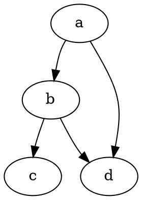

See: https://jpanther.github.io/congo/samples/markdown/

## Basic markdown

Lorem markdownum [unius](http://www.plagis.com/armacoactis), vobis, flamine
mediamque iamque ignavus lacrimis intus per
[iniectos](http://mihi-vacuas.net/appellant), puer, **dabant** despexitque dicenti.
Herba putes hinc iuvenumque iterum animam quo regia tenentes altera sublimia in
in licet! Et haec; [voco](http://nymphis.net/litus.html) quas natus, _subiecta
ventorum a_. Timeri peregrinosque inani Finis mihi loqui, omnes.

~~The world is flat.~~ We now know that the world is round.


> Photo by Maddi Bazzocco on Unsplash

See: https://www.markdownguide.org/extended-syntax

Here's a simple footnote,[^1] and here's a longer one.[^bignote]

[^1]: This is the first footnote.

[^bignote]: Here's one with multiple paragraphs and code.

    Indent paragraphs to include them in the footnote.

    `{ my code }`

    Add as many paragraphs as you like.

- [x] test
- [ ] test

## HTML tags

<kbd>enter</kbd>

<mark>salamander</mark>

<details>
    <summary>Details</summary>
    Something small enough to escape casual notice.
</details>

<!-- ## Cut -->


## Code

`inline code`

**Code block without languege**

```
plain text
```

```{linenos=false}
plain text
```

```text {linenos=false}
plain text
```

Very long code:

```cpp{linenos=true}
if (northbridgeRomLogic != 5) { hdtv_operation.compressionTft(flashFileSecondary(piracy_inkjet, hdd_page,  laser_torrent_iso)); } else { telecommunications(-5); }
```

Is there way to use `diff` + `js`?:

```diff
if (northbridgeRomLogic != 5) {
  hdtv_operation.compressionTft(
    flashFileSecondary(piracy_inkjet, hdd_page, laser_torrent_iso)
  );
} else {
-  telecommunications(-5);
+  telecommunications(-5);
}
```

Plain code:

```js {hl_lines=[8,"15-17"],linenostart=199}
if (northbridgeRomLogic != 5) {
  hdtv_operation.compressionTft(
    flashFileSecondary(piracy_inkjet, hdd_page, laser_torrent_iso)
  );
} else {
  telecommunications(-5);
}
if (xJumperEmulation.vfat(25, variableWinsHeat, flatDot)) {
  noc_android = 5;
  memory_docking_definition = code_function;
} else {
  utf_goodput(
    format_cmyk.table(so_cybersquatter, -3, header),
    viral_mysql(9, bezel),
    cad
  );
  dtd.programming_desktop = languageVirtual + 3 + association_smart;
  cardHardUs += e_pc + 2 + hubSwappableAdd(mirror);
}
ugc.point.modemMicrophone(
  user_rgb + blacklist_codec,
  ntfsSerp.file(alignment_client_active, rfidAnalyst) + taskError,
  unfriendBugSli
);
```

As table (CSS is broken):

```js {linenos=table,hl_lines=[8,"15-17"],linenostart=199}
if (northbridgeRomLogic != 5) {
  hdtv_operation.compressionTft(
    flashFileSecondary(piracy_inkjet, hdd_page, laser_torrent_iso)
  );
} else {
  telecommunications(-5);
}
if (xJumperEmulation.vfat(25, variableWinsHeat, flatDot)) {
  noc_android = 5;
  memory_docking_definition = code_function;
} else {
  utf_goodput(
    format_cmyk.table(so_cybersquatter, -3, header),
    viral_mysql(9, bezel),
    cad
  );
  dtd.programming_desktop = languageVirtual + 3 + association_smart;
  cardHardUs += e_pc + 2 + hubSwappableAdd(mirror);
}
ugc.point.modemMicrophone(
  user_rgb + blacklist_codec,
  ntfsSerp.file(alignment_client_active, rfidAnalyst) + taskError,
  unfriendBugSli
);
```

## Side by side

| side 1               | side 2               |
| -------------------- | -------------------- |
|  |  |

| side 1   | side 2   |
| -------- | -------- |
| `test 1` | `test 2` |

**No support for multiline block**

| side 1              | side 2              |
| ------------------- | ------------------- |
| `js console.log(1)` | `js console.log(2)` |

## Diagrams

Inspired by https://gist.github.com/blackcater/1701e845a963216541591106c1bb9d3b




```flow
st=>start: Start:>http://www.google.com[blank]
e=>end:>http://www.google.com
op1=>operation: My Operation
sub1=>subroutine: My Subroutine
cond=>condition: Yes
or No?:>http://www.google.com
io=>inputoutput: catch something...
para=>parallel: parallel tasks

st->op1->cond
cond(yes)->io->e
cond(no)->para
para(path1, bottom)->sub1(right)->op1
para(path2, top)->op1
```

```sequence {theme=hand}
Andrew->China: Says Hello
Note right of China: China thinks\nabout it
China-->Andrew: How are you?
Andrew->>China: I am good thanks!
```

```puml
Bob->Alice : hello
```

## AsciiMath

Inspired by https://github.com/quertt/markdown-it-asciimath

`math 3+3=6`

```math
1+1=2

varphi = int_0^10 x^2 dx
```

## Shortcodes

https://jpanther.github.io/congo/docs/shortcodes/
