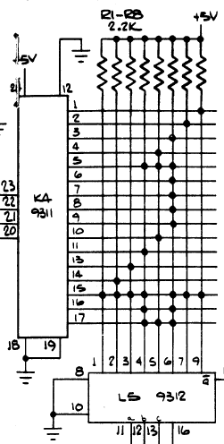
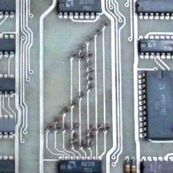

## Definition

How we can define code (in sense of computer program, I'm not talking about encryption)? There is more than one answer.

<!--more-->

### Result of programming

One way to define code is to say this is the result of programming (along with documentation and tickets). For the fullness of definition we would need to define what is programming:

> We define programming, as a general human activity, to mean the act of extending or changing a system’s functionality. Programming is a widespread activity that is done both by nonspecialists (e.g., consumers who change the settings of their alarm clock or cellular phone) and specialists (computer programmers, the audience of this book).
>
> -- Concepts, Techniques, and Models of Computer Programming by Peter Van Roy and Seif Haridi

### Configuration for a computer

We can say that code is a configuration for a computer. And we need to define computer:

> The computer is a device (software or hardware) that can do computations (see below), which can do some sort of mechanical reasoning (see below).
>
> -- [What is a computer?](/posts/what-is-computer/index.md)

### System of a meaning

Another way to see code is to interpret it as a system of meaning. If we would say that programming is a way to build knowledge. In the same way, as we turn some common knowledge into science:

- first, we gather some observations and ideas,
- then we try to organize it in some system,
- then we try to understand the essence of the process and propose some model which we can use to do prediction if we are able to predict things we think that we understand the process.

In science mathematical model is the highest form of understanding. In the same sense, code can be thought of as the highest way to understand things, because we can run code and "verify" results.

See [What Do You Mean?](https://www.youtube.com/watch?v=ndnvOElnyUg) by Kevlin Henney for more explanations.

## Forms of a code

### Text

Let's assume that the code is some form of a text. On the other hand, not all text is the code, right? Let's put a line between the code and the "plain" text:

- plain text is something written in natural language, for example, documentation and comments
- code is something written in a programming language

When we write software we use both. We can use them separately or in the mix. We can think about is as the spectrum (from the plain text to the code):

```text
  mostly code                                                  mostly text
<-------------------------------------------------------------------------->
  assembly                  literate programming               plain text
        source code           Jupyter Notebook             markdown
```

Mostly code:

- assembly code - typically code without comments
- source code - a lot of code with some comments

Mostly text:

- plain text
- markdown - mostly text with a bit of special markup (headers, quotes, etc.)

In the middle (equal amounts of code and text):

- [Literate programming](http://www.literateprogramming.com/knuthweb.pdf)
- [Jupyter Notebook](https://jupyter-notebook.readthedocs.io/en/stable/notebook.html#introduction)
- [Observable Notebook](https://observablehq.com/@observablehq/user-manual)

#### Self-explanatory code vs comments

Some people insist that comments are bad and instead we should use self-explanatory code exclusively. I believe that this is [false dichotomy](https://dev.to/stereobooster/black-or-white-35fg), we can use both.

- There is no empirical evidence that self-explanatory code is easier to debug
- Replacing all comments with self-explanatory code can increase code indirection - e.g. bigger number of small functions will force you to jump across code forward and backward. See [this post](https://www.hillelwayne.com/post/what-comments/) for explanations.

But I do get the point of people who advocate for self-explanatory code over comments:

- comments can get stale (unused code gets stale as well)
- comments are not verified by tests or type checkers

I'm just saying there is no need to be extreme about it.

Some notorious examples of comments in code:

- [Appolo-11 (assembly code with comments)](https://github.com/chrislgarry/Apollo-11/blob/master/Comanche055/INTERPRETER.agc)
- [Keep the space shuttle flying](https://github.com/kubernetes/kubernetes/blob/ec2e767e59395376fa191d7c56a74f53936b7653/pkg/controller/volume/persistentvolume/pv_controller.go)

#### Natural language

In the beginning, we drew the line between code and text. But this line is pretty thin because we can write code in natural languages (to some extent), for example, [inferring SQL queries from plain-text questions about tables](https://github.com/paulfitz/mlsql).

#### Pros

Text is a portable format, you can easily send it over the internet, you can version it, diff it, etc.

#### Cons

The main cons of text (from my PoV) is a file system (which is not required, but assumed most of the time). File system creates one more level of decisions to be taken - how to structure folders, how to name files. Good frameworks (for example, Rails) remove this issue by providing conventions for naming.

There are alternative approaches, for example:

- [we can use tags instead of hierarchies to organize files](https://www.nayuki.io/page/designing-better-file-organization-around-tags-not-hierarchies)
- [we can use SQL to select files](https://github.com/kashav/fsql)
- we can use unique file names like in [IFPS](https://ipfs.io/) ([IPNS](https://docs.ipfs.io/guides/concepts/ipns/) is used for human-readable names)
- we can use canvas instead of files in directories like in [luna](https://www.luna-lang.org/).

AST instead of text, hashes instead of names, no file system:

> The fact that things were done a certain way in the 1970s is not a good reason to keep doing them, especially if they make programming worse.
>
> Each Unison definition is some syntax tree, and by hashing this tree in a way that incorporates the hashes of all that definition's dependencies, we obtain the Unison hash which uniquely identifies that definition.
>
> We're used to thinking about our codebase as a bag of text files that are mutated as we make changes to our code, but in Unison the codebase is represented as a collection of serialized syntax trees...
>
> -- [Unison - a friendly programming language from the future](https://www.unisonweb.org/docs/quickstart)

#### Editors

> Unpopular opinion: text is actually a really bad medium for storing source code
>
> -- [@hillelogram](https://twitter.com/hillelogram/status/1130517002425122816)

**Editing code** in plain text editor (for example, nano, notepad, TextEdit) is a **poor experience**. To make text editing tolerable we need:

- highlighting (for example, [tree-sitter](http://tree-sitter.github.io/tree-sitter/))
- autocomplete (for example, [intellisense](https://code.visualstudio.com/docs/editor/intellisense), [langserver](https://langserver.org/), [tabnine](https://tabnine.com/blog/deep/), [kite](https://kite.com/))
- highlight matching brackets, show lines of indentation, collapse code blocks
- showing contextual documentation with tooltips
- [code specific navigation](https://code.visualstudio.com/docs/editor/editingevolved), for example, "jump to definition"
- and other editing specific improvements, like [Emmet](https://emmet.io/), [parinfer](https://shaunlebron.github.io/parinfer/) (see [history of editors for Lisp](https://github.com/shaunlebron/history-of-lisp-parens/blob/master/editors.md)).
- "[projectional code editing](https://twitter.com/gr__or/status/1135237918719696896)", for example, [tofu](https://gregoor.github.io/tofu/)

### Images

#### Images in comments

> I've been trying to layout code in a visually pleasing manner lately with lots of diagrams. I'm finding it useful to remember what the code does but also as visual cues to find where things are. It can be a pain to edit though.
>
> <video src="./code-by-greje656.mp4" autoplay loop width="100%"></video>
>
> -- [@greje656](https://twitter.com/greje656/status/1142802836343939074)

I sometimes want to draw pictures in comments. It is possible to use good old ASCII-art, or use special markup (for example, [DOT Language](https://www.graphviz.org/doc/info/lang.html)), or inline SVG.

#### Visual tools for coding

We can code with visual representation, for example:

- [Scratch](https://scratch.mit.edu/) - block editor
- [Circuitlab](https://www.circuitlab.com/) - circuit designer
- [luna](https://www.luna-lang.org/) - flow
- [nodes](http://nodes.io/story/) - JavaScript-based 2D canvas for computational thinking

More examples of beautiful and strange editors:

- [The Whole Code Catalog](https://futureofcoding.org/catalog/)
- [Gallery of programmer interfaces](https://docs.google.com/presentation/d/e/2PACX-1vSPuf3eQ2tlCtXAif4gEWQQU-xK8EzhiH3SIfuD7vWy7eP4NN0-KRejbec_m-GF6-f_D95OOFyyoolx/pub?start=false&slide=id.g1da0625f1b_0_56)
- [Visual Programming Languages - Snapshots](http://blog.interfacevision.com/design/design-visual-progarmming-languages-snapshots/)
- [Visual Programming Codex](https://github.com/ivanreese/visual-programming-codex)

### Hardware

We are not limited to software. People "write" programs with hardware as well, for example:

> A (very) early example of video game art... Atari's Space Race (1973) did not have a ROM to store data. So half of the rocket shape was stored as an 8x16 diode matrix, which was mirrored to create the full shape. This is plainly visible in the schematic and the circuit board. 🚀
>
> |  |  |  |
> | ------------------- | ------------------- | ------------------- |
>
>
> -- [@pixnblox](https://twitter.com/pixnblox/status/1104485690899922944)

People used punch cards to write code and store information in the past:


Image source: [wikipedia](https://en.wikipedia.org/wiki/Punched_card#/media/File:Used_Punchcard_(5151286161).jpg)

Plug boards can be used to "write" code:


Image source: [wikipedia](https://en.wikipedia.org/wiki/Plugboard#/media/File:IBM402plugboard.Shrigley.wireside.jpg)
