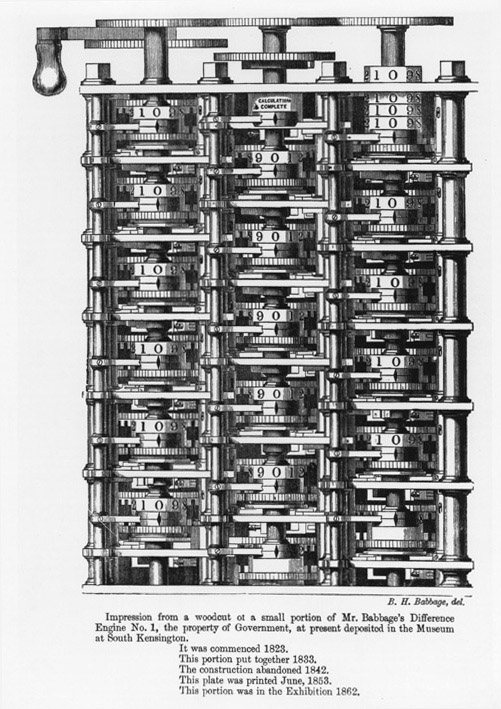
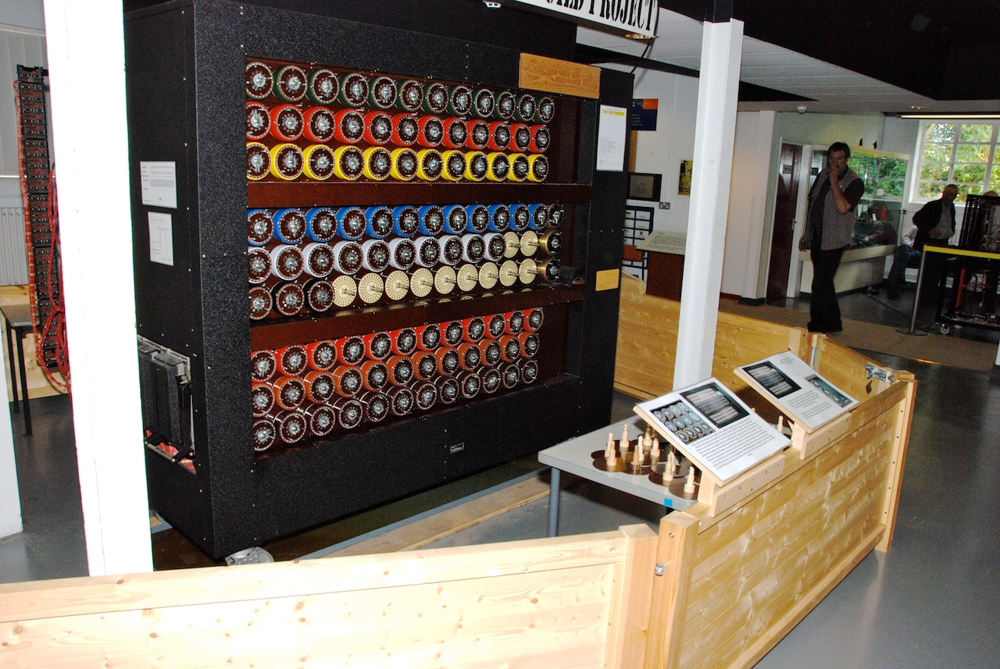
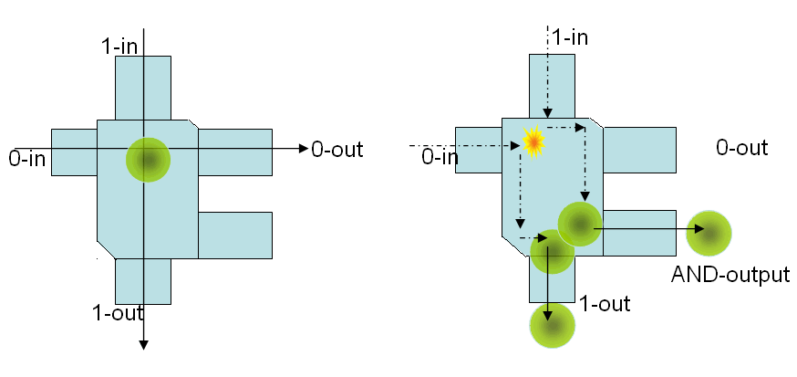
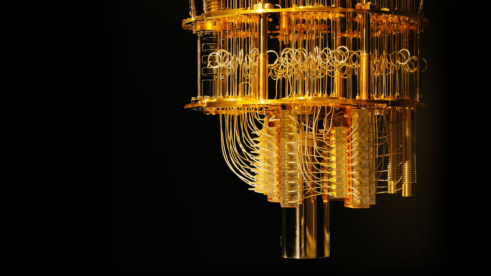
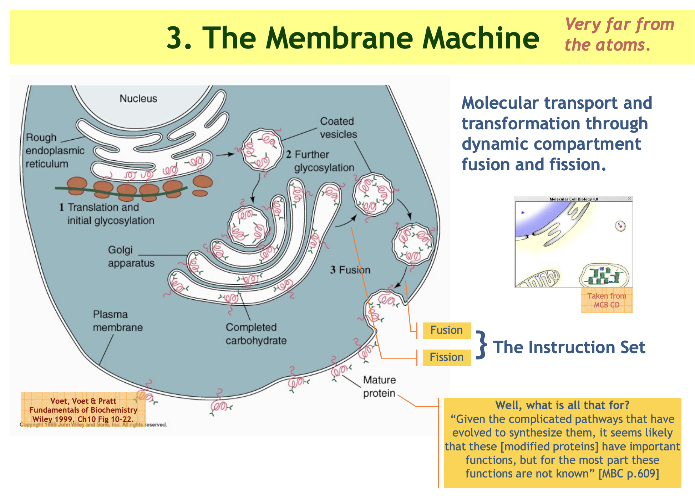

If we say that computer science is a branch of knowledge which studies "computers". What does "computer" mean in this case?

## Definition

The computer is a device (software or hardware) which can do computations (see below), which can do some sort of mechanical reasoning (see below).

It is important to understand that there is no principal difference (for the definition of computer in our context) if we talk about hardware or software because we can run the program on hardware directly or inside a virtual machine. This idea was proposed by Turing - you can create Turin Machine (TM) inside another TM, because of this property of TM it is (relatively) easy to prove that halting problem is not decidable in the general case.

### Main parts

If you take most popular computational models (see below) you will see that one way or another they have following parts: processor (some unit which does the work), memory (some kind of information storage), input, output.

For example,

|           | Personal Computer | Turing Machine      | von Neumann computer     | Programming Language Interpeter |
| --------- | ----------------- | ------------------- | ------------------------ | ------------------------------- |
| processor | CPU, GPU          | machine, oracle     | computer                 | eval                            |
| memory    | RAM, hard drive   | tape                | memory                   | environment, variables          |
| input     | keyboard, mouse   | tape, choice device | directly write to memory | read                            |
| output    | screen, printer   | tape                | output register          | print                           |

See: [What makes a computer, a computer?](https://www.khanacademy.org/computing/computer-science/how-computers-work2/v/khan-academy-and-codeorg-what-makes-a-computer-a-computer)

## It's about computations

> Computer science is a terrible name for this business. First of all, it’s not a science. It might be engineering or it might be art, but we’ll actually see that computer so-called science actually has a lot in common with magic… So it’s not a science. It’s also not really very much about computers. And it’s not about computers in the same sense that physics is not really about particle accelerators, and biology is not really about microscopes and petri dishes. And it’s not about computers in the same sense that geometry is not really about using surveying instruments.
>
> -- [Hal Abelson](https://www.youtube.com/watch?v=2Op3QLzMgSY)

One way to approach this question is to say that computer science is not about computers, but rather about computations (and computers are devices which can carry out computations).

## What is computation?

> There are several ways to define computation. For now, I take the simplest: **a computation is a sequence of steps, which I call a behavior**. There are three common choices for what a step is, leading to **three different kinds of behavior**:
>
> - **Action Behavior**. A step is an action, which is just an element of some set of actions. An action behavior is a sequence of actions.
> - **State Behavior**. A step is a pair `(s, t)` of states, where a state is an element of some set of states. A state behavior is a sequence `s1 → s2 → s3 → · · ·` of states. The step `(si, si+1)` represents a transition from state `si` to state `si+1`.
> - **State-Action Behavior**. A step is a triple `(s, α, ti)`, where `s` and `t` are states and `α` is an action. A state-action behavior is a sequence `s1 -α1→ s2 -α2→ s3 -α3→ · · ·`. The step `(si, αi, si+1)` represents a transition from state `si` to state `si+1` that is performed by action `αi`.
>
> -- [Computation and State Machines](https://lamport.azurewebsites.net/pubs/state-machine.pdf). Leslie Lamport, 19 April 2008

Recently I asked the question: ["What are the building blocks of the software?"](https://dev.to/stereobooster/what-are-the-building-blocks-of-the-software-17cn). In my opinion "computation" is the answer to this question. Everything that computer can do can be described in this manner (at least for now, maybe later they will come up with a better idea).

## Mechanization of reasoning

The idea of mechanization of reasoning appeared at least in the middle ages (if not earlier). People start to think about thinking (reasoning itself) and if that process can be automated with the help of machines.

> Leibniz (1646-1716) compared the universe (including the human mind) to an elaborate clock, ticking without the constant intervention of the clockmaker (an idea that Leibniz’s contemporary, Isaac Newton, rejected as marginalizing the role of God in His creation)...
> Leibniz wrote that he had been inspired by his recent predecessor Thomas Hobbes (1588-1679) to consider even the human mind as an automaton...
> Man-made machines and the natural creations, including the mind, differ not in kind, Leibniz believed, but merely in degree of complexity, as natural beings are machines “all-the-way-down”...
> We therefore see that Leibniz, in the 1600s, believed that the mind was a “natural automaton” and reason a “computation”, and seeing the similarity between Aristotle’s logic, the description of correct reasoning in a semi-symbolic language, and algebra, the science of symbol combination, sought to invent an algebra-like calculus that to provide a “determined procedure” for reasoning.
>
> -- [Finite of Sense and Infinite of Thought: A History of Computation, Logic and Algebra, Part I](https://pron.github.io/posts/computation-logic-algebra-pt1), 05 Jan 2018

This is what computers were about from the beginning - we try to answer the question if we can automate reasoning process (if we assume it to be symbolic manipulations)?

Turing took a similar approach (1936), he proposed machine which would do the work instead of the human, it would write (or erase) symbols on paper the same way a mathematician does while calculating something.

> We may compare a man in the process of computing a real number to machine which...

His first work was dedicated to some specific problem (Entscheidungsproblem, German for "decision problem", is a challenge posed by David Hilbert). Later he wondered if we would be able to go beyond that? Can we replicate the whole thinking process of the human (including creativity and guessing) with machines? And this is how the Artificial Intelligence field appeared. Turing proposed a couple of extensions of the original machine (oracles, for example) and formulated the Turing test (1950).

In 1960 John McCarthy while was working in MIT on AI problems invented LISP (see [Recursive Functions of Symbolic Expressions Their Computation by Machine, Part I](https://aiplaybook.a16z.com/reference-material/mccarthy-1960.pdf)), which was thought as symbol processing language.

## Computers in practice

Some examples of computing devices.

**Leibniz's stepped reckoner** (replica in the Deutsches Museum). The device was discovered in 1879 in an attic at the University of Göttingen by workers fixing a leak in the roof. Image source: [Wikipedia](https://en.wikipedia.org/wiki/Stepped_reckoner#/media/File:Leibnitzrechenmaschine.jpg).

**Babbage’s Difference Engine** No.1, Woodcut, 1853. This woodcut depicts a trial piece of the Difference Engine No. 1, built-in 1833 and held by the Science Museum, London. Image source: [University of Minnesota](http://www.cbi.umn.edu/about/babbage.html).

**Jacquard loom** (with punched cards). Image source: [Wikipedia](https://en.wikipedia.org/wiki/Jacquard_loom#/media/File:Jacquard.loom.cards.jpg).

BOMBE - **electro-mechanical machine**, developed during WWII by Alan Turing and Gordon Welchman, whilst working as codebreakers at Bletchley Park. Image source: [cryptomuseum](https://www.cryptomuseum.com/crypto/bombe/).

ENIAC was the first **vacuum tubes** general-purpose computer. Its first program was a study of the feasibility of the thermonuclear weapon - project Manhattan, where John von Neumann took part. Image source: [Columbia University Computing History](http://www.columbia.edu/cu/computinghistory/eniac.html)

**Billiard-ball model** of computation proposed by Edward Fredkin and Tommaso Toffoli in their paper [Conservative Logic](http://fab.cba.mit.edu/classes/862.16/notes/computation/Fredkin-2002.pdf). Image source: [Wikipedia](https://en.wikipedia.org/wiki/Billiard-ball_computer#/media/File:Toffoli_BilliardBall.gif).

IBM’s **quantum computer**. Image source: [Quantamagazine](https://www.quantamagazine.org/quantum-supremacy-is-coming-heres-what-you-should-know-20190718/).

[**Bio computer**](http://lucacardelli.name/BioComputing.htm). Cells compute. For example, finding food, avoiding predators. Image source: [lucacardelli.name](<http://lucacardelli.name/Talks/2009-03-12%20Abstract%20Machines%20of%20Systems%20Biology%20(Warsaw).pdf>).

This is my random selection simply to show that there are computers other than transistor-based. You can find more examples here [computerhistory](https://www.computerhistory.org/timeline/), [Wikipedia](https://en.wikipedia.org/wiki/List_of_pioneers_in_computer_science).

## Computers in theory

In the previous section, we talked about "hardware". In this section let's talk about theory - computational models.

### Turing Machines

> We have said that the computable numbers are those whose decimals are calculable by finite means... I shall only say that the justification lies in the fact that the human memory is necessarily limited.
> We may compare a man in the process of computing a real number to a machine which is only capable of a finite number of conditions `q1: q2. .... qI` which will be called "m-configurations". The machine is supplied with a "tape" (the analogue of paper) running through it, and divided into sections (called "squares") each capable of bearing a "symbol"... However, by altering its m-configuration the machine can effectively remember some of the symbols which it has "seen" (scanned) previously. The possible behaviour of the
> machine at any moment is determined by the a-configuration and the scanned symbol...
> The machine may also change the square which is being scanned, but only by shifting it one place to right or left. In addition to any of these operations the m-configuration may be changed. Some of the symbols written down will form the sequence of figures which is the decimal of the real number which is being computed. The others are just rough notes to "assist the memory ". It will only be these rough notes which will be liable to erasure.
>
> -- [On Computable Numbers, With An Application To The Entscheidungsproblem](https://www.cs.virginia.edu/~robins/Turing_Paper_1936.pdf). A. M. Turing, 28 May, 1936

Lamport about TM:

> A Turing machine is a state machine whose state describes the contents of the tape, the internal state, and the position of the read/write head.

Some people would consider computers to be Turing Machines (TM). Turing Machines are in turn correspond to lambda calculus, from what we can conclude that all computable problems are function-based. This is not quite correct.

> Some computer scientists think an algorithm is a function from inputs to outputs. If that were true, then bubble sort and heap sort would be the same algorithm, since they compute the same function

Modern computers can do more than classical TM. Classical TM is deterministic - e.g. it's behavior is fully determined by the initial program. It gets all the configuration upfront and doesn't read user input during the execution. Turing himself knew about that limitation that is why he as well introduced "choice machines" (TM with ability to read user input, which makes it non-deterministic) and "oracle machines" (TM machines with oracle - "magic" device which can answer some questions).

> TMs cannot compute all problems, nor can they do everything that real computers
> can do.
>
> -- [The Origins of the Turing Thesis](https://pdfs.semanticscholar.org/9a9d/3d5393dd90a37ef9a0b8420fe4c41fc5d8f9.pdf). Dina Goldin, Peter Wegner, June 25, 2004

They even started a new field discussing models which can compute more than TM - hypercomputation.

> It has long been assumed that the Turing machine computes all the functions that are computable in any reasonable sense. It is therefore assumed to be a sufficient model for computability. What then, is one to make of the slow trickle of papers that discuss models which can compute more than the Turing machine? It is perhaps tempting to dismiss such theorizing as idle speculation alike to the more fanciful areas of pure mathematics, in which models and abstractions are studied for their own sake with little regard to any real-world implications.
>
> -- [Hypercomputation: computing more than the Turing machine](https://arxiv.org/abs/math/0209332). Toby Ord, 25 Sep 2002

### Von Neumann Computers

> An automatic computing system is a (usually highly composite) device, which can carry out instructions to perform calculations of a considerable order of complexity—e.g. to solve a non-linear partial differential equation in 2 or 3 independent variables numerically.
>
> -- [First Draft of a Report on the EDVAC](https://web.archive.org/web/20010615054532/http://qss.stanford.edu/~godfrey/vonNeumann/vnedvac.pdf). John von Neumann, June 30, 1945

Lamport about von Neumann computer:

> The state of a von Neumann computer specifies the contents of the memory and of all the registers, including a program counter (`pc`) that contains the address of the next instruction to be executed. The next-state relation contains the pair `(s, t)` of states iff executing the next instruction (the one specified by `pc`) in state `s` produces state `t`. Output can be represented with an output register; input can be represented with a read instruction that nondeterministically sets a memory location to an arbitrary value.

### Algorithms

> An algorithm is a recipe, a set of instructions or the specifications of a process for doing something. That something is usually solving a problem of some sort.
>
> -- Computer Science: Problems, Algorithms, Languages, Information and Computers. J. K. Rice, J. N. Rice., 1969.

This is basically "a recipe for generating behaviors" (from Lamport definition).

### BNF Grammars

To learn more about BNF watch [this talk by Guy Steele](https://www.youtube.com/watch?v=dCuZkaaou0Q). He calls it "the most popular programming language in computer science".

Lamport about BNF:

> BNF grammar can be described as a state machine whose states are sequences of terminals and/or non-terminals. The set of initial states contains only the sequence consisting of the single starting non-terminal. The next-state relation is defined to contain `(s, t)` iff s can be transformed to t by applying a production rule to expand a single non-terminal.
