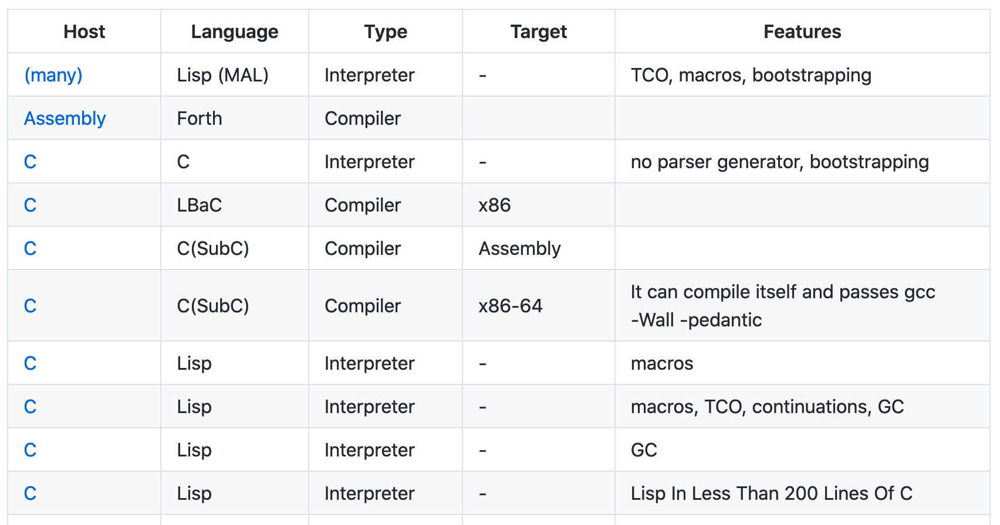

I [started to collect small programming languagess](https://github.com/stereobooster/write-you-a-programming-language) that you can implement in a relatively small amount of time for educational purposes.

What does it mean to write a language? One way to put it is: you need to write a program that will interpret or compile programming language (New language). But to write a program you need to use some existing programming language (Host language). It is also possible to write a program in raw machine code.

## interpreter vs compiler

The first choice to make is: will you write an interpreter or compiler (or both). How do they relate?

- computer (machine) is an interpreter for the machine code (also language, but not human readable)
- compiler translates source code into another language, for example
  - into high-level programming language (aka transpilation)
  - into machine code for virtual machine (aka bytecode), for example, JVM
  - into a low-level language, for example, assembly, which would later be translated (by another program) to a machine code
- interpreter actually executes instructions, for example, JavaScript, Lisp, Machine, JVM, [gnuplot](http://www.gnuplot.info/), calculator, etc.

The interesting part is that you can write both interpreter and compiler for the programming language, for example, Lisp (CommonLisp), Scheme (Chez Scheme).

Another interesting observation is that you can write an interpreter or compiler of the language in the language itself (New = Old). You need to write the first compiler or interpreter in a different language and then you can "bootstrap" and write the next versions using the language itself (aka [metacircular evaluator](https://www.youtube.com/watch?v=aAlR3cezPJg), self-hosting). I guess another name for it can be [dogfooding](https://dictionary.cambridge.org/dictionary/english/dogfooding).

We can categorize tutorials based on host and "new" languages, for example:

- [Make a Lisp](https://github.com/kanaka/mal) - Clojure inspired Lisp implemented in 82 languages
- [Write Yourself a Scheme in 48 Hours](https://upload.wikimedia.org/wikipedia/commons/a/aa/Write_Yourself_a_Scheme_in_48_Hours.pdf) - Scheme implemented in Haskell
- [Write you a Haskell](http://dev.stephendiehl.com/fun/) - Subset of Haskell 2010 implemented in Haskell

If language is implemented as a compiler, then it translates source language to a target language. Source language is the same as the "new language", but the target language is not the same as a host language. We can categorize tutorials based on source and target languages, for example:

- [Implementing a JIT Compiled Language with Haskell and LLVM](https://www.stephendiehl.com/llvm/#the-basic-language). Complier implemented in Haskell, that translates language "Kaleidoscope" to LLVM IR (intermediate representation)
- [How to implement a PL](http://lisperator.net/pltut/dream). Compiler implemented in JS, that translates language "λanguage" to JS
- [the-super-tiny-compiler](https://github.com/jamiebuilds/the-super-tiny-compiler). Compiler implemented in JS, that translates a small subset of Lisp to C-ish like syntax

## Memory management

The next question to ask is how your programming language will manage memory:

- it will not, for example, some kind of declarative PL
- you don't care. Allocate memory and let OS clean it up after application terminates
- static memory management, like in C
  - special case Rust's borrow checker
  - special case [Zig](https://ziglang.org/learn/overview/#manual-memory-management)
- garbage collection, like in Lisp, JavaScript, etc.
  - special case Pony's reference capabilities
- Maybe [mix of static and GC](https://jondgoodwin.com/pling/gmm.pdf))?

## Type system

The next question to ask is what your PL will do with types:

- untyped (when you have only one type), for example, lambda calculus or calculator
- dynamically typed, for example, Lisp
- statically typed, for example, Haskell
- gradually typed, for example, TypeScript

If you choose to use a sound type system there is a big choice of the type system: Martin-Lof (for example, ML), dependent types (for example, Idris), linear types, etc.

## Paradigms

All the above apply to every PL. Now you can choose other features that would define for programming paradigm (one or more).

For example, you allow first-class functions, eager evaluation (with [call-by-sharing](https://stereobooster.com/posts/call-by-name-by-reference-by-sharing/)), dynamic types, macros and you get a Lisp.

- If you use hygienic macros and continuations, you get a Scheme (more or less).
- If you use immutable data types, you get a Clojure (more or less).

Or you allow first-class functions, lazy evaluation, static types and you get ML.

See: [Programming Paradigms for Dummies: What Every Programmer Should Know](https://www.researchgate.net/publication/241111987_Programming_Paradigms_for_Dummies_What_Every_Programmer_Should_Know), [What is a Programming Paradigm?](https://pling.jondgoodwin.com/post/what-is-a-programming-paradigm/)

## Additional features

On top of that you can add some features, like:

- module system
- tail call optimization
- functional-style pattern matching
- or prolog style pattern matching (unification)
- etc.

## Parser generators

One of the success factors of [MAL](https://github.com/kanaka/mal) is that it doesn't need a parser generator - it is relatively easy to implement Lisp parser. This makes it very portable (implemented in more than 80 languages). The same goes for [lis.py](https://norvig.com/lispy.html) - it has an even simpler tokenizer.

Most non-lisp tutorials assume some specific parser generator, which makes them less portable.

Another interesting idea on how to improve this is to make a compiler ("frontend") which will compile input to a really small subset intermediate representation (for example, Shen needs 46 basic instructions and Haskel Core has 8) then learner can implement compiler or interpreter for the intermediate language.

## List of tutorials

Here is [my collection of tutorials on how to create a programming language](https://github.com/stereobooster/write-you-a-programming-language). It's a GitHub repo, so you're welcome to contribute.

